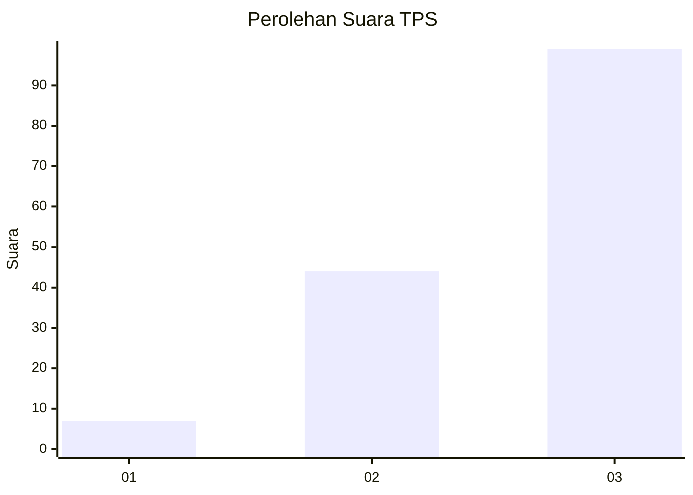
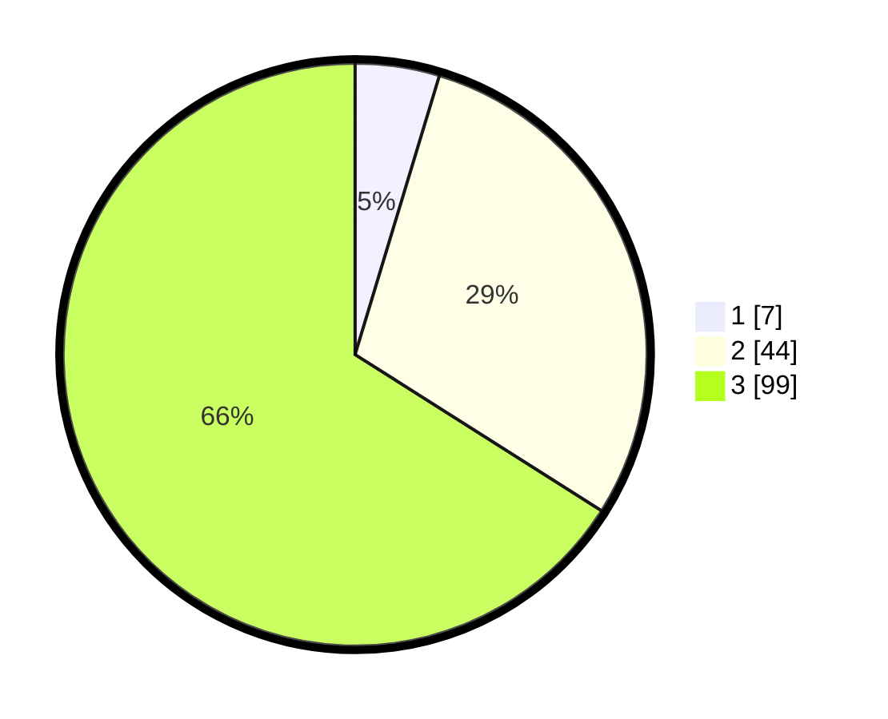

# Hasil

## Grafik

## Tabel

| No. | Nama Paslon    | Suara | Suara (raw) | Persentase |
|:--- |:-------------- | -----:| -----------:| ----------:|
| 1   | ANIES MUHAIMIN | 7     | [7][p-1]    | 4,67       |
| 2   | PRABOWO GIBRAN | 44    | [44][p-2]   | 29,33      |
| 3   | GANJAR MAHFUD  | 99    | [99][p-3]   | 66,00      |

[p-1]: https://github.com/gigit-pemilu/pemilu-2024-33-jawa-tengah/blob/main/pilpres/hitung-suara/sub/33-jawa-tengah/sub/02-banyumas/sub/01-lumbir/sub/2008-dermaji/sub/020-tps/sub/paslon-1.txt
[p-2]: https://github.com/gigit-pemilu/pemilu-2024-33-jawa-tengah/blob/main/pilpres/hitung-suara/sub/33-jawa-tengah/sub/02-banyumas/sub/01-lumbir/sub/2008-dermaji/sub/020-tps/sub/paslon-2.txt
[p-3]: https://github.com/gigit-pemilu/pemilu-2024-33-jawa-tengah/blob/main/pilpres/hitung-suara/sub/33-jawa-tengah/sub/02-banyumas/sub/01-lumbir/sub/2008-dermaji/sub/020-tps/sub/paslon-3.txt

## Foto C Plano

https://sirekap-obj-formc.kpu.go.id/1f37/pemilu/ppwp/33/02/01/20/08/3302012008020-20240215-010519--bcba61d4-02cf-4d73-ade4-976e4f6cecc6.jpg

https://sirekap-obj-formc.kpu.go.id/1f37/pemilu/ppwp/33/02/01/20/08/3302012008020-20240215-010622--5ac553a6-ff19-481e-ae5d-0ec429931616.jpg

https://sirekap-obj-formc.kpu.go.id/1f37/pemilu/ppwp/33/02/01/20/08/3302012008020-20240215-010730--d28128fb-03f8-424f-888b-0b990f984325.jpg

## Metadata

| Key        | Value               |
| ---------- | ------------------- |
| Time Stamp | 2024-02-15 09:00:24 |

