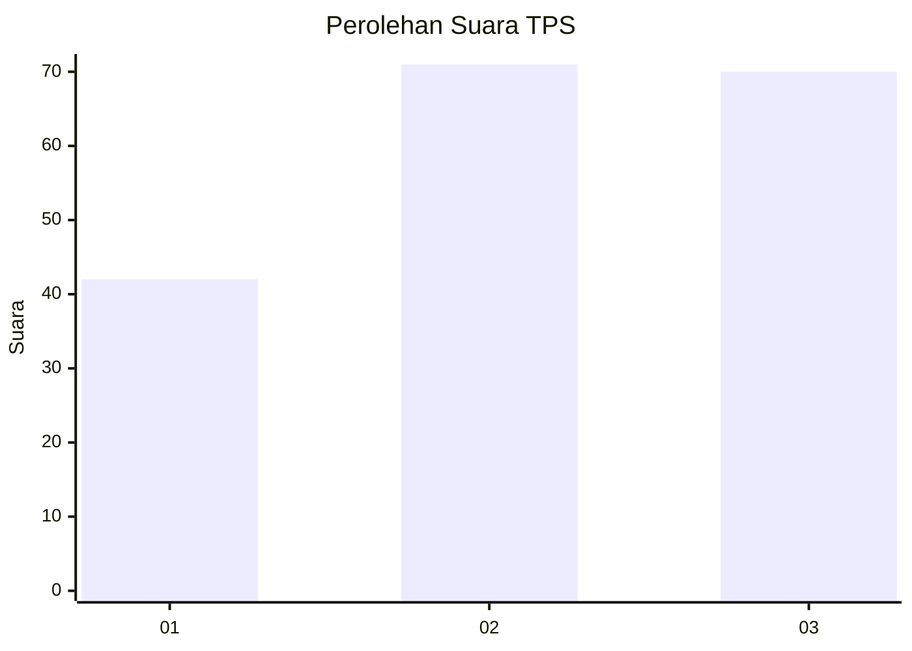
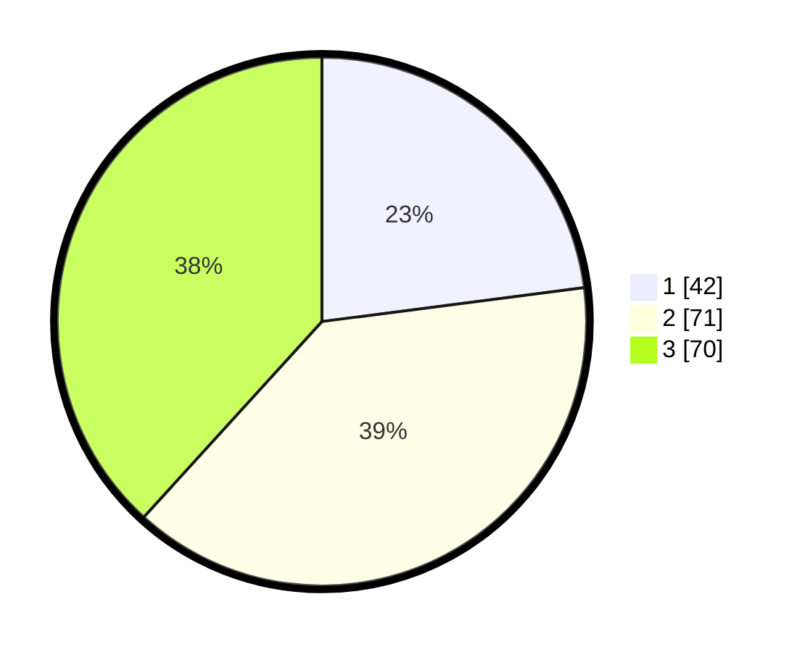

# Hasil

## Grafik

## Tabel

| No. | Nama Paslon    | Suara | Suara (raw) | Persentase |
|:--- |:-------------- | -----:| -----------:| ----------:|
| 1   | ANIES MUHAIMIN | 42    | [42][p-1]   | 22,95      |
| 2   | PRABOWO GIBRAN | 71    | [71][p-2]   | 38,80      |
| 3   | GANJAR MAHFUD  | 70    | [70][p-3]   | 38,25      |

[p-1]: https://github.com/gigit-pemilu/pemilu-2024-33-jawa-tengah/blob/main/pilpres/hitung-suara/sub/33-jawa-tengah/sub/02-banyumas/sub/01-lumbir/sub/2010-cingebul/sub/003-tps/sub/paslon-1.txt
[p-2]: https://github.com/gigit-pemilu/pemilu-2024-33-jawa-tengah/blob/main/pilpres/hitung-suara/sub/33-jawa-tengah/sub/02-banyumas/sub/01-lumbir/sub/2010-cingebul/sub/003-tps/sub/paslon-2.txt
[p-3]: https://github.com/gigit-pemilu/pemilu-2024-33-jawa-tengah/blob/main/pilpres/hitung-suara/sub/33-jawa-tengah/sub/02-banyumas/sub/01-lumbir/sub/2010-cingebul/sub/003-tps/sub/paslon-3.txt

## Foto C Plano

https://sirekap-obj-formc.kpu.go.id/4860/pemilu/ppwp/33/02/01/20/10/3302012010003-20240214-223206--fd499bd8-b86d-465e-bac0-7a1b88c02a7b.jpg

https://sirekap-obj-formc.kpu.go.id/4860/pemilu/ppwp/33/02/01/20/10/3302012010003-20240214-223302--a780d06b-31c6-4d34-88ef-0cb4c5eaa861.jpg

https://sirekap-obj-formc.kpu.go.id/4860/pemilu/ppwp/33/02/01/20/10/3302012010003-20240214-224003--ab74ada0-b923-4075-9628-8526e436e666.jpg

## Metadata

| Key        | Value               |
| ---------- | ------------------- |
| Time Stamp | 2024-02-16 23:00:00 |

