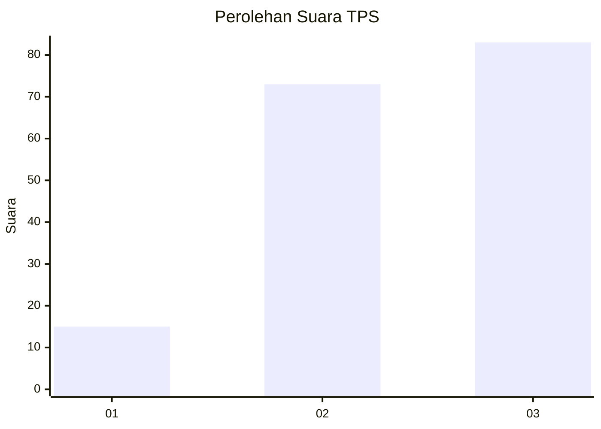
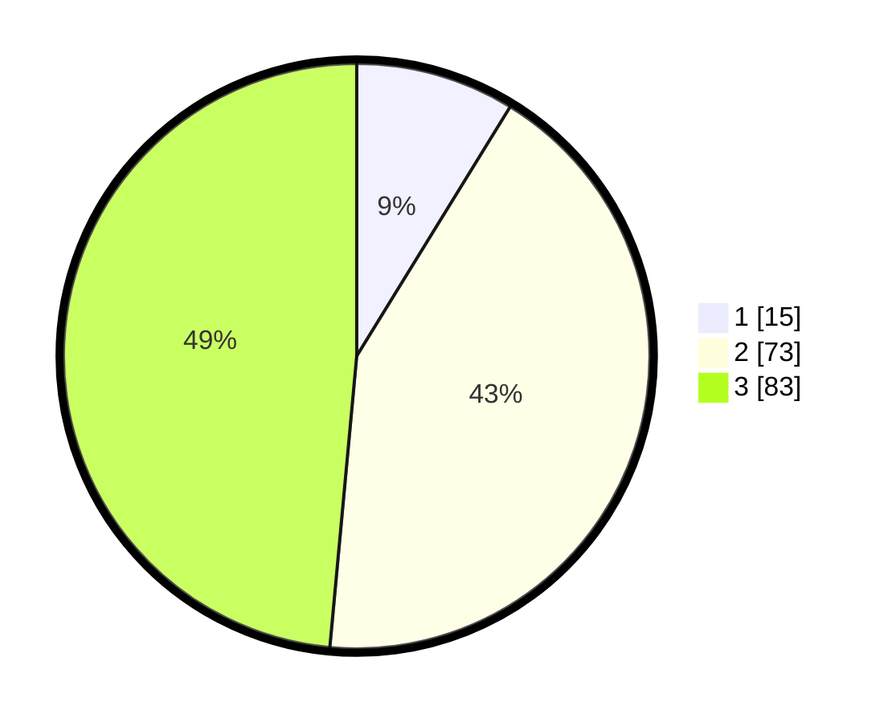

# Hasil

## Grafik

## Tabel

| No. | Nama Paslon    | Suara | Suara (raw) | Persentase |
|:--- |:-------------- | -----:| -----------:| ----------:|
| 1   | ANIES MUHAIMIN | 15    | [15][p-1]   | 8,77       |
| 2   | PRABOWO GIBRAN | 73    | [73][p-2]   | 42,69      |
| 3   | GANJAR MAHFUD  | 83    | [83][p-3]   | 48,54      |

[p-1]: https://github.com/gigit-pemilu/pemilu-2024-33-jawa-tengah/blob/main/pilpres/hitung-suara/sub/33-jawa-tengah/sub/02-banyumas/sub/01-lumbir/sub/2010-cingebul/sub/013-tps/sub/paslon-1.txt
[p-2]: https://github.com/gigit-pemilu/pemilu-2024-33-jawa-tengah/blob/main/pilpres/hitung-suara/sub/33-jawa-tengah/sub/02-banyumas/sub/01-lumbir/sub/2010-cingebul/sub/013-tps/sub/paslon-2.txt
[p-3]: https://github.com/gigit-pemilu/pemilu-2024-33-jawa-tengah/blob/main/pilpres/hitung-suara/sub/33-jawa-tengah/sub/02-banyumas/sub/01-lumbir/sub/2010-cingebul/sub/013-tps/sub/paslon-3.txt

## Foto C Plano

https://sirekap-obj-formc.kpu.go.id/f7ec/pemilu/ppwp/33/02/01/20/10/3302012010013-20240214-223003--accaf048-ab35-4172-ab7b-56ac89b331b4.jpg

https://sirekap-obj-formc.kpu.go.id/f7ec/pemilu/ppwp/33/02/01/20/10/3302012010013-20240215-040544--14168f9f-270c-4023-b70c-154806370a99.jpg

https://sirekap-obj-formc.kpu.go.id/f7ec/pemilu/ppwp/33/02/01/20/10/3302012010013-20240214-223015--f2071ed6-6bb3-46cd-b698-3bc61bac7df4.jpg

## Metadata

| Key        | Value               |
| ---------- | ------------------- |
| Time Stamp | 2024-02-16 23:00:00 |

