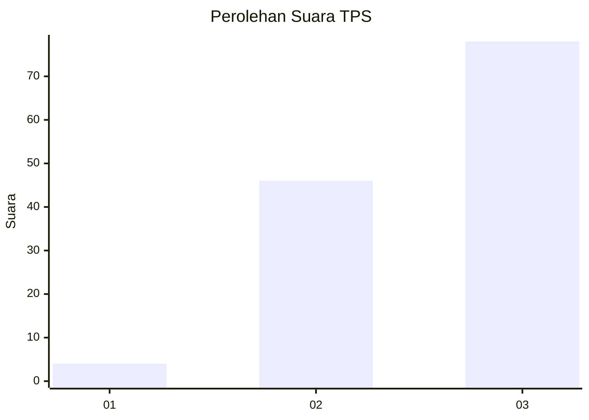
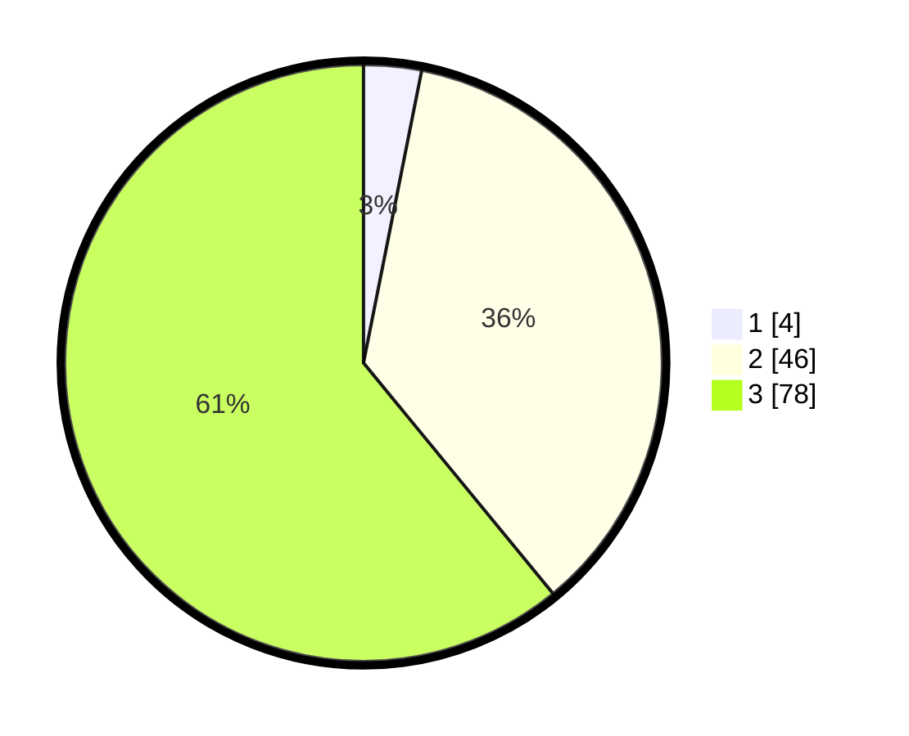

# Hasil

## Grafik

## Tabel

| No. | Nama Paslon    | Suara | Suara (raw) | Persentase |
|:--- |:-------------- | -----:| -----------:| ----------:|
| 1   | ANIES MUHAIMIN | 4     | [4][p-1]    | 3,13       |
| 2   | PRABOWO GIBRAN | 46    | [46][p-2]   | 35,94      |
| 3   | GANJAR MAHFUD  | 78    | [78][p-3]   | 60,94      |

[p-1]: https://github.com/gigit-pemilu/pemilu-2024/blob/main/pilpres/hitung-suara/sub/33-jawa-tengah/sub/02-banyumas/sub/01-lumbir/sub/2010-cingebul/sub/020-tps/sub/paslon-1.txt
[p-2]: https://github.com/gigit-pemilu/pemilu-2024/blob/main/pilpres/hitung-suara/sub/33-jawa-tengah/sub/02-banyumas/sub/01-lumbir/sub/2010-cingebul/sub/020-tps/sub/paslon-2.txt
[p-3]: https://github.com/gigit-pemilu/pemilu-2024/blob/main/pilpres/hitung-suara/sub/33-jawa-tengah/sub/02-banyumas/sub/01-lumbir/sub/2010-cingebul/sub/020-tps/sub/paslon-3.txt

## Foto C Plano

https://sirekap-obj-formc.kpu.go.id/60a0/pemilu/ppwp/33/02/01/20/10/3302012010020-20240215-000428--6576ae79-9bb0-4325-9498-a48e03bacc61.jpg

https://sirekap-obj-formc.kpu.go.id/60a0/pemilu/ppwp/33/02/01/20/10/3302012010020-20240214-231126--3b629638-97cc-4f89-b37c-6ccdbc6e312c.jpg

https://sirekap-obj-formc.kpu.go.id/60a0/pemilu/ppwp/33/02/01/20/10/3302012010020-20240214-231508--dddc9bb9-6529-494e-b6a4-24585bfe2c6b.jpg

## Metadata

| Key        | Value               |
| ---------- | ------------------- |
| Time Stamp | 2024-02-16 21:01:00 |

