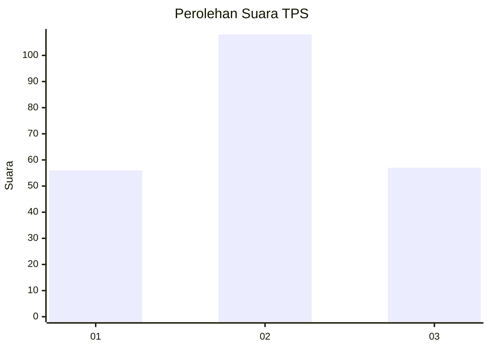
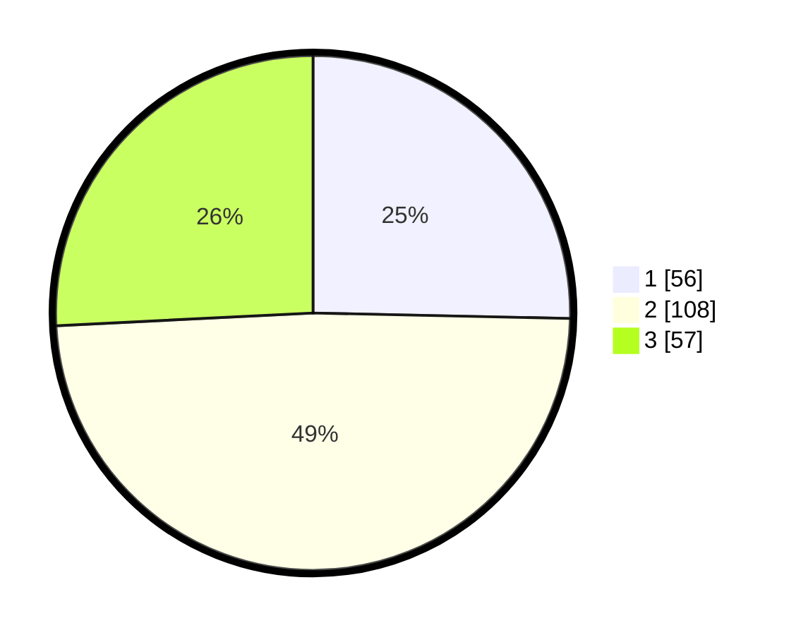

# Hasil

## Grafik

## Tabel

| No. | Nama Paslon    | Suara | Suara (raw) | Persentase |
|:--- |:-------------- | -----:| -----------:| ----------:|
| 1   | ANIES MUHAIMIN | 56    | [56][p-1]   | 25,34      |
| 2   | PRABOWO GIBRAN | 108   | [108][p-2]  | 48,87      |
| 3   | GANJAR MAHFUD  | 57    | [57][p-3]   | 25,79      |

[p-1]: https://github.com/gigit-pemilu/pemilu-2024-33-jawa-tengah/blob/main/pilpres/hitung-suara/sub/33-jawa-tengah/sub/02-banyumas/sub/02-wangon/sub/2001-randegan/sub/002-tps/sub/paslon-1.txt
[p-2]: https://github.com/gigit-pemilu/pemilu-2024-33-jawa-tengah/blob/main/pilpres/hitung-suara/sub/33-jawa-tengah/sub/02-banyumas/sub/02-wangon/sub/2001-randegan/sub/002-tps/sub/paslon-2.txt
[p-3]: https://github.com/gigit-pemilu/pemilu-2024-33-jawa-tengah/blob/main/pilpres/hitung-suara/sub/33-jawa-tengah/sub/02-banyumas/sub/02-wangon/sub/2001-randegan/sub/002-tps/sub/paslon-3.txt

## Foto C Plano

https://sirekap-obj-formc.kpu.go.id/9754/pemilu/ppwp/33/02/02/20/01/3302022001002-20240214-212012--dc306c05-74f5-4027-9001-622b946fb8d8.jpg

https://sirekap-obj-formc.kpu.go.id/9754/pemilu/ppwp/33/02/02/20/01/3302022001002-20240217-091802--0aa7feb1-5098-4865-a094-94327562f607.jpg

https://sirekap-obj-formc.kpu.go.id/9754/pemilu/ppwp/33/02/02/20/01/3302022001002-20240217-091818--67dcacc6-d2a5-4d1f-b114-885416133f6a.jpg

## Metadata

| Key        | Value               |
| ---------- | ------------------- |
| Time Stamp | 2024-02-17 09:30:03 |

