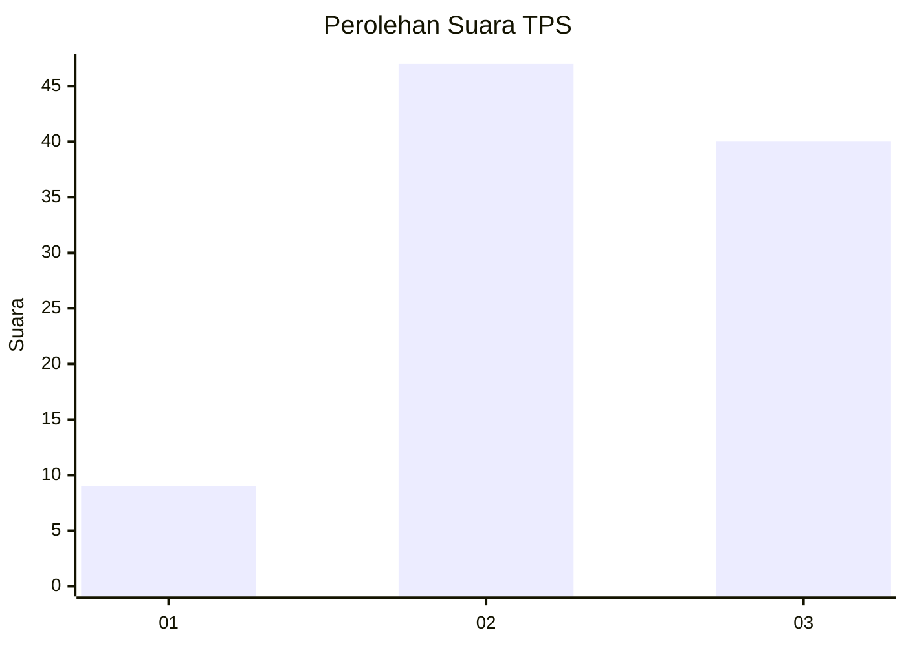
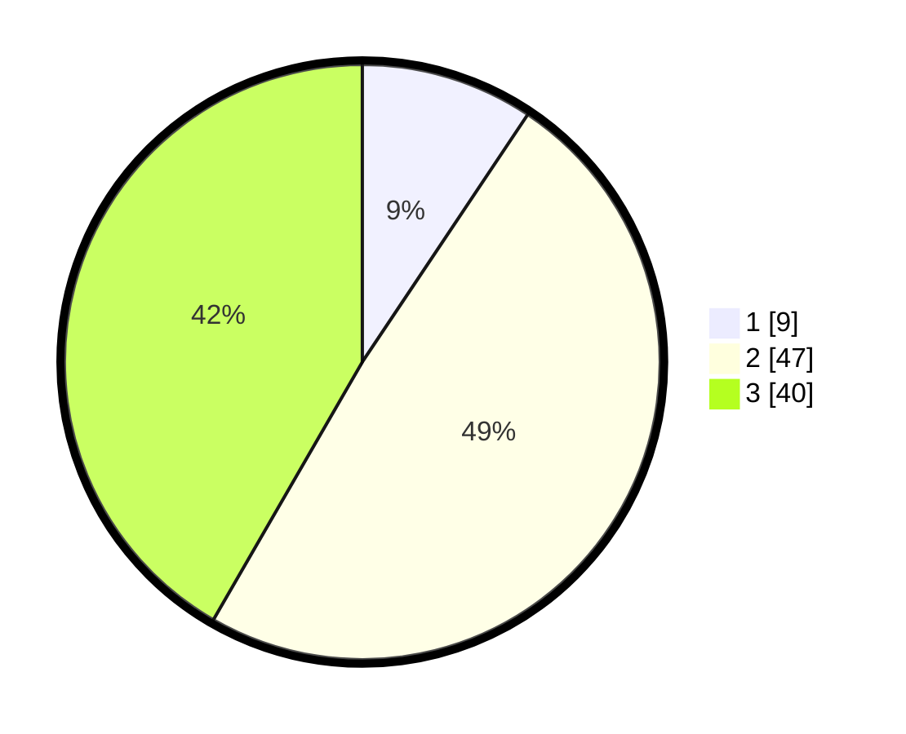

# Hasil

## Grafik

## Tabel

| No. | Nama Paslon    | Suara | Suara (raw) | Persentase |
|:--- |:-------------- | -----:| -----------:| ----------:|
| 1   | ANIES MUHAIMIN | 9     | [9][p-1]    | 9,38       |
| 2   | PRABOWO GIBRAN | 47    | [47][p-2]   | 48,96      |
| 3   | GANJAR MAHFUD  | 40    | [40][p-3]   | 41,67      |

[p-1]: https://github.com/gigit-pemilu/pemilu-2024-33-jawa-tengah/blob/main/pilpres/hitung-suara/sub/33-jawa-tengah/sub/02-banyumas/sub/02-wangon/sub/2001-randegan/sub/024-tps/sub/paslon-1.txt
[p-2]: https://github.com/gigit-pemilu/pemilu-2024-33-jawa-tengah/blob/main/pilpres/hitung-suara/sub/33-jawa-tengah/sub/02-banyumas/sub/02-wangon/sub/2001-randegan/sub/024-tps/sub/paslon-2.txt
[p-3]: https://github.com/gigit-pemilu/pemilu-2024-33-jawa-tengah/blob/main/pilpres/hitung-suara/sub/33-jawa-tengah/sub/02-banyumas/sub/02-wangon/sub/2001-randegan/sub/024-tps/sub/paslon-3.txt

## Foto C Plano

https://sirekap-obj-formc.kpu.go.id/70f7/pemilu/ppwp/33/02/02/20/01/3302022001024-20240214-202824--352c7279-26f1-43d4-97b5-ab16b3c66ebf.jpg

https://sirekap-obj-formc.kpu.go.id/70f7/pemilu/ppwp/33/02/02/20/01/3302022001024-20240214-191045--3da86483-daa2-4f34-b1f2-2f919d99cf51.jpg

https://sirekap-obj-formc.kpu.go.id/70f7/pemilu/ppwp/33/02/02/20/01/3302022001024-20240214-190751--a60fe56f-7f0c-4d06-b17c-f036e8454ccc.jpg

## Metadata

| Key        | Value               |
| ---------- | ------------------- |
| Time Stamp | 2024-02-15 00:41:44 |

