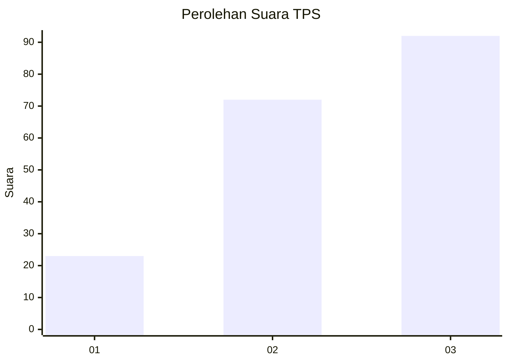
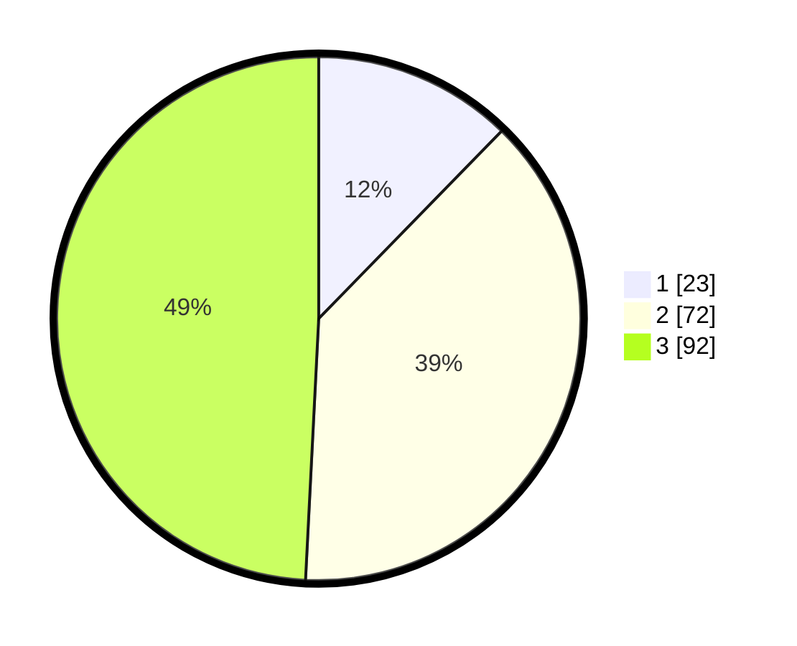

# Hasil

## Grafik

## Tabel

| No. | Nama Paslon    | Suara | Suara (raw) | Persentase |
|:--- |:-------------- | -----:| -----------:| ----------:|
| 1   | ANIES MUHAIMIN | 23    | [23][p-1]   | 12,30      |
| 2   | PRABOWO GIBRAN | 72    | [72][p-2]   | 38,50      |
| 3   | GANJAR MAHFUD  | 92    | [92][p-3]   | 49,20      |

[p-1]: https://github.com/gigit-pemilu/pemilu-2024-33-jawa-tengah/blob/main/pilpres/hitung-suara/sub/33-jawa-tengah/sub/02-banyumas/sub/02-wangon/sub/2002-rawaheng/sub/003-tps/sub/paslon-1.txt
[p-2]: https://github.com/gigit-pemilu/pemilu-2024-33-jawa-tengah/blob/main/pilpres/hitung-suara/sub/33-jawa-tengah/sub/02-banyumas/sub/02-wangon/sub/2002-rawaheng/sub/003-tps/sub/paslon-2.txt
[p-3]: https://github.com/gigit-pemilu/pemilu-2024-33-jawa-tengah/blob/main/pilpres/hitung-suara/sub/33-jawa-tengah/sub/02-banyumas/sub/02-wangon/sub/2002-rawaheng/sub/003-tps/sub/paslon-3.txt

## Foto C Plano

https://sirekap-obj-formc.kpu.go.id/3514/pemilu/ppwp/33/02/02/20/02/3302022002003-20240215-031240--0104a9d3-25a0-47cc-bf5f-bf730d88517c.jpg

https://sirekap-obj-formc.kpu.go.id/3514/pemilu/ppwp/33/02/02/20/02/3302022002003-20240215-031405--e6ae99a1-e256-4fa9-8cc1-62d150eb86f2.jpg

https://sirekap-obj-formc.kpu.go.id/3514/pemilu/ppwp/33/02/02/20/02/3302022002003-20240215-031509--875b3f1b-b1a2-40bc-a7c8-a322dd990756.jpg

## Metadata

| Key        | Value               |
| ---------- | ------------------- |
| Time Stamp | 2024-02-17 18:00:00 |

