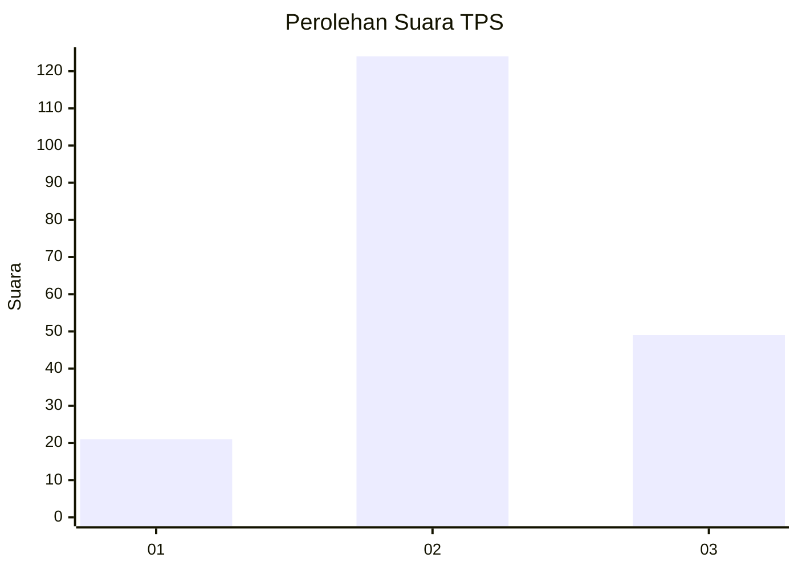
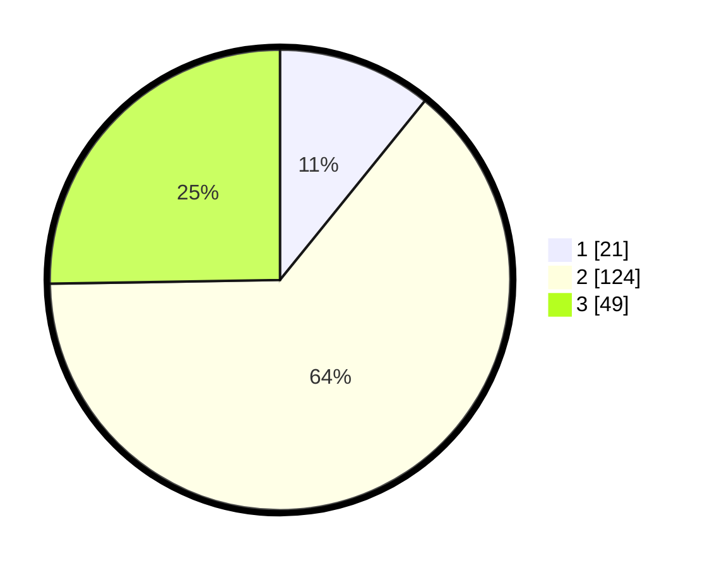

# Hasil

## Grafik

## Tabel

| No. | Nama Paslon    | Suara | Suara (raw) | Persentase |
|:--- |:-------------- | -----:| -----------:| ----------:|
| 1   | ANIES MUHAIMIN | 21    | [21][p-1]   | 10,82      |
| 2   | PRABOWO GIBRAN | 124   | [124][p-2]  | 63,92      |
| 3   | GANJAR MAHFUD  | 49    | [49][p-3]   | 25,26      |

[p-1]: https://github.com/gigit-pemilu/pemilu-2024/blob/main/pilpres/hitung-suara/sub/33-jawa-tengah/sub/02-banyumas/sub/02-wangon/sub/2002-rawaheng/sub/005-tps/sub/paslon-1.txt
[p-2]: https://github.com/gigit-pemilu/pemilu-2024/blob/main/pilpres/hitung-suara/sub/33-jawa-tengah/sub/02-banyumas/sub/02-wangon/sub/2002-rawaheng/sub/005-tps/sub/paslon-2.txt
[p-3]: https://github.com/gigit-pemilu/pemilu-2024/blob/main/pilpres/hitung-suara/sub/33-jawa-tengah/sub/02-banyumas/sub/02-wangon/sub/2002-rawaheng/sub/005-tps/sub/paslon-3.txt

## Foto C Plano

https://sirekap-obj-formc.kpu.go.id/3778/pemilu/ppwp/33/02/02/20/02/3302022002005-20240215-005310--ef56566f-781e-4dcf-992f-1da0d8730fec.jpg

https://sirekap-obj-formc.kpu.go.id/3778/pemilu/ppwp/33/02/02/20/02/3302022002005-20240215-011045--325380b5-c3ee-4517-bbf6-beeb8f097cfc.jpg

https://sirekap-obj-formc.kpu.go.id/3778/pemilu/ppwp/33/02/02/20/02/3302022002005-20240215-011222--1bd14105-d40f-4e62-bd9c-f7b4396e3184.jpg

## Metadata

| Key        | Value               |
| ---------- | ------------------- |
| Time Stamp | 2024-02-15 19:00:26 |

