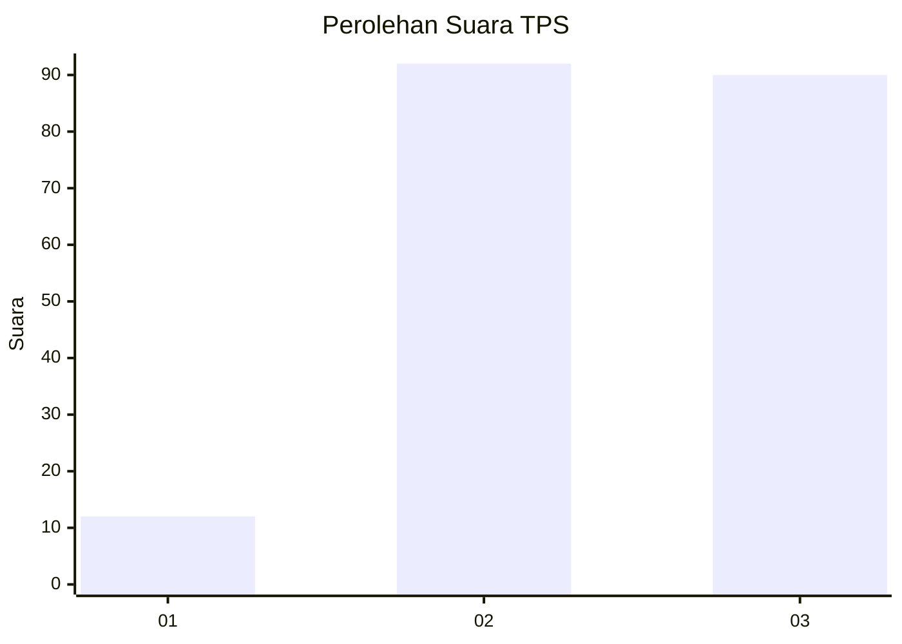
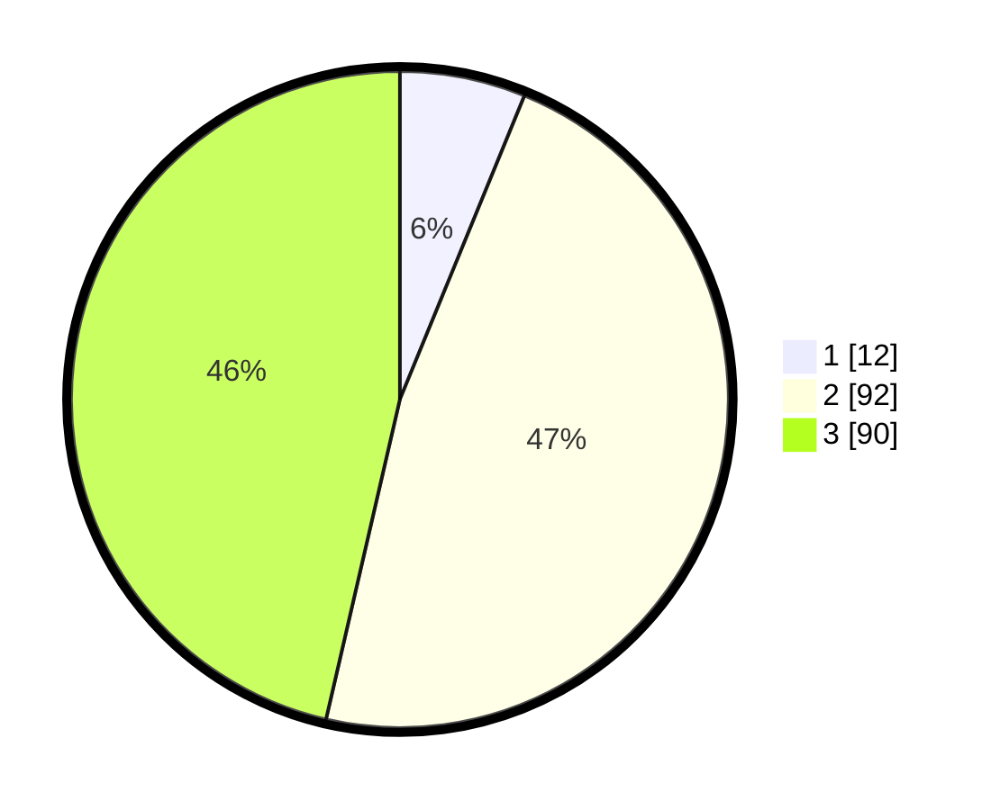

# Hasil

## Grafik

## Tabel

| No. | Nama Paslon    | Suara | Suara (raw) | Persentase |
|:--- |:-------------- | -----:| -----------:| ----------:|
| 1   | ANIES MUHAIMIN | 12    | [12][p-1]   | 6,19       |
| 2   | PRABOWO GIBRAN | 92    | [92][p-2]   | 47,42      |
| 3   | GANJAR MAHFUD  | 90    | [90][p-3]   | 46,39      |

[p-1]: https://github.com/gigit-pemilu/pemilu-2024-33-jawa-tengah/blob/main/pilpres/hitung-suara/sub/33-jawa-tengah/sub/02-banyumas/sub/02-wangon/sub/2003-pengadegan/sub/005-tps/sub/paslon-1.txt
[p-2]: https://github.com/gigit-pemilu/pemilu-2024-33-jawa-tengah/blob/main/pilpres/hitung-suara/sub/33-jawa-tengah/sub/02-banyumas/sub/02-wangon/sub/2003-pengadegan/sub/005-tps/sub/paslon-2.txt
[p-3]: https://github.com/gigit-pemilu/pemilu-2024-33-jawa-tengah/blob/main/pilpres/hitung-suara/sub/33-jawa-tengah/sub/02-banyumas/sub/02-wangon/sub/2003-pengadegan/sub/005-tps/sub/paslon-3.txt

## Foto C Plano

https://sirekap-obj-formc.kpu.go.id/7156/pemilu/ppwp/33/02/02/20/03/3302022003005-20240215-000446--d08860d1-b303-4503-b7ef-d3cb47b653fe.jpg

https://sirekap-obj-formc.kpu.go.id/7156/pemilu/ppwp/33/02/02/20/03/3302022003005-20240215-000527--59a1ffcd-ed19-4d65-a371-6201fd5af8b7.jpg

https://sirekap-obj-formc.kpu.go.id/7156/pemilu/ppwp/33/02/02/20/03/3302022003005-20240215-000556--f2da829c-23fd-483f-aa14-862bb00fd90b.jpg

## Metadata

| Key        | Value               |
| ---------- | ------------------- |
| Time Stamp | 2024-02-15 19:30:26 |

