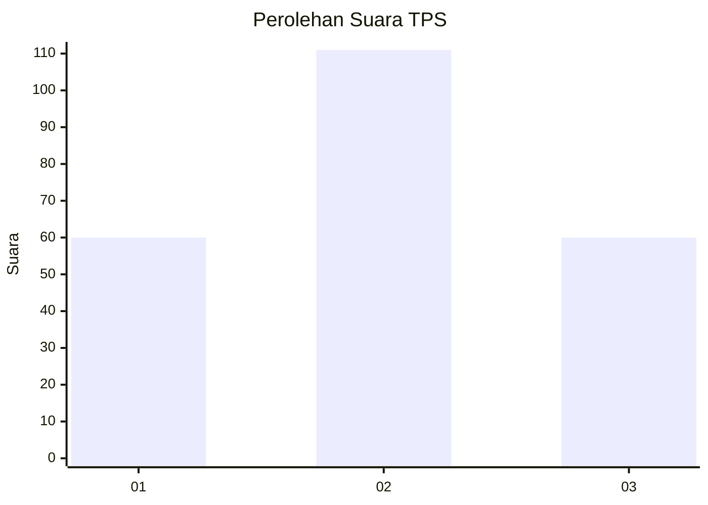
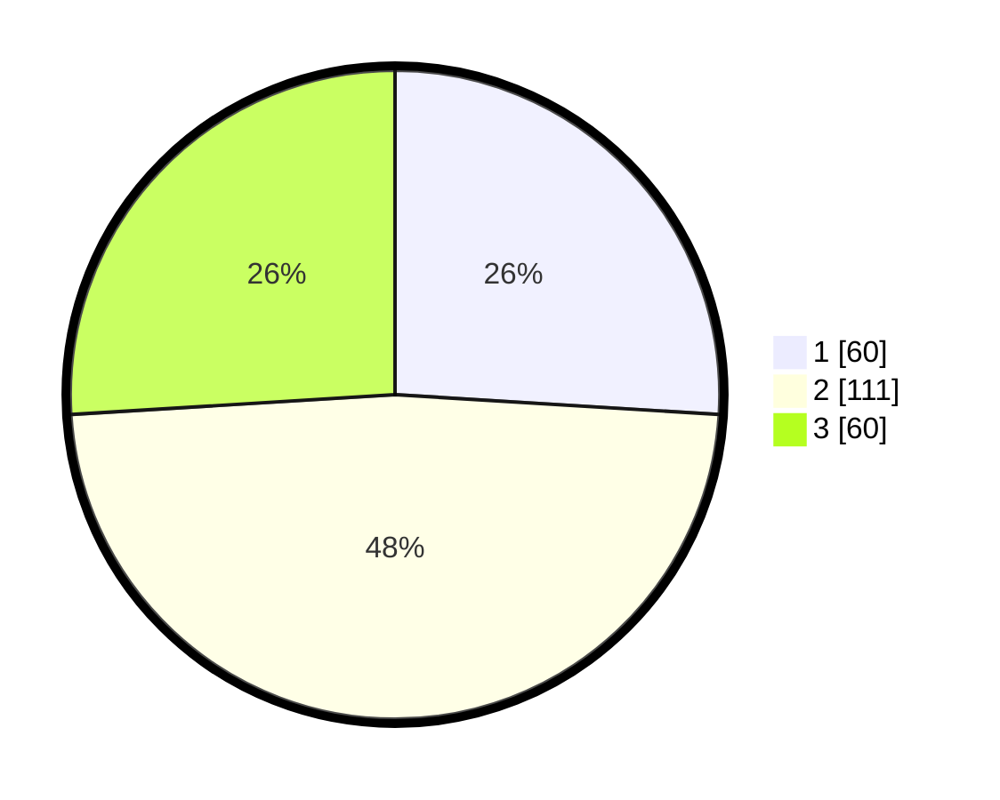

# Hasil

## Grafik

## Tabel

| No. | Nama Paslon    | Suara | Suara (raw) | Persentase |
|:--- |:-------------- | -----:| -----------:| ----------:|
| 1   | ANIES MUHAIMIN | 60    | [60][p-1]   | 25,97      |
| 2   | PRABOWO GIBRAN | 111   | [111][p-2]  | 48,05      |
| 3   | GANJAR MAHFUD  | 60    | [60][p-3]   | 25,97      |

[p-1]: https://github.com/gigit-pemilu/pemilu-2024/blob/main/pilpres/hitung-suara/sub/33-jawa-tengah/sub/02-banyumas/sub/02-wangon/sub/2005-wangon/sub/002-tps/sub/paslon-1.txt
[p-2]: https://github.com/gigit-pemilu/pemilu-2024/blob/main/pilpres/hitung-suara/sub/33-jawa-tengah/sub/02-banyumas/sub/02-wangon/sub/2005-wangon/sub/002-tps/sub/paslon-2.txt
[p-3]: https://github.com/gigit-pemilu/pemilu-2024/blob/main/pilpres/hitung-suara/sub/33-jawa-tengah/sub/02-banyumas/sub/02-wangon/sub/2005-wangon/sub/002-tps/sub/paslon-3.txt

## Foto C Plano

https://sirekap-obj-formc.kpu.go.id/00d9/pemilu/ppwp/33/02/02/20/05/3302022005002-20240214-222318--ab0811bf-5763-460c-9b8c-9c4be9d6861e.jpg

https://sirekap-obj-formc.kpu.go.id/00d9/pemilu/ppwp/33/02/02/20/05/3302022005002-20240215-020937--18b0c5ba-0bf9-4486-8dd2-cdaca598d9b2.jpg

https://sirekap-obj-formc.kpu.go.id/00d9/pemilu/ppwp/33/02/02/20/05/3302022005002-20240215-021043--8e57cebe-8d40-4e01-a39d-b8127e05ca8d.jpg

## Metadata

| Key        | Value               |
| ---------- | ------------------- |
| Time Stamp | 2024-02-17 18:00:00 |

