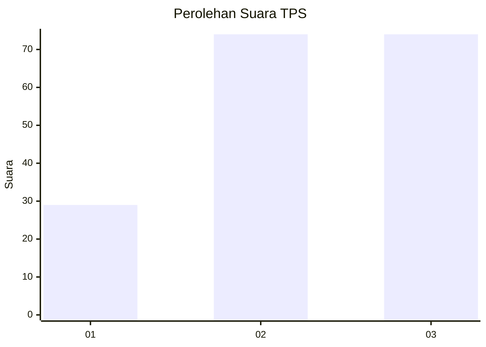
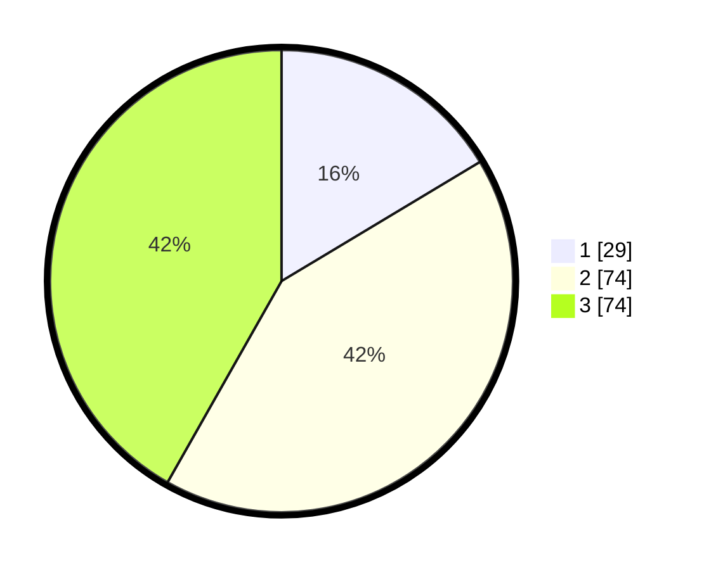

# Hasil

## Grafik

## Tabel

| No. | Nama Paslon    | Suara | Suara (raw) | Persentase |
|:--- |:-------------- | -----:| -----------:| ----------:|
| 1   | ANIES MUHAIMIN | 29    | [29][p-1]   | 16,38      |
| 2   | PRABOWO GIBRAN | 74    | [74][p-2]   | 41,81      |
| 3   | GANJAR MAHFUD  | 74    | [74][p-3]   | 41,81      |

[p-1]: https://github.com/gigit-pemilu/pemilu-2024-33-jawa-tengah/blob/main/pilpres/hitung-suara/sub/33-jawa-tengah/sub/02-banyumas/sub/02-wangon/sub/2006-banteran/sub/009-tps/sub/paslon-1.txt
[p-2]: https://github.com/gigit-pemilu/pemilu-2024-33-jawa-tengah/blob/main/pilpres/hitung-suara/sub/33-jawa-tengah/sub/02-banyumas/sub/02-wangon/sub/2006-banteran/sub/009-tps/sub/paslon-2.txt
[p-3]: https://github.com/gigit-pemilu/pemilu-2024-33-jawa-tengah/blob/main/pilpres/hitung-suara/sub/33-jawa-tengah/sub/02-banyumas/sub/02-wangon/sub/2006-banteran/sub/009-tps/sub/paslon-3.txt

## Foto C Plano

https://sirekap-obj-formc.kpu.go.id/2253/pemilu/ppwp/33/02/02/20/06/3302022006009-20240214-211757--524e2b60-f6ef-4194-a642-0b6757ab5c06.jpg

https://sirekap-obj-formc.kpu.go.id/2253/pemilu/ppwp/33/02/02/20/06/3302022006009-20240214-212620--10603684-0d46-4400-8f77-67e62fcb4d6e.jpg

https://sirekap-obj-formc.kpu.go.id/2253/pemilu/ppwp/33/02/02/20/06/3302022006009-20240214-212720--c9ef767a-2fea-4f8b-bfce-3697254fa472.jpg

## Metadata

| Key        | Value               |
| ---------- | ------------------- |
| Time Stamp | 2024-02-15 00:41:44 |

