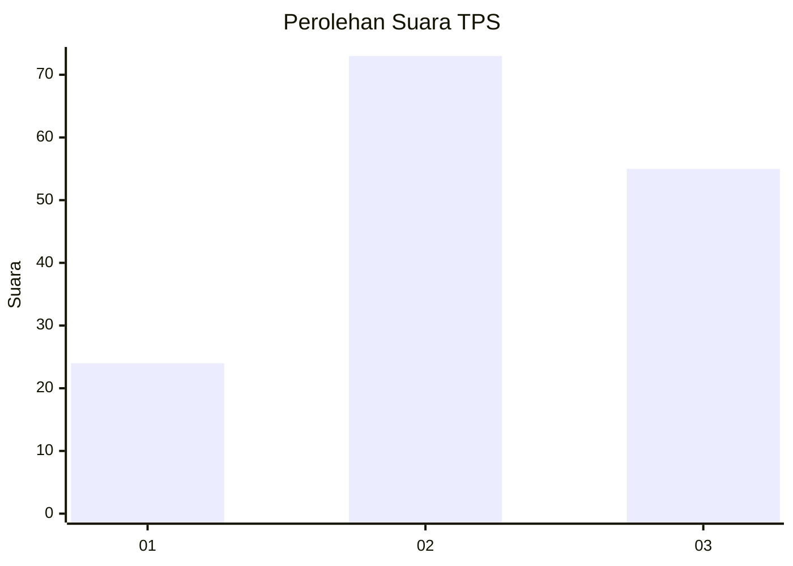
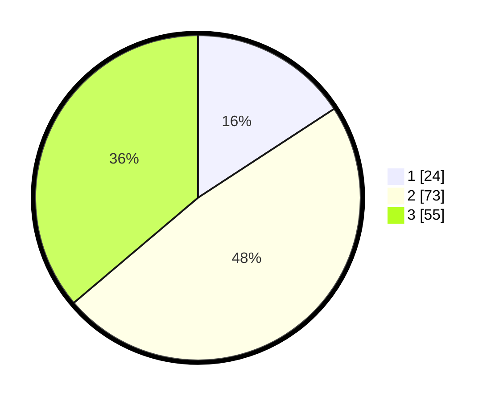

# Hasil

## Grafik

## Tabel

| No. | Nama Paslon    | Suara | Suara (raw) | Persentase |
|:--- |:-------------- | -----:| -----------:| ----------:|
| 1   | ANIES MUHAIMIN | 24    | [24][p-1]   | 15,79      |
| 2   | PRABOWO GIBRAN | 73    | [73][p-2]   | 48,03      |
| 3   | GANJAR MAHFUD  | 55    | [55][p-3]   | 36,18      |

[p-1]: https://github.com/gigit-pemilu/pemilu-2024-33-jawa-tengah/blob/main/pilpres/hitung-suara/sub/33-jawa-tengah/sub/02-banyumas/sub/02-wangon/sub/2007-jambu/sub/015-tps/sub/paslon-1.txt
[p-2]: https://github.com/gigit-pemilu/pemilu-2024-33-jawa-tengah/blob/main/pilpres/hitung-suara/sub/33-jawa-tengah/sub/02-banyumas/sub/02-wangon/sub/2007-jambu/sub/015-tps/sub/paslon-2.txt
[p-3]: https://github.com/gigit-pemilu/pemilu-2024-33-jawa-tengah/blob/main/pilpres/hitung-suara/sub/33-jawa-tengah/sub/02-banyumas/sub/02-wangon/sub/2007-jambu/sub/015-tps/sub/paslon-3.txt

## Foto C Plano

https://sirekap-obj-formc.kpu.go.id/737f/pemilu/ppwp/33/02/02/20/07/3302022007015-20240214-185144--0e2271a4-245e-4bac-b6f1-8b8074d77a88.jpg

https://sirekap-obj-formc.kpu.go.id/737f/pemilu/ppwp/33/02/02/20/07/3302022007015-20240214-184541--97a576bc-3586-4568-8698-4905d5736efb.jpg

https://sirekap-obj-formc.kpu.go.id/737f/pemilu/ppwp/33/02/02/20/07/3302022007015-20240214-184937--850e70d5-f12a-49cf-8e70-ec1cc95a7010.jpg

## Metadata

| Key        | Value               |
| ---------- | ------------------- |
| Time Stamp | 2024-02-17 18:30:00 |

