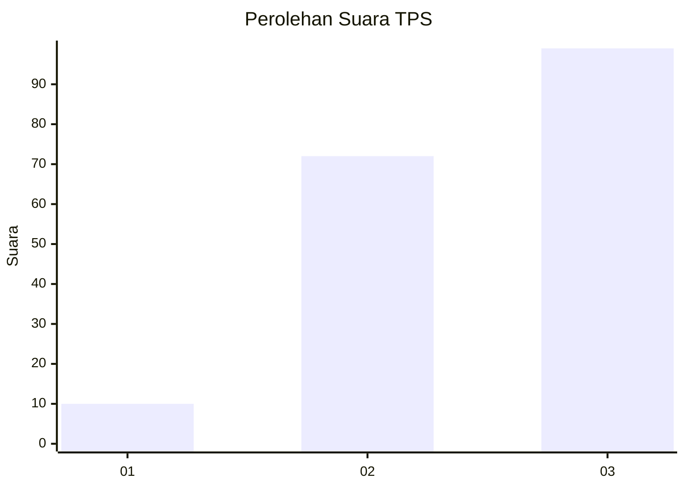
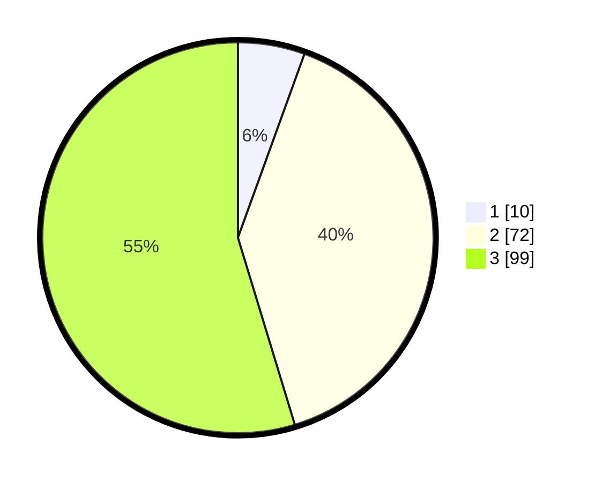

# Hasil

## Grafik

## Tabel

| No. | Nama Paslon    | Suara | Suara (raw) | Persentase |
|:--- |:-------------- | -----:| -----------:| ----------:|
| 1   | ANIES MUHAIMIN | 10    | [10][p-1]   | 5,52       |
| 2   | PRABOWO GIBRAN | 72    | [72][p-2]   | 39,78      |
| 3   | GANJAR MAHFUD  | 99    | [99][p-3]   | 54,70      |

[p-1]: https://github.com/gigit-pemilu/pemilu-2024/blob/main/pilpres/hitung-suara/sub/33-jawa-tengah/sub/02-banyumas/sub/02-wangon/sub/2007-jambu/sub/020-tps/sub/paslon-1.txt
[p-2]: https://github.com/gigit-pemilu/pemilu-2024/blob/main/pilpres/hitung-suara/sub/33-jawa-tengah/sub/02-banyumas/sub/02-wangon/sub/2007-jambu/sub/020-tps/sub/paslon-2.txt
[p-3]: https://github.com/gigit-pemilu/pemilu-2024/blob/main/pilpres/hitung-suara/sub/33-jawa-tengah/sub/02-banyumas/sub/02-wangon/sub/2007-jambu/sub/020-tps/sub/paslon-3.txt

## Foto C Plano

https://sirekap-obj-formc.kpu.go.id/db50/pemilu/ppwp/33/02/02/20/07/3302022007020-20240214-214715--09e240dc-dc5a-4cf1-b81c-c6a8bcf9c8bc.jpg

https://sirekap-obj-formc.kpu.go.id/db50/pemilu/ppwp/33/02/02/20/07/3302022007020-20240214-222448--9b66bef5-9c97-4875-8649-7bf2b16b1f1d.jpg

https://sirekap-obj-formc.kpu.go.id/db50/pemilu/ppwp/33/02/02/20/07/3302022007020-20240214-223049--b45ebb2c-44ce-4218-908b-765255a0ef67.jpg

## Metadata

| Key        | Value               |
| ---------- | ------------------- |
| Time Stamp | 2024-02-16 01:00:27 |

