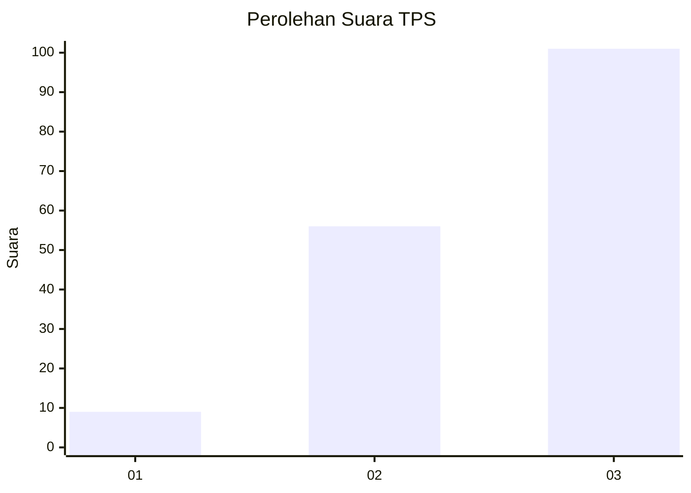
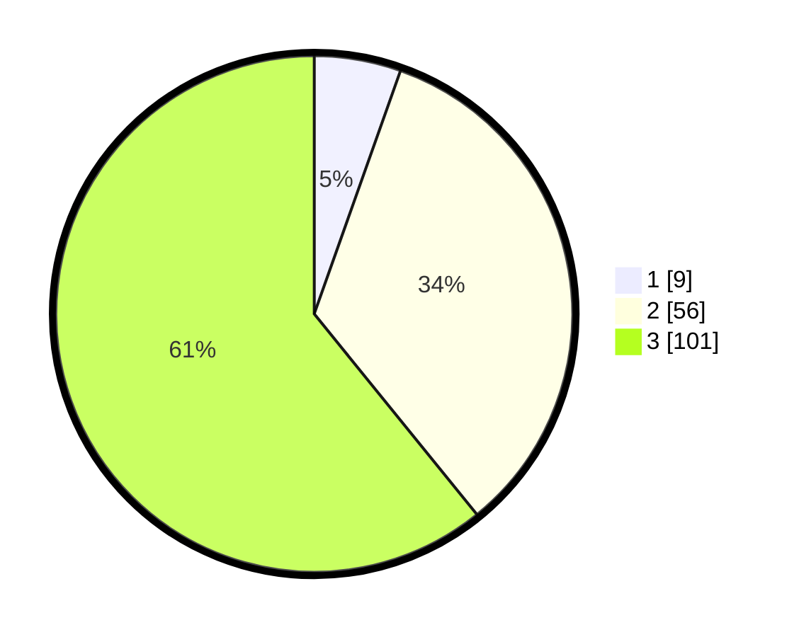

# Hasil

## Grafik

## Tabel

| No. | Nama Paslon    | Suara | Suara (raw) | Persentase |
|:--- |:-------------- | -----:| -----------:| ----------:|
| 1   | ANIES MUHAIMIN | 9     | [9][p-1]    | 5,42       |
| 2   | PRABOWO GIBRAN | 56    | [56][p-2]   | 33,73      |
| 3   | GANJAR MAHFUD  | 101   | [101][p-3]  | 60,84      |

[p-1]: https://github.com/gigit-pemilu/pemilu-2024/blob/main/pilpres/hitung-suara/sub/33-jawa-tengah/sub/02-banyumas/sub/02-wangon/sub/2007-jambu/sub/021-tps/sub/paslon-1.txt
[p-2]: https://github.com/gigit-pemilu/pemilu-2024/blob/main/pilpres/hitung-suara/sub/33-jawa-tengah/sub/02-banyumas/sub/02-wangon/sub/2007-jambu/sub/021-tps/sub/paslon-2.txt
[p-3]: https://github.com/gigit-pemilu/pemilu-2024/blob/main/pilpres/hitung-suara/sub/33-jawa-tengah/sub/02-banyumas/sub/02-wangon/sub/2007-jambu/sub/021-tps/sub/paslon-3.txt

## Foto C Plano

https://sirekap-obj-formc.kpu.go.id/d77c/pemilu/ppwp/33/02/02/20/07/3302022007021-20240215-002912--18fb0bab-aaf3-4a70-8c9a-5f9ff0e80559.jpg

https://sirekap-obj-formc.kpu.go.id/d77c/pemilu/ppwp/33/02/02/20/07/3302022007021-20240215-004228--16ff6234-c565-487a-8562-3baa246744c5.jpg

https://sirekap-obj-formc.kpu.go.id/d77c/pemilu/ppwp/33/02/02/20/07/3302022007021-20240215-004701--6d173df5-a8af-4295-aba4-8533bda65953.jpg

## Metadata

| Key        | Value               |
| ---------- | ------------------- |
| Time Stamp | 2024-02-17 18:30:00 |

