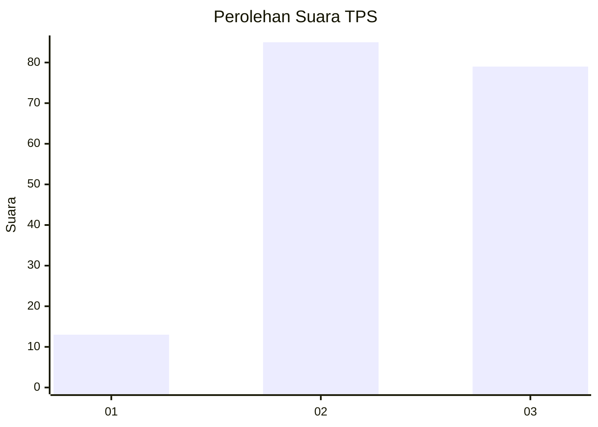
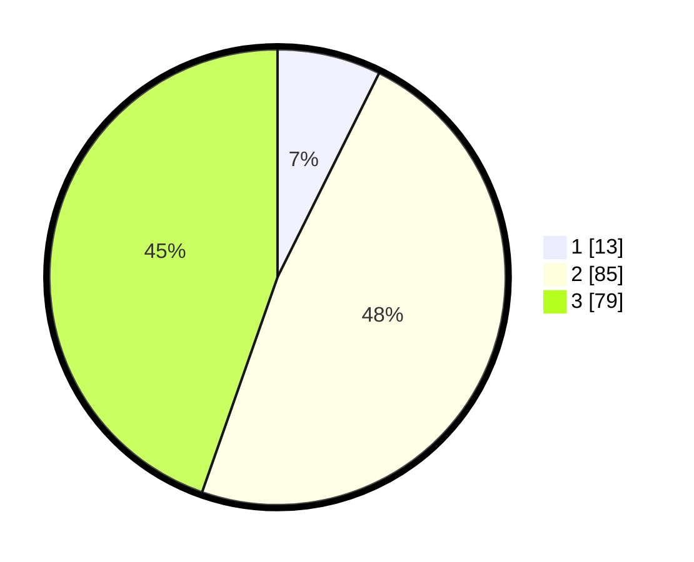

# Hasil

## Grafik

## Tabel

| No. | Nama Paslon    | Suara | Suara (raw) | Persentase |
|:--- |:-------------- | -----:| -----------:| ----------:|
| 1   | ANIES MUHAIMIN | 13    | [13][p-1]   | 7,34       |
| 2   | PRABOWO GIBRAN | 85    | [85][p-2]   | 48,02      |
| 3   | GANJAR MAHFUD  | 79    | [79][p-3]   | 44,63      |

[p-1]: https://github.com/gigit-pemilu/pemilu-2024/blob/main/pilpres/hitung-suara/sub/33-jawa-tengah/sub/02-banyumas/sub/02-wangon/sub/2007-jambu/sub/022-tps/sub/paslon-1.txt
[p-2]: https://github.com/gigit-pemilu/pemilu-2024/blob/main/pilpres/hitung-suara/sub/33-jawa-tengah/sub/02-banyumas/sub/02-wangon/sub/2007-jambu/sub/022-tps/sub/paslon-2.txt
[p-3]: https://github.com/gigit-pemilu/pemilu-2024/blob/main/pilpres/hitung-suara/sub/33-jawa-tengah/sub/02-banyumas/sub/02-wangon/sub/2007-jambu/sub/022-tps/sub/paslon-3.txt

## Foto C Plano

https://sirekap-obj-formc.kpu.go.id/2760/pemilu/ppwp/33/02/02/20/07/3302022007022-20240215-004332--e298bd90-ac8a-492f-8abb-526ba926e577.jpg

https://sirekap-obj-formc.kpu.go.id/2760/pemilu/ppwp/33/02/02/20/07/3302022007022-20240215-004558--85aa4412-0d17-43fd-9454-ff607cd3b7bd.jpg

https://sirekap-obj-formc.kpu.go.id/2760/pemilu/ppwp/33/02/02/20/07/3302022007022-20240215-004728--7b6b9dbc-e9af-4d87-8bf8-0c3ff27a86bb.jpg

## Metadata

| Key        | Value               |
| ---------- | ------------------- |
| Time Stamp | 2024-02-17 19:30:00 |

