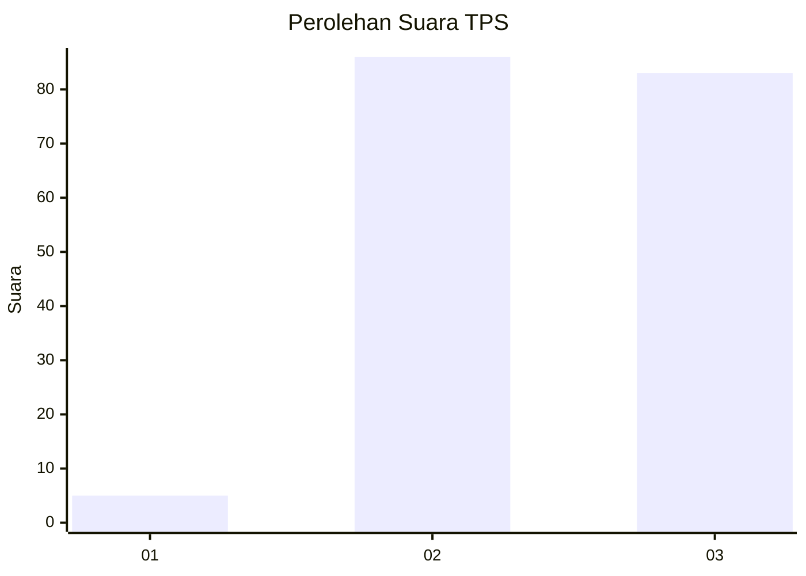
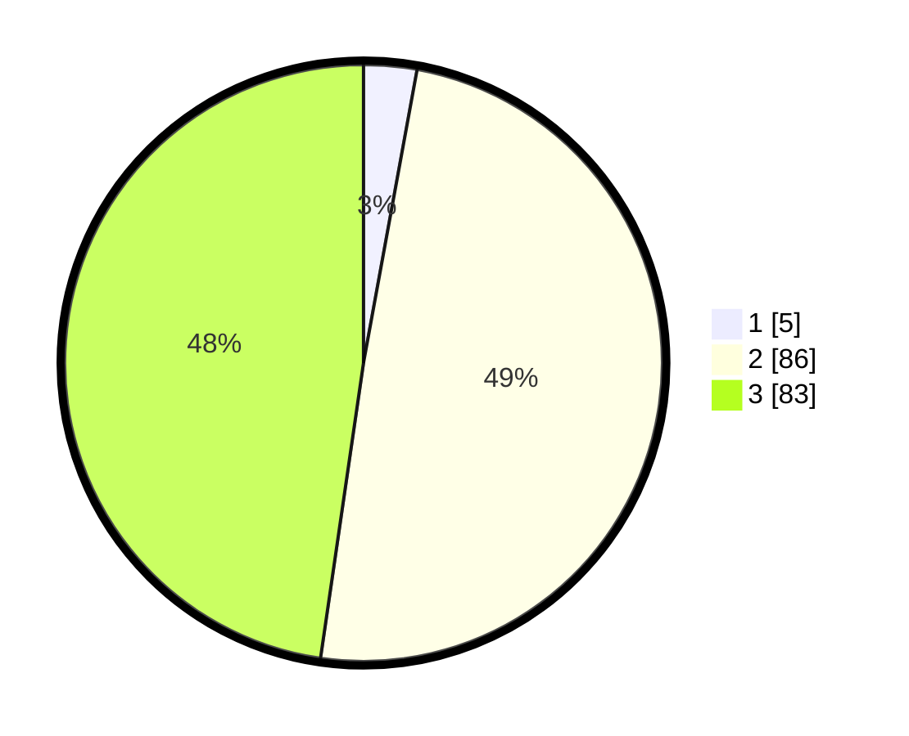

# Hasil

## Grafik

## Tabel

| No. | Nama Paslon    | Suara | Suara (raw) | Persentase |
|:--- |:-------------- | -----:| -----------:| ----------:|
| 1   | ANIES MUHAIMIN | 5     | [5][p-1]    | 2,87       |
| 2   | PRABOWO GIBRAN | 86    | [86][p-2]   | 49,43      |
| 3   | GANJAR MAHFUD  | 83    | [83][p-3]   | 47,70      |

[p-1]: https://github.com/gigit-pemilu/pemilu-2024-33-jawa-tengah/blob/main/pilpres/hitung-suara/sub/33-jawa-tengah/sub/02-banyumas/sub/03-jatilawang/sub/2002-pekuncen/sub/003-tps/sub/paslon-1.txt
[p-2]: https://github.com/gigit-pemilu/pemilu-2024-33-jawa-tengah/blob/main/pilpres/hitung-suara/sub/33-jawa-tengah/sub/02-banyumas/sub/03-jatilawang/sub/2002-pekuncen/sub/003-tps/sub/paslon-2.txt
[p-3]: https://github.com/gigit-pemilu/pemilu-2024-33-jawa-tengah/blob/main/pilpres/hitung-suara/sub/33-jawa-tengah/sub/02-banyumas/sub/03-jatilawang/sub/2002-pekuncen/sub/003-tps/sub/paslon-3.txt

## Foto C Plano

https://sirekap-obj-formc.kpu.go.id/9f0e/pemilu/ppwp/33/02/03/20/02/3302032002003-20240214-230911--b8896e64-b428-4d67-a853-c039e2e0844f.jpg

https://sirekap-obj-formc.kpu.go.id/9f0e/pemilu/ppwp/33/02/03/20/02/3302032002003-20240214-230742--1e80fa14-50cc-4ef1-b17c-f294b14f3da1.jpg

https://sirekap-obj-formc.kpu.go.id/9f0e/pemilu/ppwp/33/02/03/20/02/3302032002003-20240214-231017--b653e32f-7798-43f3-8287-58d2ea6d88ca.jpg

## Metadata

| Key        | Value               |
| ---------- | ------------------- |
| Time Stamp | 2024-02-16 23:00:00 |

