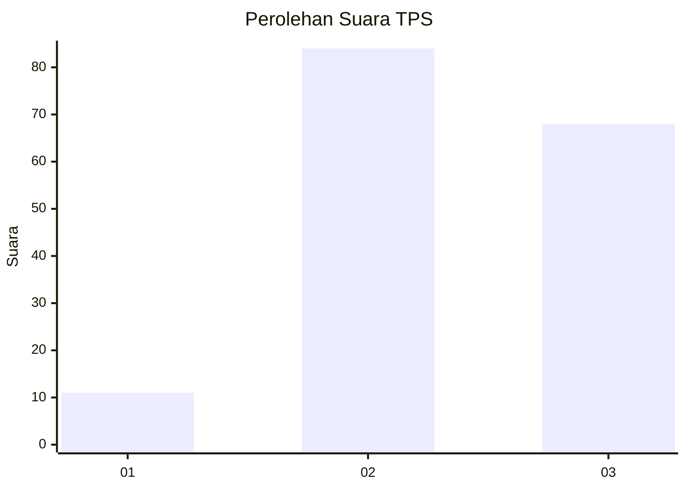
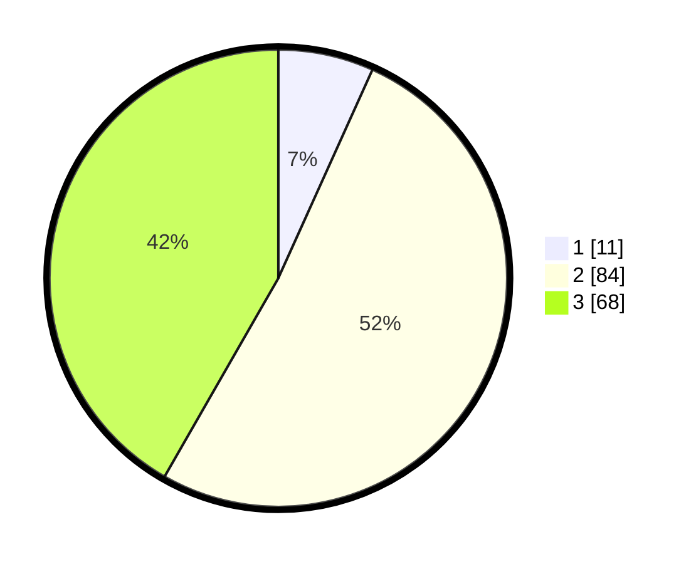

# Hasil

## Grafik

## Tabel

| No. | Nama Paslon    | Suara | Suara (raw) | Persentase |
|:--- |:-------------- | -----:| -----------:| ----------:|
| 1   | ANIES MUHAIMIN | 11    | [11][p-1]   | 6,75       |
| 2   | PRABOWO GIBRAN | 84    | [84][p-2]   | 51,53      |
| 3   | GANJAR MAHFUD  | 68    | [68][p-3]   | 41,72      |

[p-1]: https://github.com/gigit-pemilu/pemilu-2024-33-jawa-tengah/blob/main/pilpres/hitung-suara/sub/33-jawa-tengah/sub/02-banyumas/sub/03-jatilawang/sub/2003-karanglewas/sub/003-tps/sub/paslon-1.txt
[p-2]: https://github.com/gigit-pemilu/pemilu-2024-33-jawa-tengah/blob/main/pilpres/hitung-suara/sub/33-jawa-tengah/sub/02-banyumas/sub/03-jatilawang/sub/2003-karanglewas/sub/003-tps/sub/paslon-2.txt
[p-3]: https://github.com/gigit-pemilu/pemilu-2024-33-jawa-tengah/blob/main/pilpres/hitung-suara/sub/33-jawa-tengah/sub/02-banyumas/sub/03-jatilawang/sub/2003-karanglewas/sub/003-tps/sub/paslon-3.txt

## Foto C Plano

https://sirekap-obj-formc.kpu.go.id/f396/pemilu/ppwp/33/02/03/20/03/3302032003003-20240215-041223--5afe258e-3f6b-4b38-9d2b-8e297058f8b7.jpg

https://sirekap-obj-formc.kpu.go.id/f396/pemilu/ppwp/33/02/03/20/03/3302032003003-20240215-041358--1c759119-6b8f-42da-b2d3-aff28b93987d.jpg

https://sirekap-obj-formc.kpu.go.id/f396/pemilu/ppwp/33/02/03/20/03/3302032003003-20240215-041513--457fa211-9102-42c4-9fee-ad20ba4f0fea.jpg

## Metadata

| Key        | Value               |
| ---------- | ------------------- |
| Time Stamp | 2024-02-16 21:01:00 |

