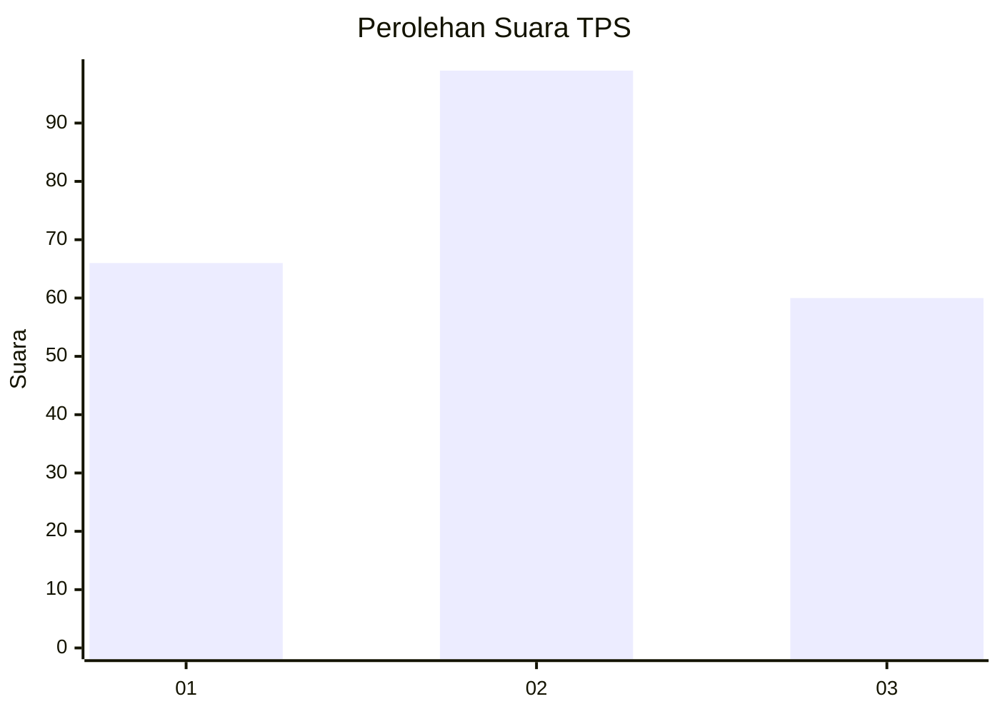
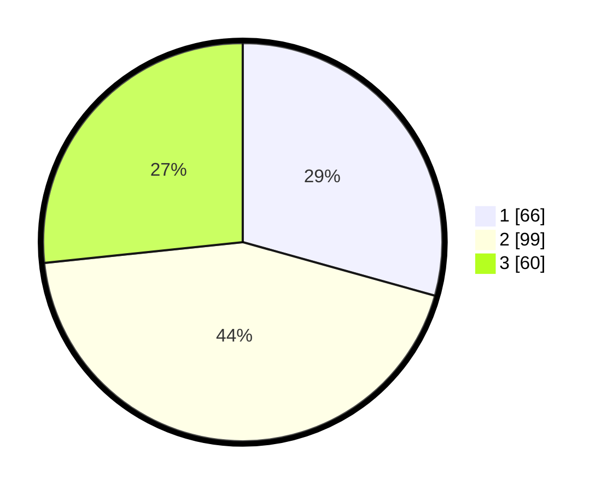

# Hasil

## Grafik

## Tabel

| No. | Nama Paslon    | Suara | Suara (raw) | Persentase |
|:--- |:-------------- | -----:| -----------:| ----------:|
| 1   | ANIES MUHAIMIN | 66    | [66][p-1]   | 29,33      |
| 2   | PRABOWO GIBRAN | 99    | [99][p-2]   | 44,00      |
| 3   | GANJAR MAHFUD  | 60    | [60][p-3]   | 26,67      |

[p-1]: https://github.com/gigit-pemilu/pemilu-2024/blob/main/pilpres/hitung-suara/sub/33-jawa-tengah/sub/02-banyumas/sub/03-jatilawang/sub/2003-karanglewas/sub/004-tps/sub/paslon-1.txt
[p-2]: https://github.com/gigit-pemilu/pemilu-2024/blob/main/pilpres/hitung-suara/sub/33-jawa-tengah/sub/02-banyumas/sub/03-jatilawang/sub/2003-karanglewas/sub/004-tps/sub/paslon-2.txt
[p-3]: https://github.com/gigit-pemilu/pemilu-2024/blob/main/pilpres/hitung-suara/sub/33-jawa-tengah/sub/02-banyumas/sub/03-jatilawang/sub/2003-karanglewas/sub/004-tps/sub/paslon-3.txt

## Foto C Plano

https://sirekap-obj-formc.kpu.go.id/d039/pemilu/ppwp/33/02/03/20/03/3302032003004-20240215-003600--db36efdc-5257-4490-bf71-3246c835cbcb.jpg

https://sirekap-obj-formc.kpu.go.id/d039/pemilu/ppwp/33/02/03/20/03/3302032003004-20240214-211815--90b721ba-244c-4833-a22f-70269cd65156.jpg

https://sirekap-obj-formc.kpu.go.id/d039/pemilu/ppwp/33/02/03/20/03/3302032003004-20240214-210035--fb405a58-5fba-4617-b749-d00fc1b4415d.jpg

## Metadata

| Key        | Value               |
| ---------- | ------------------- |
| Time Stamp | 2024-02-16 21:01:00 |

