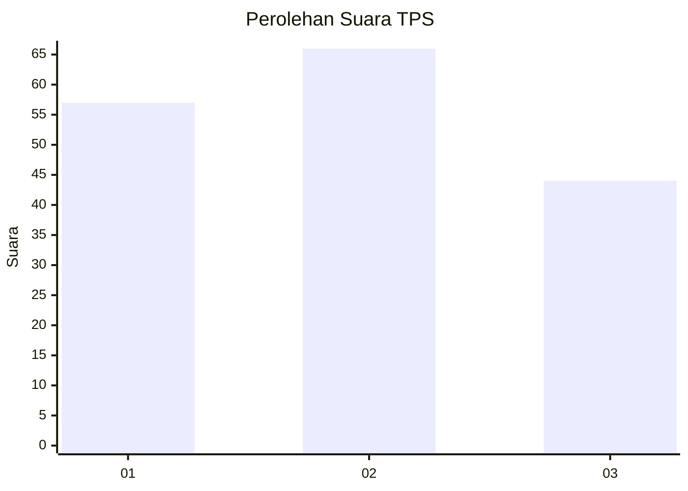
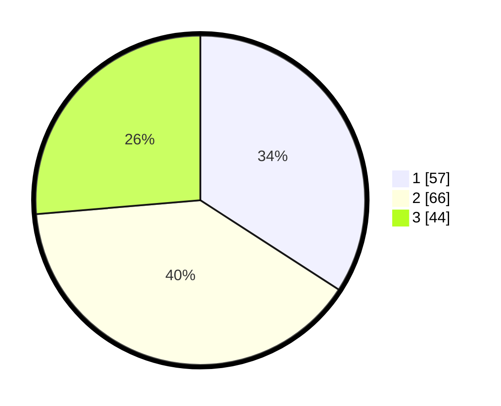

# Hasil

## Grafik

## Tabel

| No. | Nama Paslon    | Suara | Suara (raw) | Persentase |
|:--- |:-------------- | -----:| -----------:| ----------:|
| 1   | ANIES MUHAIMIN | 57    | [57][p-1]   | 34,13      |
| 2   | PRABOWO GIBRAN | 66    | [66][p-2]   | 39,52      |
| 3   | GANJAR MAHFUD  | 44    | [44][p-3]   | 26,35      |

[p-1]: https://github.com/gigit-pemilu/pemilu-2024/blob/main/pilpres/hitung-suara/sub/33-jawa-tengah/sub/02-banyumas/sub/03-jatilawang/sub/2009-tinggarjaya/sub/010-tps/sub/paslon-1.txt
[p-2]: https://github.com/gigit-pemilu/pemilu-2024/blob/main/pilpres/hitung-suara/sub/33-jawa-tengah/sub/02-banyumas/sub/03-jatilawang/sub/2009-tinggarjaya/sub/010-tps/sub/paslon-2.txt
[p-3]: https://github.com/gigit-pemilu/pemilu-2024/blob/main/pilpres/hitung-suara/sub/33-jawa-tengah/sub/02-banyumas/sub/03-jatilawang/sub/2009-tinggarjaya/sub/010-tps/sub/paslon-3.txt

## Foto C Plano

https://sirekap-obj-formc.kpu.go.id/6909/pemilu/ppwp/33/02/03/20/09/3302032009010-20240214-203932--4c5bc94a-c263-4175-a1e3-13e857cca33a.jpg

https://sirekap-obj-formc.kpu.go.id/6909/pemilu/ppwp/33/02/03/20/09/3302032009010-20240214-141652--fbe70e4c-0bf0-40b6-ba09-088265f6e5fc.jpg

https://sirekap-obj-formc.kpu.go.id/6909/pemilu/ppwp/33/02/03/20/09/3302032009010-20240214-141720--64e4c626-664a-4665-8b18-d3b1ed386371.jpg

## Metadata

| Key        | Value               |
| ---------- | ------------------- |
| Time Stamp | 2024-02-14 21:46:01 |

