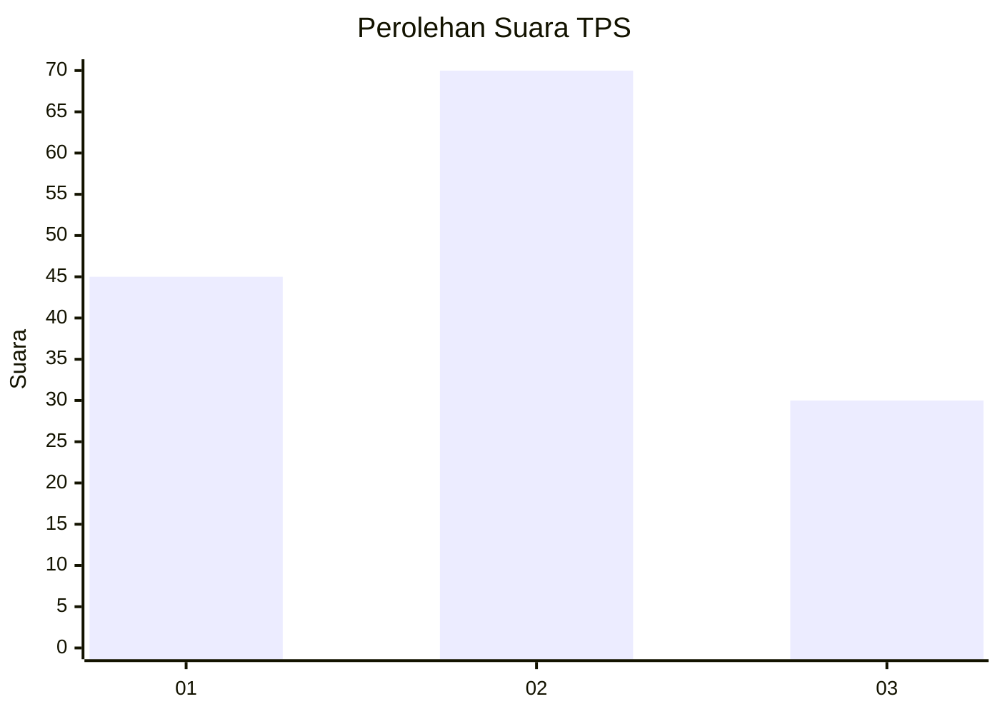
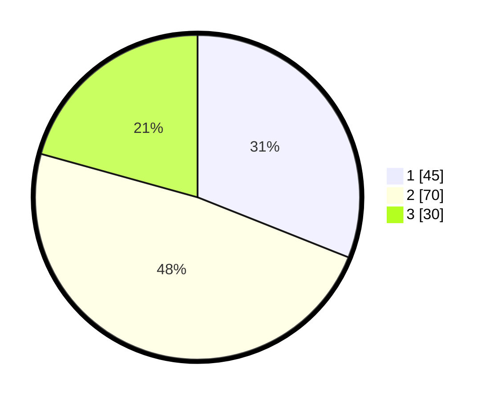

# Hasil

## Grafik

## Tabel

| No. | Nama Paslon    | Suara | Suara (raw) | Persentase |
|:--- |:-------------- | -----:| -----------:| ----------:|
| 1   | ANIES MUHAIMIN | 45    | [45][p-1]   | 31,03      |
| 2   | PRABOWO GIBRAN | 70    | [70][p-2]   | 48,28      |
| 3   | GANJAR MAHFUD  | 30    | [30][p-3]   | 20,69      |

[p-1]: https://github.com/gigit-pemilu/pemilu-2024/blob/main/pilpres/hitung-suara/sub/33-jawa-tengah/sub/02-banyumas/sub/03-jatilawang/sub/2009-tinggarjaya/sub/022-tps/sub/paslon-1.txt
[p-2]: https://github.com/gigit-pemilu/pemilu-2024/blob/main/pilpres/hitung-suara/sub/33-jawa-tengah/sub/02-banyumas/sub/03-jatilawang/sub/2009-tinggarjaya/sub/022-tps/sub/paslon-2.txt
[p-3]: https://github.com/gigit-pemilu/pemilu-2024/blob/main/pilpres/hitung-suara/sub/33-jawa-tengah/sub/02-banyumas/sub/03-jatilawang/sub/2009-tinggarjaya/sub/022-tps/sub/paslon-3.txt

## Foto C Plano

https://sirekap-obj-formc.kpu.go.id/b467/pemilu/ppwp/33/02/03/20/09/3302032009022-20240214-221438--27447e22-e14e-4d2e-9891-e2a8467829a7.jpg

https://sirekap-obj-formc.kpu.go.id/b467/pemilu/ppwp/33/02/03/20/09/3302032009022-20240217-192648--cf51f1e5-d557-4ec0-9e8d-1effc024d00f.jpg

https://sirekap-obj-formc.kpu.go.id/b467/pemilu/ppwp/33/02/03/20/09/3302032009022-20240214-221612--c33c0ad1-07f9-4b89-a650-9acd30ff132f.jpg

## Metadata

| Key        | Value               |
| ---------- | ------------------- |
| Time Stamp | 2024-02-24 22:31:28 |

