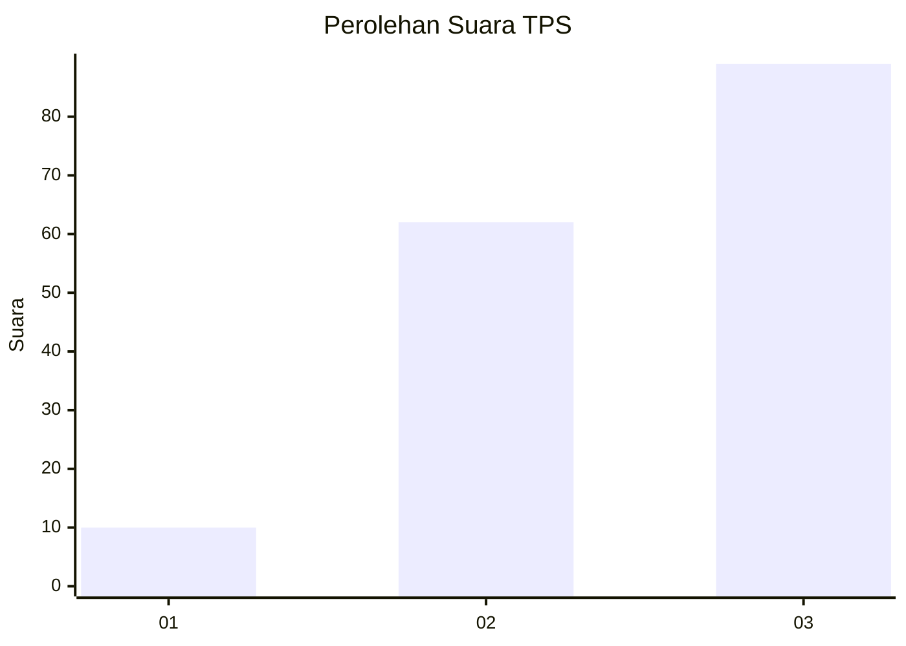
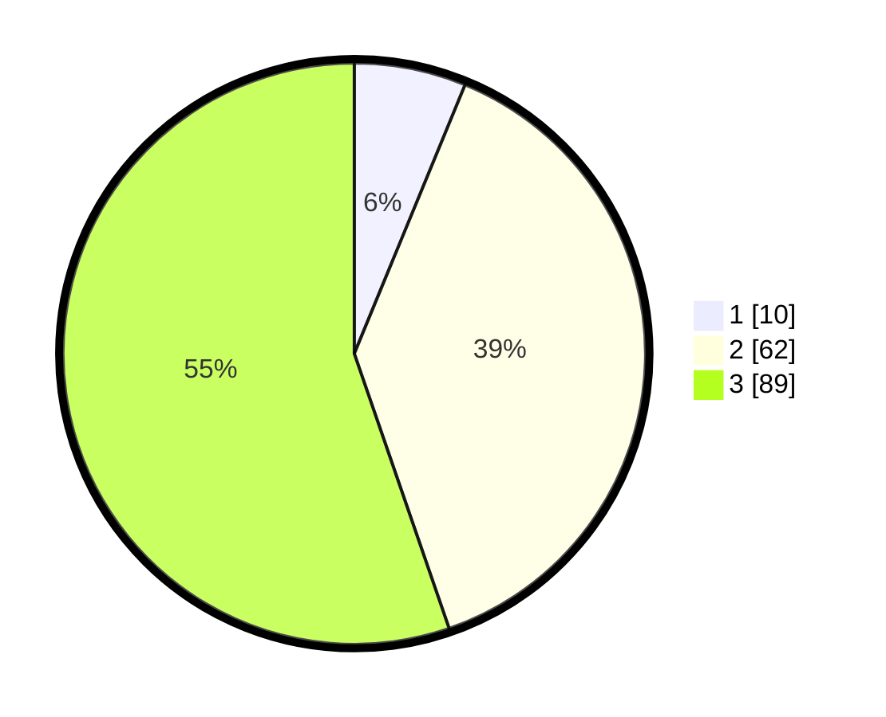

# Hasil

## Grafik

## Tabel

| No. | Nama Paslon    | Suara | Suara (raw) | Persentase |
|:--- |:-------------- | -----:| -----------:| ----------:|
| 1   | ANIES MUHAIMIN | 10    | [10][p-1]   | 6,21       |
| 2   | PRABOWO GIBRAN | 62    | [62][p-2]   | 38,51      |
| 3   | GANJAR MAHFUD  | 89    | [89][p-3]   | 55,28      |

[p-1]: https://github.com/gigit-pemilu/pemilu-2024-33-jawa-tengah/blob/main/pilpres/hitung-suara/sub/33-jawa-tengah/sub/02-banyumas/sub/03-jatilawang/sub/2011-gentawangi/sub/004-tps/sub/paslon-1.txt
[p-2]: https://github.com/gigit-pemilu/pemilu-2024-33-jawa-tengah/blob/main/pilpres/hitung-suara/sub/33-jawa-tengah/sub/02-banyumas/sub/03-jatilawang/sub/2011-gentawangi/sub/004-tps/sub/paslon-2.txt
[p-3]: https://github.com/gigit-pemilu/pemilu-2024-33-jawa-tengah/blob/main/pilpres/hitung-suara/sub/33-jawa-tengah/sub/02-banyumas/sub/03-jatilawang/sub/2011-gentawangi/sub/004-tps/sub/paslon-3.txt

## Foto C Plano

https://sirekap-obj-formc.kpu.go.id/c839/pemilu/ppwp/33/02/03/20/11/3302032011004-20240215-002749--ed1bb04b-fcfc-4edc-8572-fa602f97327a.jpg

https://sirekap-obj-formc.kpu.go.id/c839/pemilu/ppwp/33/02/03/20/11/3302032011004-20240215-002908--4b710113-bbb5-4013-bbc6-7d85b84c69bb.jpg

https://sirekap-obj-formc.kpu.go.id/c839/pemilu/ppwp/33/02/03/20/11/3302032011004-20240215-003101--1e2fb426-3f47-4415-9fa5-7a9f2c59d4ef.jpg

## Metadata

| Key        | Value               |
| ---------- | ------------------- |
| Time Stamp | 2024-02-16 13:00:29 |

