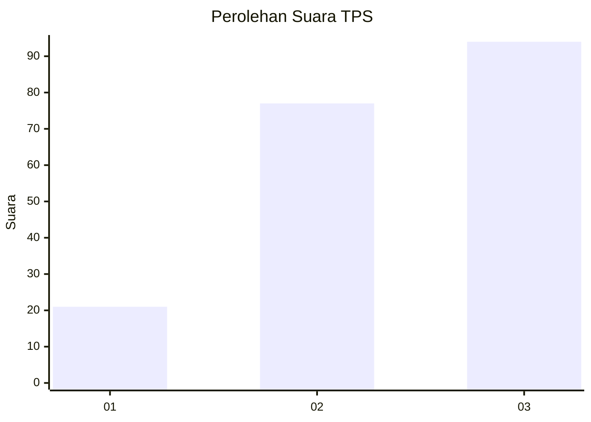
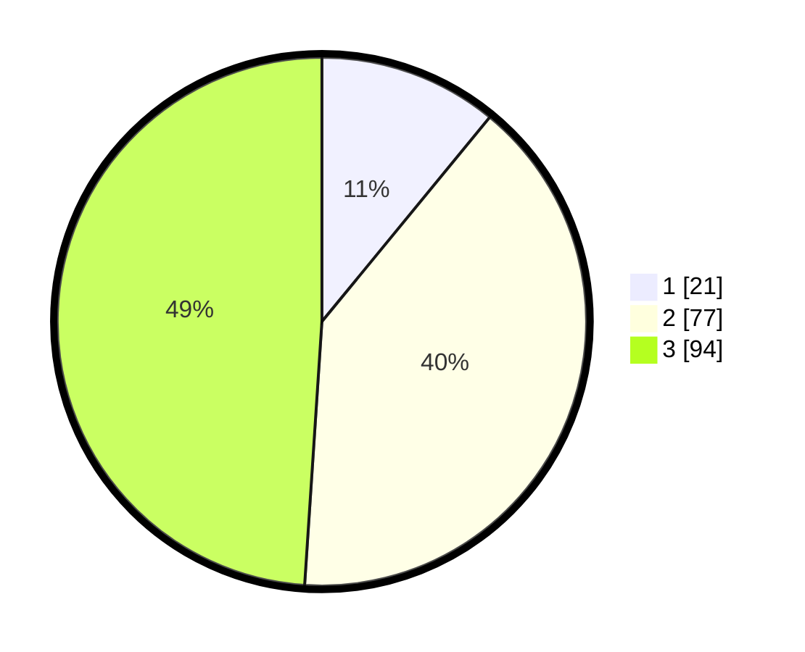

# Hasil

## Grafik

## Tabel

| No. | Nama Paslon    | Suara | Suara (raw) | Persentase |
|:--- |:-------------- | -----:| -----------:| ----------:|
| 1   | ANIES MUHAIMIN | 21    | [21][p-1]   | 10,94      |
| 2   | PRABOWO GIBRAN | 77    | [77][p-2]   | 40,10      |
| 3   | GANJAR MAHFUD  | 94    | [94][p-3]   | 48,96      |

[p-1]: https://github.com/gigit-pemilu/pemilu-2024/blob/main/pilpres/hitung-suara/sub/33-jawa-tengah/sub/02-banyumas/sub/03-jatilawang/sub/2011-gentawangi/sub/005-tps/sub/paslon-1.txt
[p-2]: https://github.com/gigit-pemilu/pemilu-2024/blob/main/pilpres/hitung-suara/sub/33-jawa-tengah/sub/02-banyumas/sub/03-jatilawang/sub/2011-gentawangi/sub/005-tps/sub/paslon-2.txt
[p-3]: https://github.com/gigit-pemilu/pemilu-2024/blob/main/pilpres/hitung-suara/sub/33-jawa-tengah/sub/02-banyumas/sub/03-jatilawang/sub/2011-gentawangi/sub/005-tps/sub/paslon-3.txt

## Foto C Plano

https://sirekap-obj-formc.kpu.go.id/ef5e/pemilu/ppwp/33/02/03/20/11/3302032011005-20240214-141742--b8fe33f6-bfaf-4dfb-a7c1-2ab01abf7d31.jpg

https://sirekap-obj-formc.kpu.go.id/ef5e/pemilu/ppwp/33/02/03/20/11/3302032011005-20240214-141841--0a120482-fd54-4520-8de4-8019221ba1ff.jpg

https://sirekap-obj-formc.kpu.go.id/ef5e/pemilu/ppwp/33/02/03/20/11/3302032011005-20240214-235020--5d6a06b9-885a-4ae7-bebd-3e78cb269af4.jpg

## Metadata

| Key        | Value               |
| ---------- | ------------------- |
| Time Stamp | 2024-02-15 02:10:27 |

