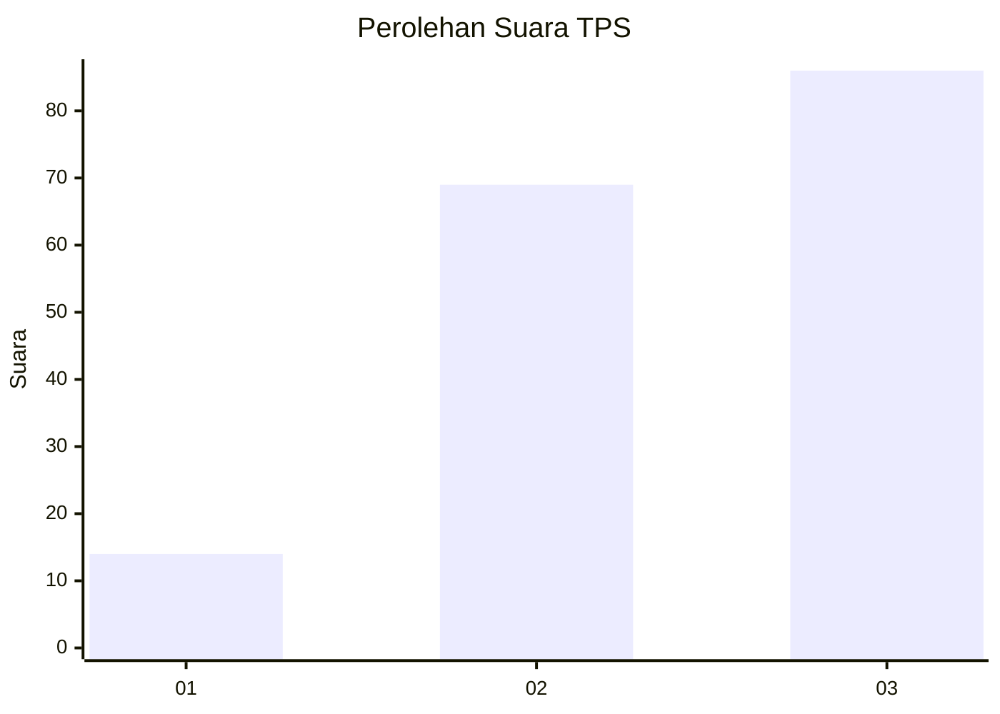
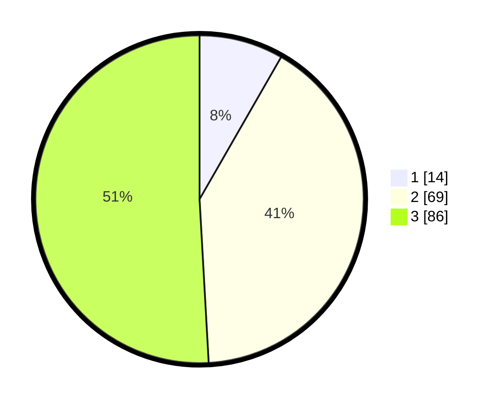

# Hasil

## Grafik

## Tabel

| No. | Nama Paslon    | Suara | Suara (raw) | Persentase |
|:--- |:-------------- | -----:| -----------:| ----------:|
| 1   | ANIES MUHAIMIN | 14    | [14][p-1]   | 8,28       |
| 2   | PRABOWO GIBRAN | 69    | [69][p-2]   | 40,83      |
| 3   | GANJAR MAHFUD  | 86    | [86][p-3]   | 50,89      |

[p-1]: https://github.com/gigit-pemilu/pemilu-2024-33-jawa-tengah/blob/main/pilpres/hitung-suara/sub/33-jawa-tengah/sub/02-banyumas/sub/03-jatilawang/sub/2011-gentawangi/sub/012-tps/sub/paslon-1.txt
[p-2]: https://github.com/gigit-pemilu/pemilu-2024-33-jawa-tengah/blob/main/pilpres/hitung-suara/sub/33-jawa-tengah/sub/02-banyumas/sub/03-jatilawang/sub/2011-gentawangi/sub/012-tps/sub/paslon-2.txt
[p-3]: https://github.com/gigit-pemilu/pemilu-2024-33-jawa-tengah/blob/main/pilpres/hitung-suara/sub/33-jawa-tengah/sub/02-banyumas/sub/03-jatilawang/sub/2011-gentawangi/sub/012-tps/sub/paslon-3.txt

## Foto C Plano

https://sirekap-obj-formc.kpu.go.id/e442/pemilu/ppwp/33/02/03/20/11/3302032011012-20240214-212517--6d87b3bb-af3a-4a91-96af-7aeb767b65ab.jpg

https://sirekap-obj-formc.kpu.go.id/e442/pemilu/ppwp/33/02/03/20/11/3302032011012-20240214-212737--dc3e29d9-024b-4fde-8ef0-e9aa274ef2ee.jpg

https://sirekap-obj-formc.kpu.go.id/e442/pemilu/ppwp/33/02/03/20/11/3302032011012-20240214-213119--e996c4ed-9e69-4bbc-a34d-5366f70f1775.jpg

## Metadata

| Key        | Value               |
| ---------- | ------------------- |
| Time Stamp | 2024-02-16 23:30:00 |

