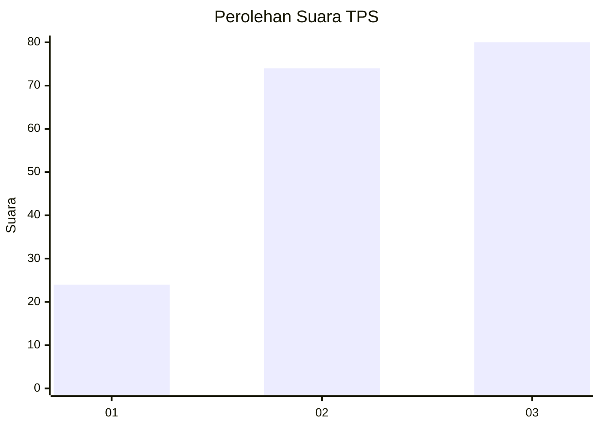
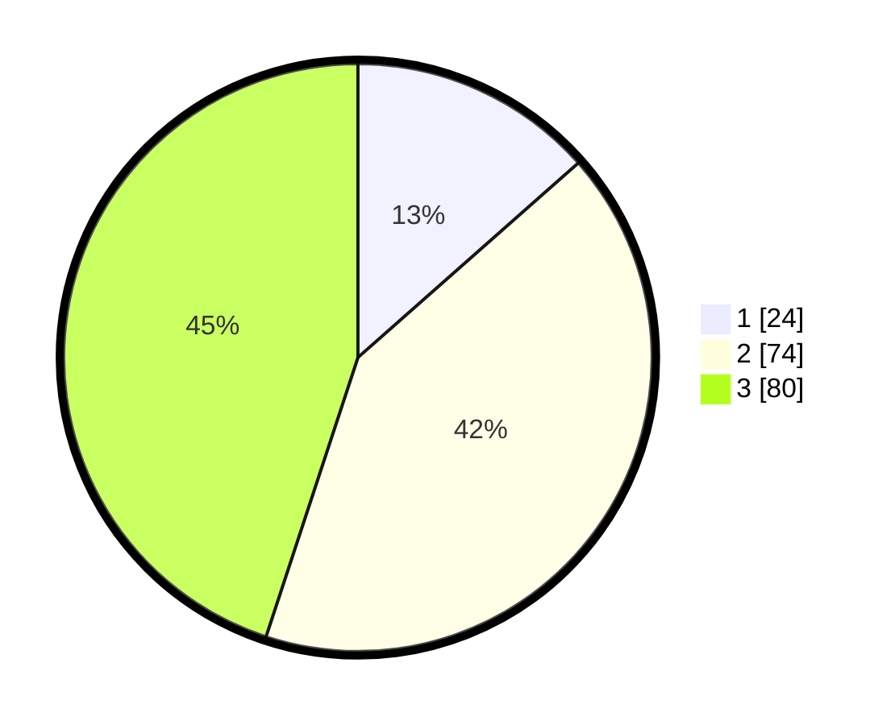

# Hasil

## Grafik

## Tabel

| No. | Nama Paslon    | Suara | Suara (raw) | Persentase |
|:--- |:-------------- | -----:| -----------:| ----------:|
| 1   | ANIES MUHAIMIN | 24    | [24][p-1]   | 13,48      |
| 2   | PRABOWO GIBRAN | 74    | [74][p-2]   | 41,57      |
| 3   | GANJAR MAHFUD  | 80    | [80][p-3]   | 44,94      |

[p-1]: https://github.com/gigit-pemilu/pemilu-2024-33-jawa-tengah/blob/main/pilpres/hitung-suara/sub/33-jawa-tengah/sub/02-banyumas/sub/04-rawalo/sub/2002-menganti/sub/002-tps/sub/paslon-1.txt
[p-2]: https://github.com/gigit-pemilu/pemilu-2024-33-jawa-tengah/blob/main/pilpres/hitung-suara/sub/33-jawa-tengah/sub/02-banyumas/sub/04-rawalo/sub/2002-menganti/sub/002-tps/sub/paslon-2.txt
[p-3]: https://github.com/gigit-pemilu/pemilu-2024-33-jawa-tengah/blob/main/pilpres/hitung-suara/sub/33-jawa-tengah/sub/02-banyumas/sub/04-rawalo/sub/2002-menganti/sub/002-tps/sub/paslon-3.txt

## Foto C Plano

https://sirekap-obj-formc.kpu.go.id/adee/pemilu/ppwp/33/02/04/20/02/3302042002002-20240217-143403--1d214f43-6bc3-4307-9e55-f0df713076d4.jpg

https://sirekap-obj-formc.kpu.go.id/adee/pemilu/ppwp/33/02/04/20/02/3302042002002-20240217-100953--d4a07dde-cad8-4821-9fc6-f661da64f00d.jpg

https://sirekap-obj-formc.kpu.go.id/adee/pemilu/ppwp/33/02/04/20/02/3302042002002-20240217-101032--e0e8754c-04a9-4616-9451-f0b96bf0a79f.jpg

## Metadata

| Key        | Value               |
| ---------- | ------------------- |
| Time Stamp | 2024-02-17 14:45:18 |

