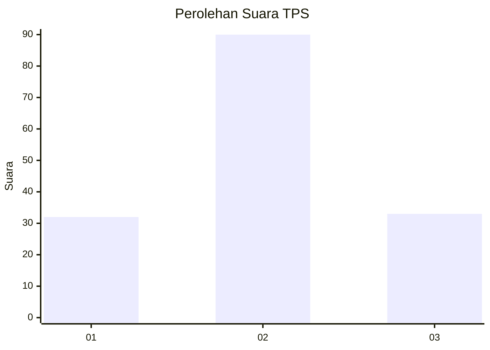
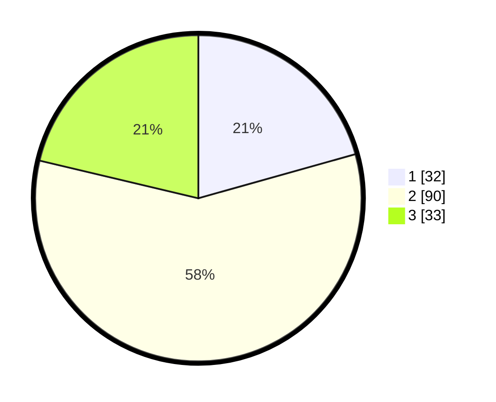

# Hasil

## Grafik

## Tabel

| No. | Nama Paslon    | Suara | Suara (raw) | Persentase |
|:--- |:-------------- | -----:| -----------:| ----------:|
| 1   | ANIES MUHAIMIN | 32    | [32][p-1]   | 20,65      |
| 2   | PRABOWO GIBRAN | 90    | [90][p-2]   | 58,06      |
| 3   | GANJAR MAHFUD  | 33    | [33][p-3]   | 21,29      |

[p-1]: https://github.com/gigit-pemilu/pemilu-2024/blob/main/pilpres/hitung-suara/sub/33-jawa-tengah/sub/02-banyumas/sub/04-rawalo/sub/2006-sidamulih/sub/016-tps/sub/paslon-1.txt
[p-2]: https://github.com/gigit-pemilu/pemilu-2024/blob/main/pilpres/hitung-suara/sub/33-jawa-tengah/sub/02-banyumas/sub/04-rawalo/sub/2006-sidamulih/sub/016-tps/sub/paslon-2.txt
[p-3]: https://github.com/gigit-pemilu/pemilu-2024/blob/main/pilpres/hitung-suara/sub/33-jawa-tengah/sub/02-banyumas/sub/04-rawalo/sub/2006-sidamulih/sub/016-tps/sub/paslon-3.txt

## Foto C Plano

https://sirekap-obj-formc.kpu.go.id/05d8/pemilu/ppwp/33/02/04/20/06/3302042006016-20240214-220735--d3756574-feab-4213-a3b3-7df011ec986b.jpg

https://sirekap-obj-formc.kpu.go.id/05d8/pemilu/ppwp/33/02/04/20/06/3302042006016-20240214-222015--bc02dcda-dee7-48c6-a900-f30eb5a14e2b.jpg

https://sirekap-obj-formc.kpu.go.id/05d8/pemilu/ppwp/33/02/04/20/06/3302042006016-20240214-222149--8e36e272-80bd-4a31-9527-72ddebaab353.jpg

## Metadata

| Key        | Value               |
| ---------- | ------------------- |
| Time Stamp | 2024-02-17 10:00:02 |

