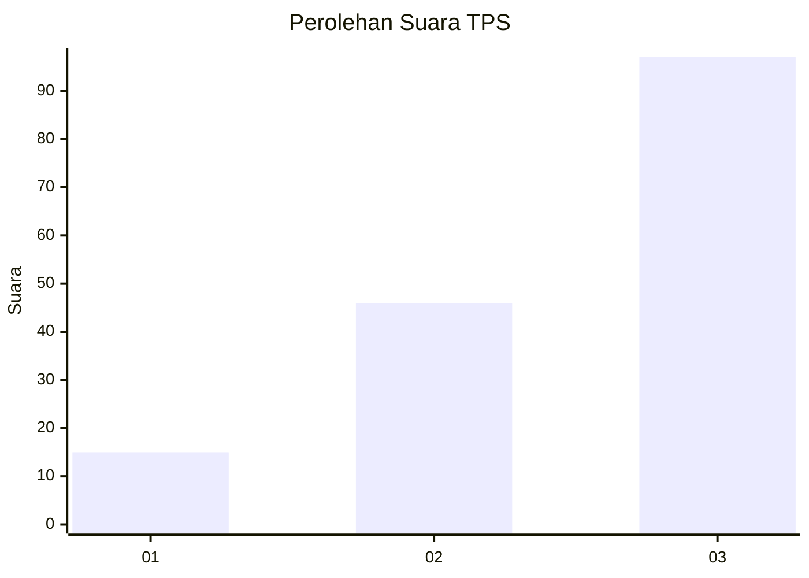
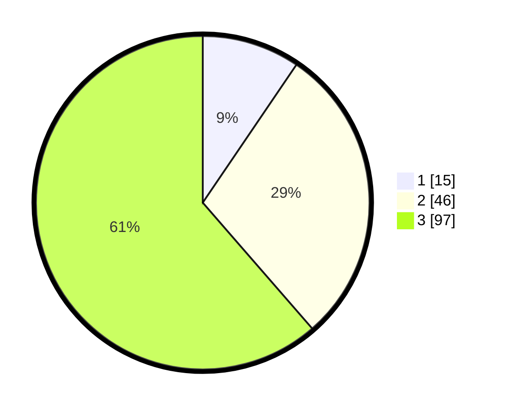

# Hasil

## Grafik

## Tabel

| No. | Nama Paslon    | Suara | Suara (raw) | Persentase |
|:--- |:-------------- | -----:| -----------:| ----------:|
| 1   | ANIES MUHAIMIN | 15    | [15][p-1]   | 9,49       |
| 2   | PRABOWO GIBRAN | 46    | [46][p-2]   | 29,11      |
| 3   | GANJAR MAHFUD  | 97    | [97][p-3]   | 61,39      |

[p-1]: https://github.com/gigit-pemilu/pemilu-2024/blob/main/pilpres/hitung-suara/sub/33-jawa-tengah/sub/02-banyumas/sub/04-rawalo/sub/2008-tipar/sub/005-tps/sub/paslon-1.txt
[p-2]: https://github.com/gigit-pemilu/pemilu-2024/blob/main/pilpres/hitung-suara/sub/33-jawa-tengah/sub/02-banyumas/sub/04-rawalo/sub/2008-tipar/sub/005-tps/sub/paslon-2.txt
[p-3]: https://github.com/gigit-pemilu/pemilu-2024/blob/main/pilpres/hitung-suara/sub/33-jawa-tengah/sub/02-banyumas/sub/04-rawalo/sub/2008-tipar/sub/005-tps/sub/paslon-3.txt

## Foto C Plano

https://sirekap-obj-formc.kpu.go.id/8839/pemilu/ppwp/33/02/04/20/08/3302042008005-20240214-232445--a31e3f46-bb0a-4702-b244-9ad895f824ef.jpg

https://sirekap-obj-formc.kpu.go.id/8839/pemilu/ppwp/33/02/04/20/08/3302042008005-20240214-232546--8ca4d931-9d01-4e89-afde-27bf52cdd348.jpg

https://sirekap-obj-formc.kpu.go.id/8839/pemilu/ppwp/33/02/04/20/08/3302042008005-20240214-232647--07552e6e-854c-4144-8390-777640f498b7.jpg

## Metadata

| Key        | Value               |
| ---------- | ------------------- |
| Time Stamp | 2024-02-16 23:00:00 |

