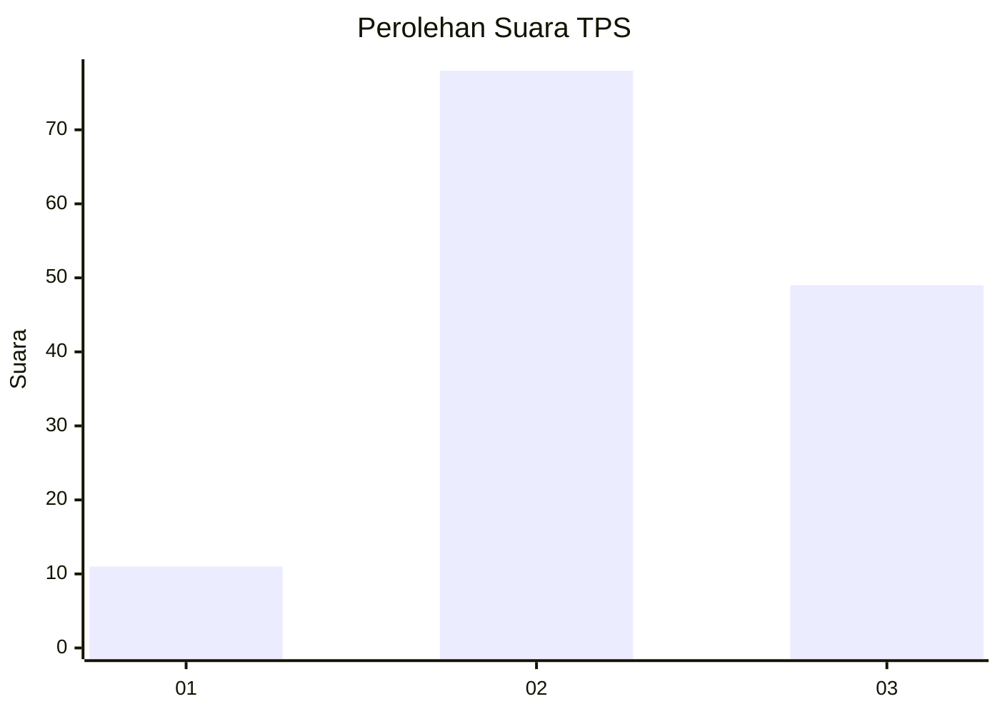
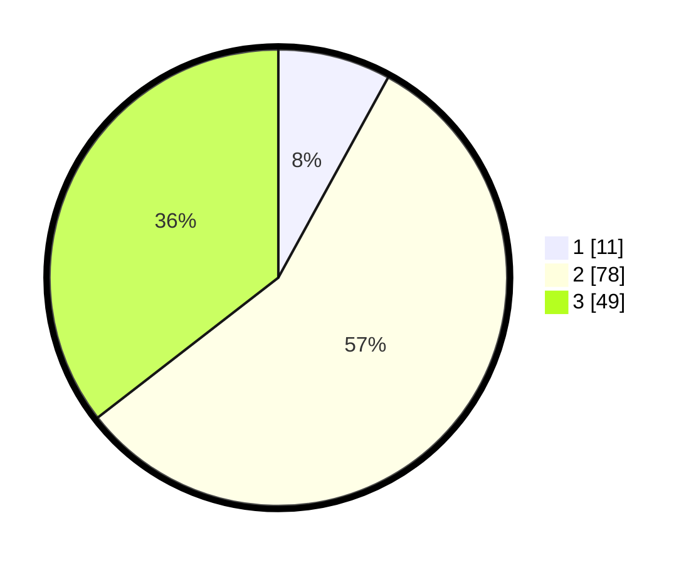

# Hasil

## Grafik

## Tabel

| No. | Nama Paslon    | Suara | Suara (raw) | Persentase |
|:--- |:-------------- | -----:| -----------:| ----------:|
| 1   | ANIES MUHAIMIN | 11    | [11][p-1]   | 7,97       |
| 2   | PRABOWO GIBRAN | 78    | [78][p-2]   | 56,52      |
| 3   | GANJAR MAHFUD  | 49    | [49][p-3]   | 35,51      |

[p-1]: https://github.com/gigit-pemilu/pemilu-2024/blob/main/pilpres/hitung-suara/sub/33-jawa-tengah/sub/02-banyumas/sub/04-rawalo/sub/2008-tipar/sub/021-tps/sub/paslon-1.txt
[p-2]: https://github.com/gigit-pemilu/pemilu-2024/blob/main/pilpres/hitung-suara/sub/33-jawa-tengah/sub/02-banyumas/sub/04-rawalo/sub/2008-tipar/sub/021-tps/sub/paslon-2.txt
[p-3]: https://github.com/gigit-pemilu/pemilu-2024/blob/main/pilpres/hitung-suara/sub/33-jawa-tengah/sub/02-banyumas/sub/04-rawalo/sub/2008-tipar/sub/021-tps/sub/paslon-3.txt

## Foto C Plano

https://sirekap-obj-formc.kpu.go.id/077d/pemilu/ppwp/33/02/04/20/08/3302042008021-20240215-003555--1cee029d-36c0-4a0a-888d-830c45074a90.jpg

https://sirekap-obj-formc.kpu.go.id/077d/pemilu/ppwp/33/02/04/20/08/3302042008021-20240215-005021--fa9bdfb3-4fa3-4a54-845f-0f771e3ca908.jpg

https://sirekap-obj-formc.kpu.go.id/077d/pemilu/ppwp/33/02/04/20/08/3302042008021-20240215-005422--0f3ebe03-2a82-4e13-8929-c1799c11425b.jpg

## Metadata

| Key        | Value               |
| ---------- | ------------------- |
| Time Stamp | 2024-02-16 23:00:00 |

