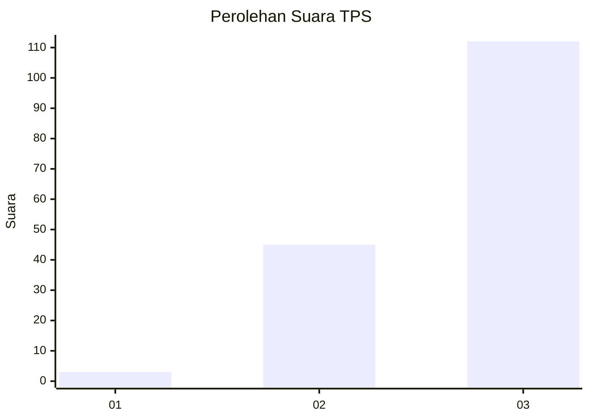
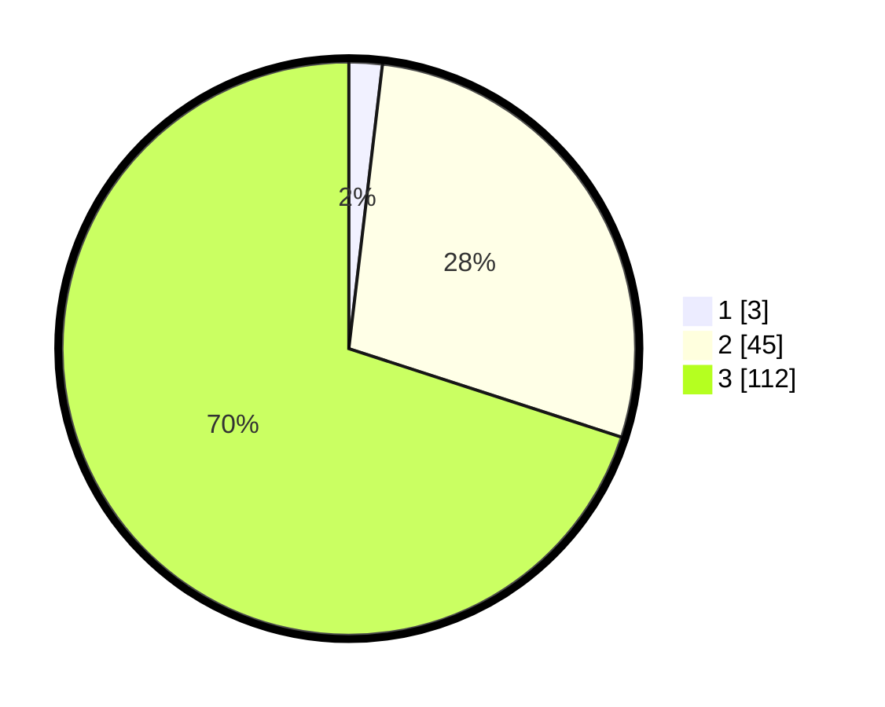

# Hasil

## Grafik

## Tabel

| No. | Nama Paslon    | Suara | Suara (raw) | Persentase |
|:--- |:-------------- | -----:| -----------:| ----------:|
| 1   | ANIES MUHAIMIN | 3     | [3][p-1]    | 1,88       |
| 2   | PRABOWO GIBRAN | 45    | [45][p-2]   | 28,13      |
| 3   | GANJAR MAHFUD  | 112   | [112][p-3]  | 70,00      |

[p-1]: https://github.com/gigit-pemilu/pemilu-2024-33-jawa-tengah/blob/main/pilpres/hitung-suara/sub/33-jawa-tengah/sub/02-banyumas/sub/04-rawalo/sub/2009-sanggreman/sub/015-tps/sub/paslon-1.txt
[p-2]: https://github.com/gigit-pemilu/pemilu-2024-33-jawa-tengah/blob/main/pilpres/hitung-suara/sub/33-jawa-tengah/sub/02-banyumas/sub/04-rawalo/sub/2009-sanggreman/sub/015-tps/sub/paslon-2.txt
[p-3]: https://github.com/gigit-pemilu/pemilu-2024-33-jawa-tengah/blob/main/pilpres/hitung-suara/sub/33-jawa-tengah/sub/02-banyumas/sub/04-rawalo/sub/2009-sanggreman/sub/015-tps/sub/paslon-3.txt

## Foto C Plano

https://sirekap-obj-formc.kpu.go.id/defb/pemilu/ppwp/33/02/04/20/09/3302042009015-20240215-013356--975bb788-c9e1-4d3b-83c1-6f14ea0c16a3.jpg

https://sirekap-obj-formc.kpu.go.id/defb/pemilu/ppwp/33/02/04/20/09/3302042009015-20240214-213915--c804a81b-95e5-4650-83e8-bbfb04c463c8.jpg

https://sirekap-obj-formc.kpu.go.id/defb/pemilu/ppwp/33/02/04/20/09/3302042009015-20240214-214033--964f3a6f-6a28-41a8-9c3e-76241e983d2c.jpg

## Metadata

| Key        | Value               |
| ---------- | ------------------- |
| Time Stamp | 2024-02-15 18:30:25 |

