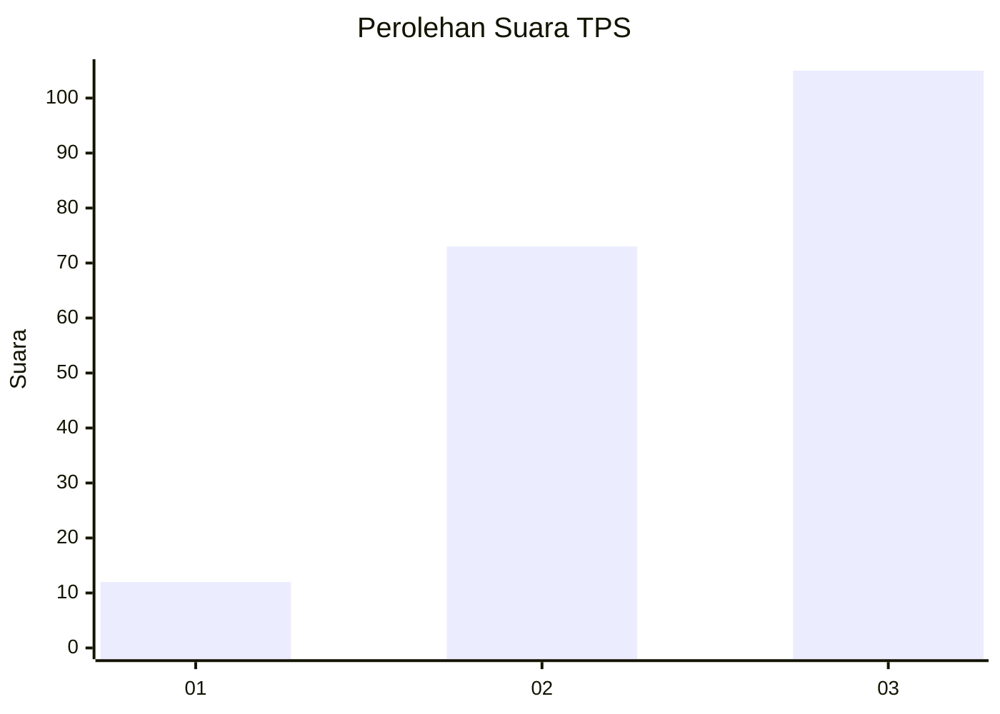
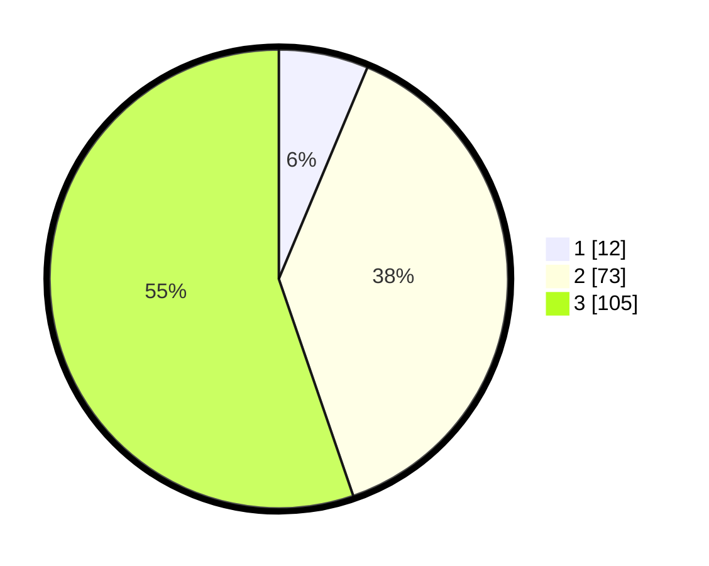

# Hasil

## Grafik

## Tabel

| No. | Nama Paslon    | Suara | Suara (raw) | Persentase |
|:--- |:-------------- | -----:| -----------:| ----------:|
| 1   | ANIES MUHAIMIN | 12    | [12][p-1]   | 6,32       |
| 2   | PRABOWO GIBRAN | 73    | [73][p-2]   | 38,42      |
| 3   | GANJAR MAHFUD  | 105   | [105][p-3]  | 55,26      |

[p-1]: https://github.com/gigit-pemilu/pemilu-2024/blob/main/pilpres/hitung-suara/sub/33-jawa-tengah/sub/02-banyumas/sub/05-kebasen/sub/2005-kaliwedi/sub/009-tps/sub/paslon-1.txt
[p-2]: https://github.com/gigit-pemilu/pemilu-2024/blob/main/pilpres/hitung-suara/sub/33-jawa-tengah/sub/02-banyumas/sub/05-kebasen/sub/2005-kaliwedi/sub/009-tps/sub/paslon-2.txt
[p-3]: https://github.com/gigit-pemilu/pemilu-2024/blob/main/pilpres/hitung-suara/sub/33-jawa-tengah/sub/02-banyumas/sub/05-kebasen/sub/2005-kaliwedi/sub/009-tps/sub/paslon-3.txt

## Foto C Plano

https://sirekap-obj-formc.kpu.go.id/ab28/pemilu/ppwp/33/02/05/20/05/3302052005009-20240214-223102--8739fc50-fdb4-446c-80ce-4ff498fa4f1a.jpg

https://sirekap-obj-formc.kpu.go.id/ab28/pemilu/ppwp/33/02/05/20/05/3302052005009-20240214-223346--629481b4-cf41-427d-a168-a37a12c9e105.jpg

https://sirekap-obj-formc.kpu.go.id/ab28/pemilu/ppwp/33/02/05/20/05/3302052005009-20240214-223438--628179d7-94e3-4292-9cd0-1da4d5de01dd.jpg

## Metadata

| Key        | Value               |
| ---------- | ------------------- |
| Time Stamp | 2024-02-17 09:00:02 |

