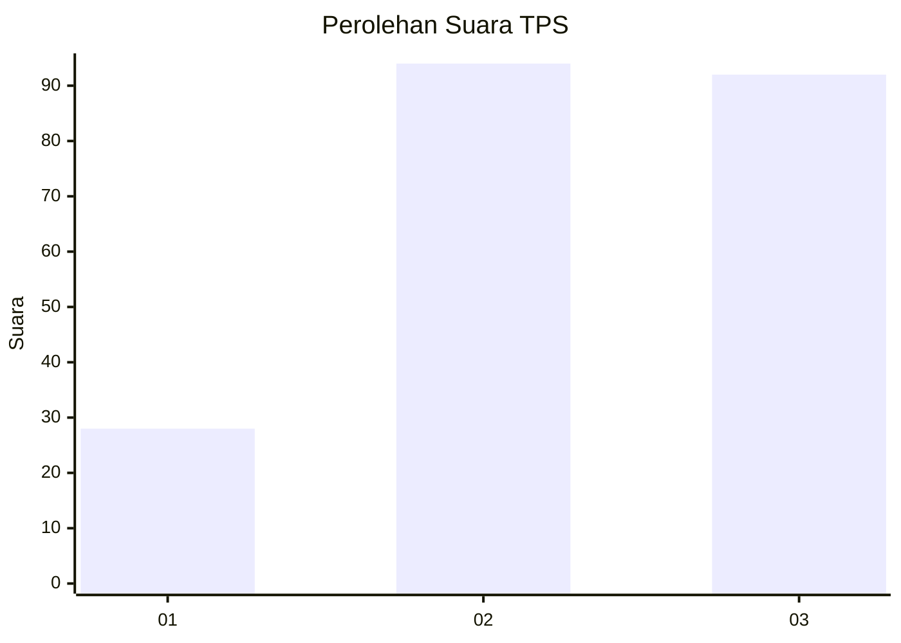
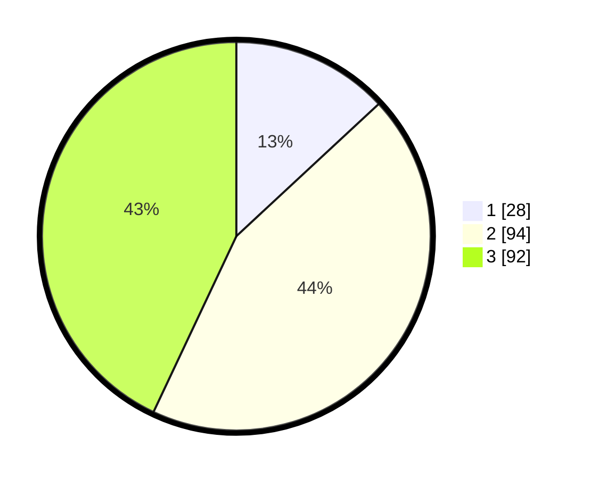

# Hasil

## Grafik

## Tabel

| No. | Nama Paslon    | Suara | Suara (raw) | Persentase |
|:--- |:-------------- | -----:| -----------:| ----------:|
| 1   | ANIES MUHAIMIN | 28    | [28][p-1]   | 13,08      |
| 2   | PRABOWO GIBRAN | 94    | [94][p-2]   | 43,93      |
| 3   | GANJAR MAHFUD  | 92    | [92][p-3]   | 42,99      |

[p-1]: https://github.com/gigit-pemilu/pemilu-2024/blob/main/pilpres/hitung-suara/sub/33-jawa-tengah/sub/02-banyumas/sub/05-kebasen/sub/2007-kalisalak/sub/026-tps/sub/paslon-1.txt
[p-2]: https://github.com/gigit-pemilu/pemilu-2024/blob/main/pilpres/hitung-suara/sub/33-jawa-tengah/sub/02-banyumas/sub/05-kebasen/sub/2007-kalisalak/sub/026-tps/sub/paslon-2.txt
[p-3]: https://github.com/gigit-pemilu/pemilu-2024/blob/main/pilpres/hitung-suara/sub/33-jawa-tengah/sub/02-banyumas/sub/05-kebasen/sub/2007-kalisalak/sub/026-tps/sub/paslon-3.txt

## Foto C Plano

https://sirekap-obj-formc.kpu.go.id/0ee9/pemilu/ppwp/33/02/05/20/07/3302052007026-20240217-092148--7223a121-d9a5-4f8e-a352-1c51ddd4dc1f.jpg

https://sirekap-obj-formc.kpu.go.id/0ee9/pemilu/ppwp/33/02/05/20/07/3302052007026-20240217-092425--f1d57c46-68e2-45ff-9dfc-6ed6d580dcc4.jpg

https://sirekap-obj-formc.kpu.go.id/0ee9/pemilu/ppwp/33/02/05/20/07/3302052007026-20240217-092534--ef4e3c45-3418-4a9e-9b2a-688e0d4d6458.jpg

## Metadata

| Key        | Value               |
| ---------- | ------------------- |
| Time Stamp | 2024-02-25 12:00:00 |

