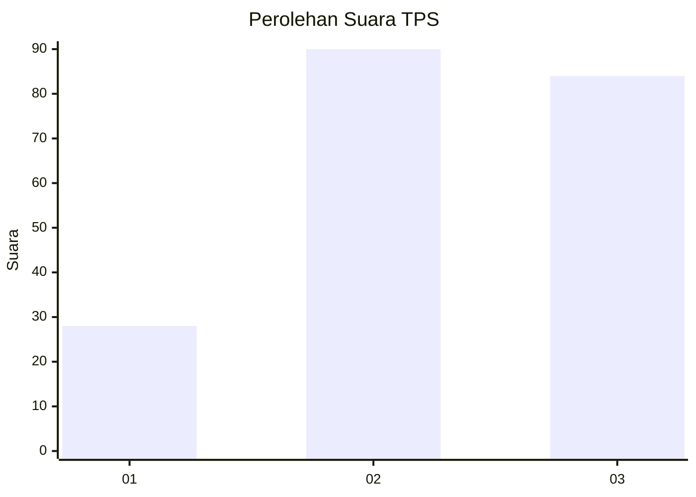
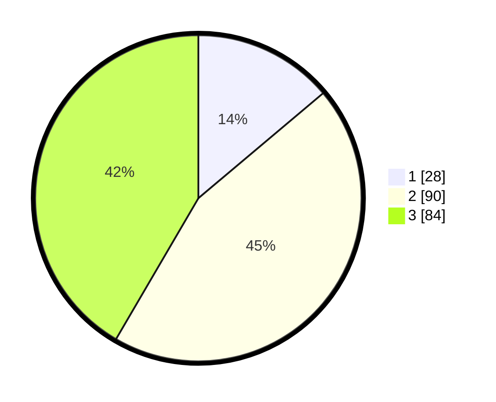

# Hasil

## Grafik

## Tabel

| No. | Nama Paslon    | Suara | Suara (raw) | Persentase |
|:--- |:-------------- | -----:| -----------:| ----------:|
| 1   | ANIES MUHAIMIN | 28    | [28][p-1]   | 13,86      |
| 2   | PRABOWO GIBRAN | 90    | [90][p-2]   | 44,55      |
| 3   | GANJAR MAHFUD  | 84    | [84][p-3]   | 41,58      |

[p-1]: https://github.com/gigit-pemilu/pemilu-2024-33-jawa-tengah/blob/main/pilpres/hitung-suara/sub/33-jawa-tengah/sub/02-banyumas/sub/06-kemranjen/sub/2003-sibalung/sub/015-tps/sub/paslon-1.txt
[p-2]: https://github.com/gigit-pemilu/pemilu-2024-33-jawa-tengah/blob/main/pilpres/hitung-suara/sub/33-jawa-tengah/sub/02-banyumas/sub/06-kemranjen/sub/2003-sibalung/sub/015-tps/sub/paslon-2.txt
[p-3]: https://github.com/gigit-pemilu/pemilu-2024-33-jawa-tengah/blob/main/pilpres/hitung-suara/sub/33-jawa-tengah/sub/02-banyumas/sub/06-kemranjen/sub/2003-sibalung/sub/015-tps/sub/paslon-3.txt

## Foto C Plano

https://sirekap-obj-formc.kpu.go.id/c982/pemilu/ppwp/33/02/06/20/03/3302062003015-20240215-021359--1e72e23f-0586-42f2-8207-10940dc64060.jpg

https://sirekap-obj-formc.kpu.go.id/c982/pemilu/ppwp/33/02/06/20/03/3302062003015-20240215-021500--b7b7bbd5-ec79-4643-a6d9-6cbe91e073b5.jpg

https://sirekap-obj-formc.kpu.go.id/c982/pemilu/ppwp/33/02/06/20/03/3302062003015-20240215-021541--6e696eb0-187e-4882-b76d-02c9189a3682.jpg

## Metadata

| Key        | Value               |
| ---------- | ------------------- |
| Time Stamp | 2024-02-16 23:00:00 |

