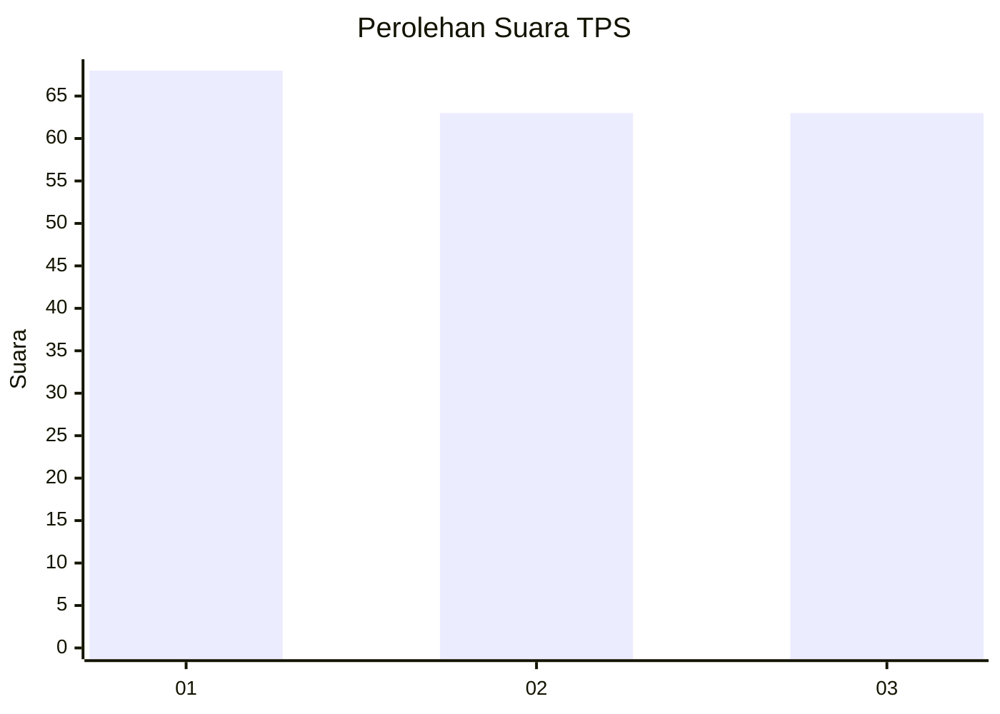
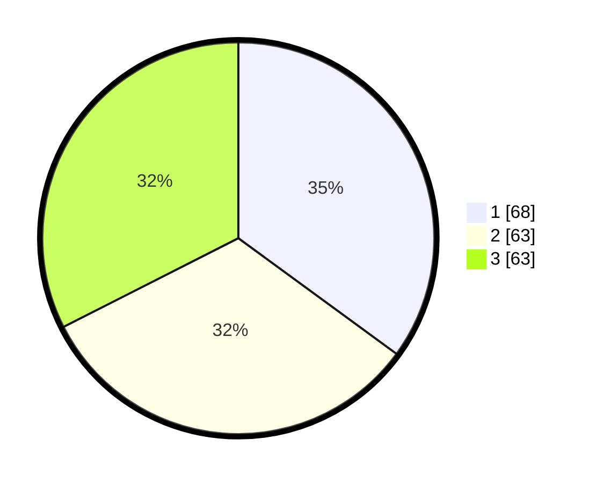

# Hasil

## Grafik

## Tabel

| No. | Nama Paslon    | Suara | Suara (raw) | Persentase |
|:--- |:-------------- | -----:| -----------:| ----------:|
| 1   | ANIES MUHAIMIN | 68    | [68][p-1]   | 35,05      |
| 2   | PRABOWO GIBRAN | 63    | [63][p-2]   | 32,47      |
| 3   | GANJAR MAHFUD  | 63    | [63][p-3]   | 32,47      |

[p-1]: https://github.com/gigit-pemilu/pemilu-2024-33-jawa-tengah/blob/main/pilpres/hitung-suara/sub/33-jawa-tengah/sub/02-banyumas/sub/06-kemranjen/sub/2006-kecila/sub/001-tps/sub/paslon-1.txt
[p-2]: https://github.com/gigit-pemilu/pemilu-2024-33-jawa-tengah/blob/main/pilpres/hitung-suara/sub/33-jawa-tengah/sub/02-banyumas/sub/06-kemranjen/sub/2006-kecila/sub/001-tps/sub/paslon-2.txt
[p-3]: https://github.com/gigit-pemilu/pemilu-2024-33-jawa-tengah/blob/main/pilpres/hitung-suara/sub/33-jawa-tengah/sub/02-banyumas/sub/06-kemranjen/sub/2006-kecila/sub/001-tps/sub/paslon-3.txt

## Foto C Plano

https://sirekap-obj-formc.kpu.go.id/3bce/pemilu/ppwp/33/02/06/20/06/3302062006001-20240214-222236--2ab80eb7-97e6-436c-9d89-964d9d3ff846.jpg

https://sirekap-obj-formc.kpu.go.id/3bce/pemilu/ppwp/33/02/06/20/06/3302062006001-20240214-222402--3b152a83-50e7-4a72-8cdf-da23d0ee8d78.jpg

https://sirekap-obj-formc.kpu.go.id/3bce/pemilu/ppwp/33/02/06/20/06/3302062006001-20240214-222518--9a1fda16-4fb9-406a-8a60-86f5e3cf0215.jpg

## Metadata

| Key        | Value               |
| ---------- | ------------------- |
| Time Stamp | 2024-02-16 23:00:00 |

