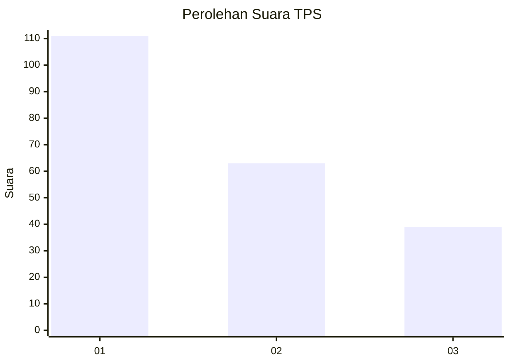
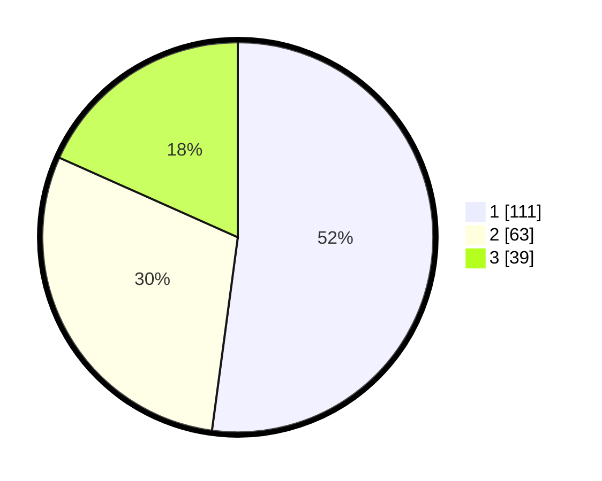

# Hasil

## Grafik

## Tabel

| No. | Nama Paslon    | Suara | Suara (raw) | Persentase |
|:--- |:-------------- | -----:| -----------:| ----------:|
| 1   | ANIES MUHAIMIN | 111   | [111][p-1]  | 52,11      |
| 2   | PRABOWO GIBRAN | 63    | [63][p-2]   | 29,58      |
| 3   | GANJAR MAHFUD  | 39    | [39][p-3]   | 18,31      |

[p-1]: https://github.com/gigit-pemilu/pemilu-2024-33-jawa-tengah/blob/main/pilpres/hitung-suara/sub/33-jawa-tengah/sub/02-banyumas/sub/06-kemranjen/sub/2009-kebarongan/sub/007-tps/sub/paslon-1.txt
[p-2]: https://github.com/gigit-pemilu/pemilu-2024-33-jawa-tengah/blob/main/pilpres/hitung-suara/sub/33-jawa-tengah/sub/02-banyumas/sub/06-kemranjen/sub/2009-kebarongan/sub/007-tps/sub/paslon-2.txt
[p-3]: https://github.com/gigit-pemilu/pemilu-2024-33-jawa-tengah/blob/main/pilpres/hitung-suara/sub/33-jawa-tengah/sub/02-banyumas/sub/06-kemranjen/sub/2009-kebarongan/sub/007-tps/sub/paslon-3.txt

## Foto C Plano

https://sirekap-obj-formc.kpu.go.id/266f/pemilu/ppwp/33/02/06/20/09/3302062009007-20240214-225006--70fbb892-44cc-40d6-aa71-899a11c9b037.jpg

https://sirekap-obj-formc.kpu.go.id/266f/pemilu/ppwp/33/02/06/20/09/3302062009007-20240214-225324--0403a63e-ffb2-46ac-a1ff-778628d0f618.jpg

https://sirekap-obj-formc.kpu.go.id/266f/pemilu/ppwp/33/02/06/20/09/3302062009007-20240214-225629--d68a8210-ff34-45b2-a51d-ad2a7df4d7f7.jpg

## Metadata

| Key        | Value               |
| ---------- | ------------------- |
| Time Stamp | 2024-02-16 23:30:00 |

