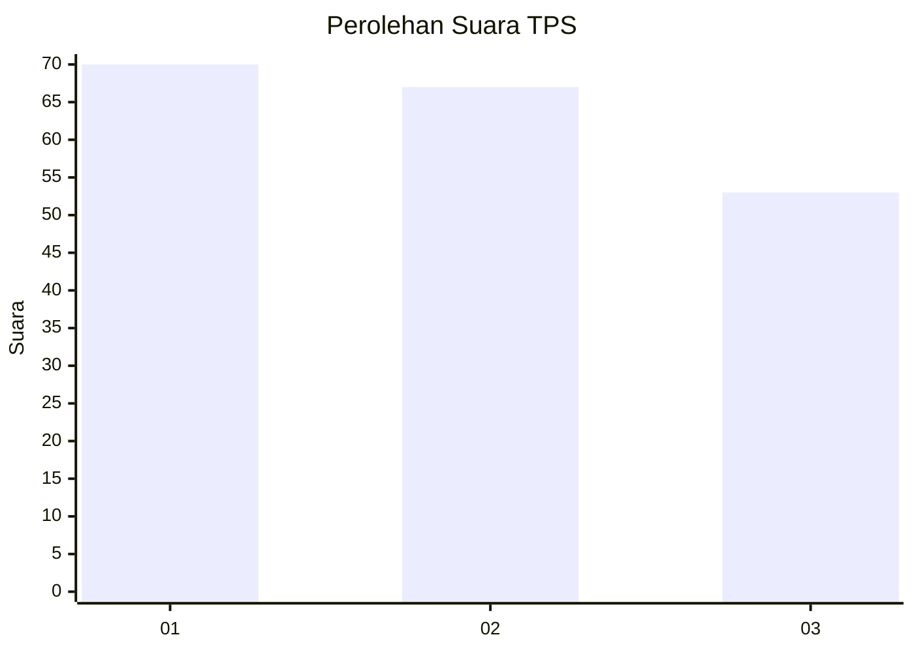
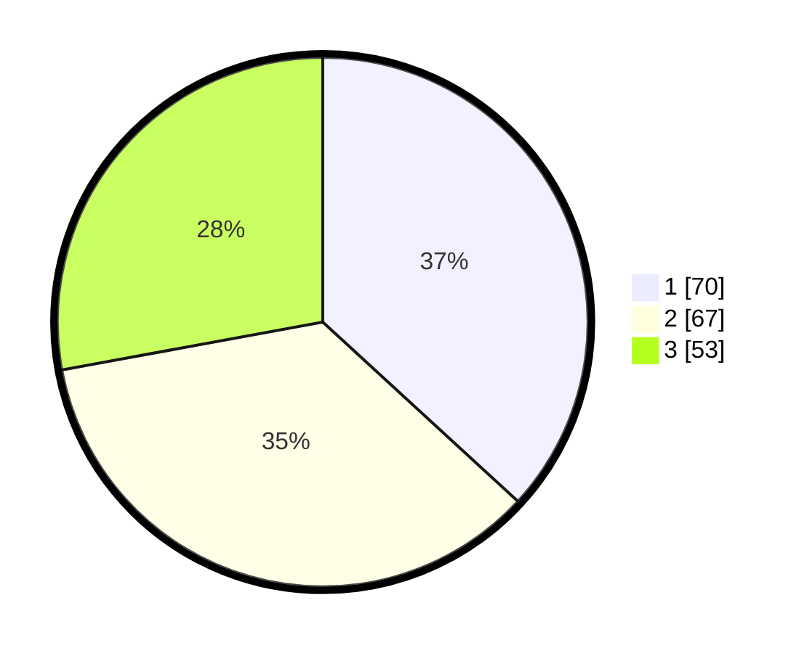

# Hasil

## Grafik

## Tabel

| No. | Nama Paslon    | Suara | Suara (raw) | Persentase |
|:--- |:-------------- | -----:| -----------:| ----------:|
| 1   | ANIES MUHAIMIN | 70    | [70][p-1]   | 36,84      |
| 2   | PRABOWO GIBRAN | 67    | [67][p-2]   | 35,26      |
| 3   | GANJAR MAHFUD  | 53    | [53][p-3]   | 27,89      |

[p-1]: https://github.com/gigit-pemilu/pemilu-2024-33-jawa-tengah/blob/main/pilpres/hitung-suara/sub/33-jawa-tengah/sub/02-banyumas/sub/06-kemranjen/sub/2009-kebarongan/sub/011-tps/sub/paslon-1.txt
[p-2]: https://github.com/gigit-pemilu/pemilu-2024-33-jawa-tengah/blob/main/pilpres/hitung-suara/sub/33-jawa-tengah/sub/02-banyumas/sub/06-kemranjen/sub/2009-kebarongan/sub/011-tps/sub/paslon-2.txt
[p-3]: https://github.com/gigit-pemilu/pemilu-2024-33-jawa-tengah/blob/main/pilpres/hitung-suara/sub/33-jawa-tengah/sub/02-banyumas/sub/06-kemranjen/sub/2009-kebarongan/sub/011-tps/sub/paslon-3.txt

## Foto C Plano

https://sirekap-obj-formc.kpu.go.id/4d8b/pemilu/ppwp/33/02/06/20/09/3302062009011-20240214-222649--02ee47cf-4bd0-4636-be48-b5fd5edf131e.jpg

https://sirekap-obj-formc.kpu.go.id/4d8b/pemilu/ppwp/33/02/06/20/09/3302062009011-20240214-222941--c77123f3-1e6c-4c6b-a36d-040ef8630ed5.jpg

https://sirekap-obj-formc.kpu.go.id/4d8b/pemilu/ppwp/33/02/06/20/09/3302062009011-20240214-223131--2fead8f5-6e43-4ea4-80eb-27a2fbbcbf4a.jpg

## Metadata

| Key        | Value               |
| ---------- | ------------------- |
| Time Stamp | 2024-02-16 23:00:00 |

