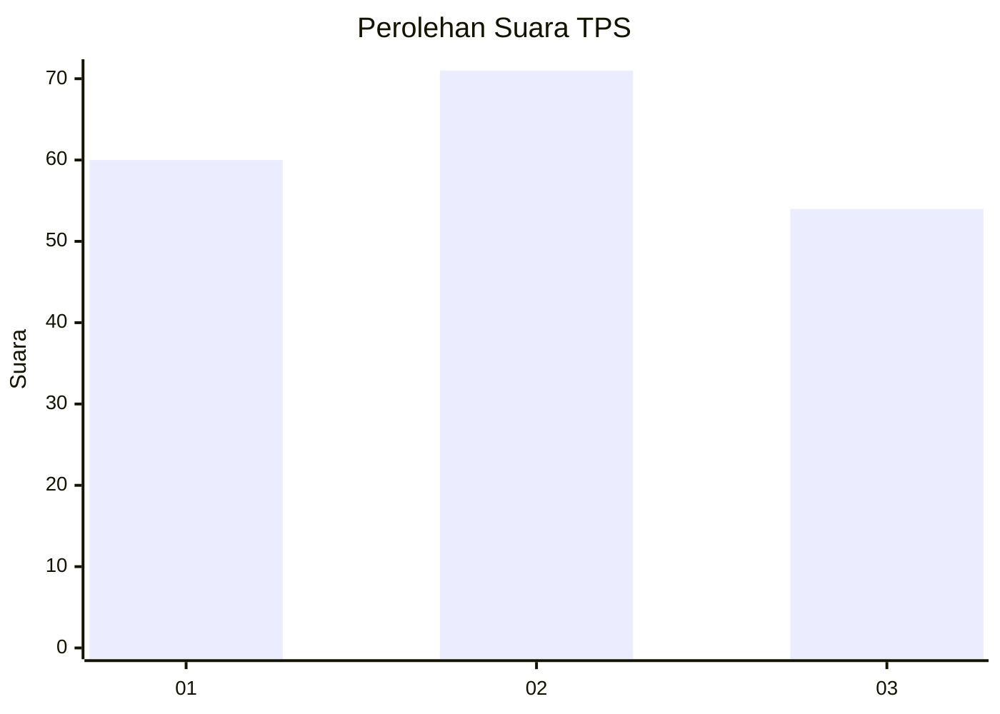
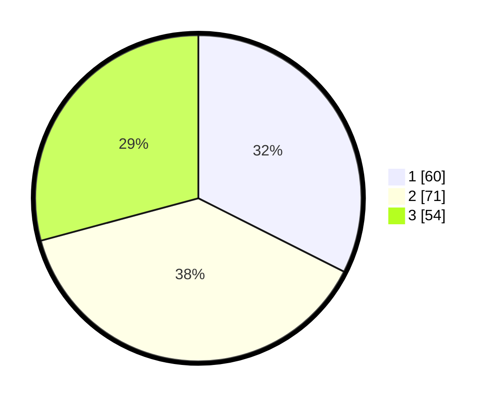

# Hasil

## Grafik

## Tabel

| No. | Nama Paslon    | Suara | Suara (raw) | Persentase |
|:--- |:-------------- | -----:| -----------:| ----------:|
| 1   | ANIES MUHAIMIN | 60    | [60][p-1]   | 32,43      |
| 2   | PRABOWO GIBRAN | 71    | [71][p-2]   | 38,38      |
| 3   | GANJAR MAHFUD  | 54    | [54][p-3]   | 29,19      |

[p-1]: https://github.com/gigit-pemilu/pemilu-2024-33-jawa-tengah/blob/main/pilpres/hitung-suara/sub/33-jawa-tengah/sub/02-banyumas/sub/06-kemranjen/sub/2009-kebarongan/sub/014-tps/sub/paslon-1.txt
[p-2]: https://github.com/gigit-pemilu/pemilu-2024-33-jawa-tengah/blob/main/pilpres/hitung-suara/sub/33-jawa-tengah/sub/02-banyumas/sub/06-kemranjen/sub/2009-kebarongan/sub/014-tps/sub/paslon-2.txt
[p-3]: https://github.com/gigit-pemilu/pemilu-2024-33-jawa-tengah/blob/main/pilpres/hitung-suara/sub/33-jawa-tengah/sub/02-banyumas/sub/06-kemranjen/sub/2009-kebarongan/sub/014-tps/sub/paslon-3.txt

## Foto C Plano

https://sirekap-obj-formc.kpu.go.id/9a7b/pemilu/ppwp/33/02/06/20/09/3302062009014-20240215-012139--0bde1fce-23fe-411c-9822-96fe3df3d5a4.jpg

https://sirekap-obj-formc.kpu.go.id/9a7b/pemilu/ppwp/33/02/06/20/09/3302062009014-20240215-012942--4b91511b-b667-46f1-86e3-ef45d15fe7b6.jpg

https://sirekap-obj-formc.kpu.go.id/9a7b/pemilu/ppwp/33/02/06/20/09/3302062009014-20240215-013210--9634f3ae-c9ba-46eb-a148-92ec9d60d1bf.jpg

## Metadata

| Key        | Value               |
| ---------- | ------------------- |
| Time Stamp | 2024-02-16 23:30:00 |

