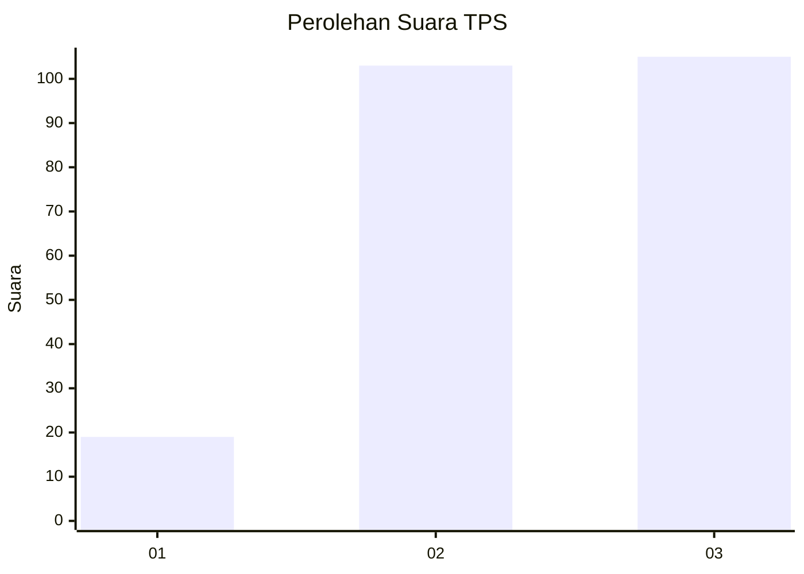
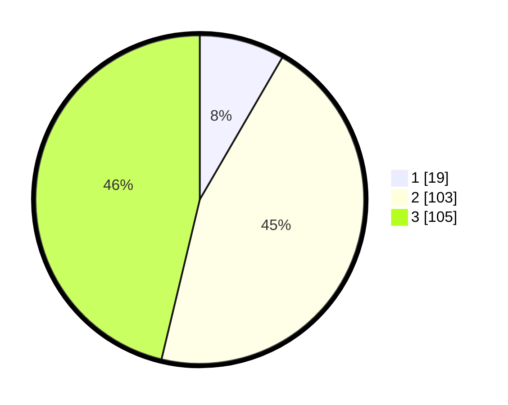

# Hasil

## Grafik

## Tabel

| No. | Nama Paslon    | Suara | Suara (raw) | Persentase |
|:--- |:-------------- | -----:| -----------:| ----------:|
| 1   | ANIES MUHAIMIN | 19    | [19][p-1]   | 8,37       |
| 2   | PRABOWO GIBRAN | 103   | [103][p-2]  | 45,37      |
| 3   | GANJAR MAHFUD  | 105   | [105][p-3]  | 46,26      |

[p-1]: https://github.com/gigit-pemilu/pemilu-2024/blob/main/pilpres/hitung-suara/sub/33-jawa-tengah/sub/02-banyumas/sub/06-kemranjen/sub/2010-sidamulya/sub/004-tps/sub/paslon-1.txt
[p-2]: https://github.com/gigit-pemilu/pemilu-2024/blob/main/pilpres/hitung-suara/sub/33-jawa-tengah/sub/02-banyumas/sub/06-kemranjen/sub/2010-sidamulya/sub/004-tps/sub/paslon-2.txt
[p-3]: https://github.com/gigit-pemilu/pemilu-2024/blob/main/pilpres/hitung-suara/sub/33-jawa-tengah/sub/02-banyumas/sub/06-kemranjen/sub/2010-sidamulya/sub/004-tps/sub/paslon-3.txt

## Foto C Plano

https://sirekap-obj-formc.kpu.go.id/2948/pemilu/ppwp/33/02/06/20/10/3302062010004-20240215-001559--e97c93a1-a09c-4ad0-af41-5095b4b8d16d.jpg

https://sirekap-obj-formc.kpu.go.id/2948/pemilu/ppwp/33/02/06/20/10/3302062010004-20240215-001717--a34b42e9-2c53-4b90-8f1e-c829e579bb53.jpg

https://sirekap-obj-formc.kpu.go.id/2948/pemilu/ppwp/33/02/06/20/10/3302062010004-20240215-001820--c33685e1-8bc8-4f39-90af-dbc5d8e6dc7c.jpg

## Metadata

| Key        | Value               |
| ---------- | ------------------- |
| Time Stamp | 2024-02-16 23:30:00 |

