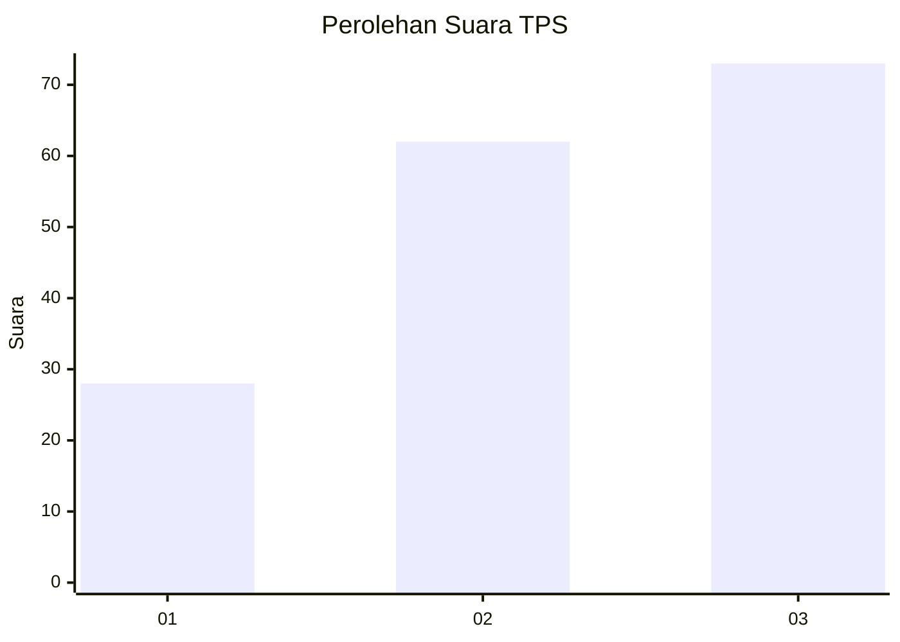
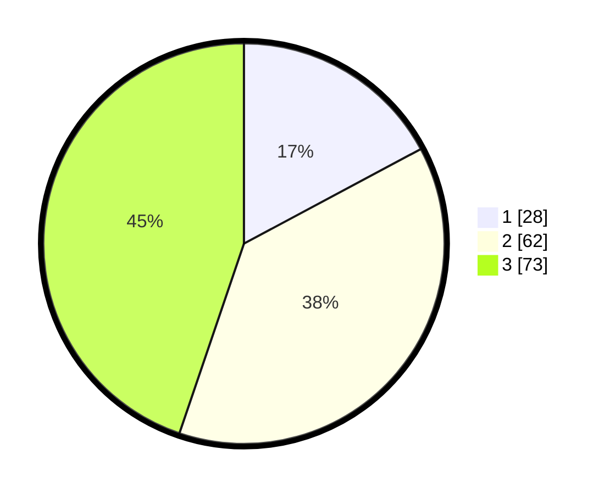

# Hasil

## Grafik

## Tabel

| No. | Nama Paslon    | Suara | Suara (raw) | Persentase |
|:--- |:-------------- | -----:| -----------:| ----------:|
| 1   | ANIES MUHAIMIN | 28    | [28][p-1]   | 17,18      |
| 2   | PRABOWO GIBRAN | 62    | [62][p-2]   | 38,04      |
| 3   | GANJAR MAHFUD  | 73    | [73][p-3]   | 44,79      |

[p-1]: https://github.com/gigit-pemilu/pemilu-2024/blob/main/pilpres/hitung-suara/sub/33-jawa-tengah/sub/02-banyumas/sub/06-kemranjen/sub/2010-sidamulya/sub/014-tps/sub/paslon-1.txt
[p-2]: https://github.com/gigit-pemilu/pemilu-2024/blob/main/pilpres/hitung-suara/sub/33-jawa-tengah/sub/02-banyumas/sub/06-kemranjen/sub/2010-sidamulya/sub/014-tps/sub/paslon-2.txt
[p-3]: https://github.com/gigit-pemilu/pemilu-2024/blob/main/pilpres/hitung-suara/sub/33-jawa-tengah/sub/02-banyumas/sub/06-kemranjen/sub/2010-sidamulya/sub/014-tps/sub/paslon-3.txt

## Foto C Plano

https://sirekap-obj-formc.kpu.go.id/2944/pemilu/ppwp/33/02/06/20/10/3302062010014-20240214-202819--57eb73b3-69bf-41fa-85be-0f5566053916.jpg

https://sirekap-obj-formc.kpu.go.id/2944/pemilu/ppwp/33/02/06/20/10/3302062010014-20240214-202923--ea6158b8-1189-495f-b3e1-f73aee4c13ce.jpg

https://sirekap-obj-formc.kpu.go.id/2944/pemilu/ppwp/33/02/06/20/10/3302062010014-20240214-203526--03226846-bb84-4905-b7a2-1d5e99e4b01a.jpg

## Metadata

| Key        | Value               |
| ---------- | ------------------- |
| Time Stamp | 2024-02-16 23:30:00 |

