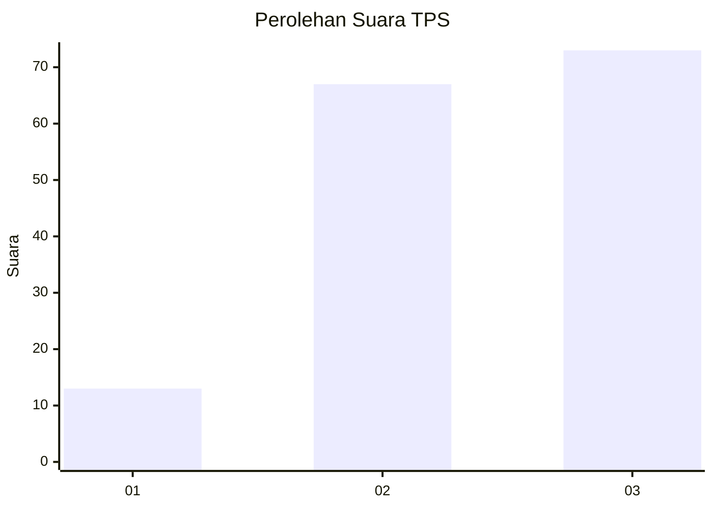
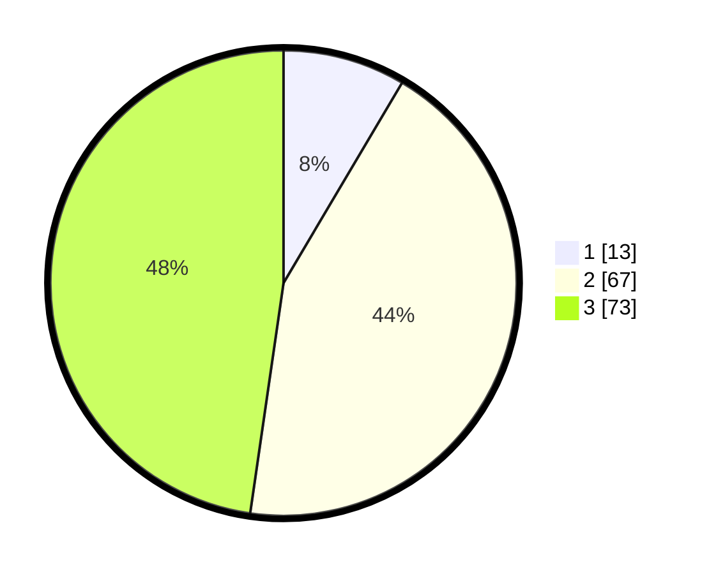

# Hasil

## Grafik

## Tabel

| No. | Nama Paslon    | Suara | Suara (raw) | Persentase |
|:--- |:-------------- | -----:| -----------:| ----------:|
| 1   | ANIES MUHAIMIN | 13    | [13][p-1]   | 8,50       |
| 2   | PRABOWO GIBRAN | 67    | [67][p-2]   | 43,79      |
| 3   | GANJAR MAHFUD  | 73    | [73][p-3]   | 47,71      |

[p-1]: https://github.com/gigit-pemilu/pemilu-2024-33-jawa-tengah/blob/main/pilpres/hitung-suara/sub/33-jawa-tengah/sub/02-banyumas/sub/06-kemranjen/sub/2011-pageralang/sub/007-tps/sub/paslon-1.txt
[p-2]: https://github.com/gigit-pemilu/pemilu-2024-33-jawa-tengah/blob/main/pilpres/hitung-suara/sub/33-jawa-tengah/sub/02-banyumas/sub/06-kemranjen/sub/2011-pageralang/sub/007-tps/sub/paslon-2.txt
[p-3]: https://github.com/gigit-pemilu/pemilu-2024-33-jawa-tengah/blob/main/pilpres/hitung-suara/sub/33-jawa-tengah/sub/02-banyumas/sub/06-kemranjen/sub/2011-pageralang/sub/007-tps/sub/paslon-3.txt

## Foto C Plano

https://sirekap-obj-formc.kpu.go.id/ca49/pemilu/ppwp/33/02/06/20/11/3302062011007-20240214-225949--1f55aa2f-a0fb-42c8-aac6-d19ebf049826.jpg

https://sirekap-obj-formc.kpu.go.id/ca49/pemilu/ppwp/33/02/06/20/11/3302062011007-20240214-230232--807abacd-2132-40dc-8601-b8d9350d9585.jpg

https://sirekap-obj-formc.kpu.go.id/ca49/pemilu/ppwp/33/02/06/20/11/3302062011007-20240214-230927--f21cac71-be3f-4ab4-bee6-5852671aeadc.jpg

## Metadata

| Key        | Value               |
| ---------- | ------------------- |
| Time Stamp | 2024-02-15 15:00:29 |

