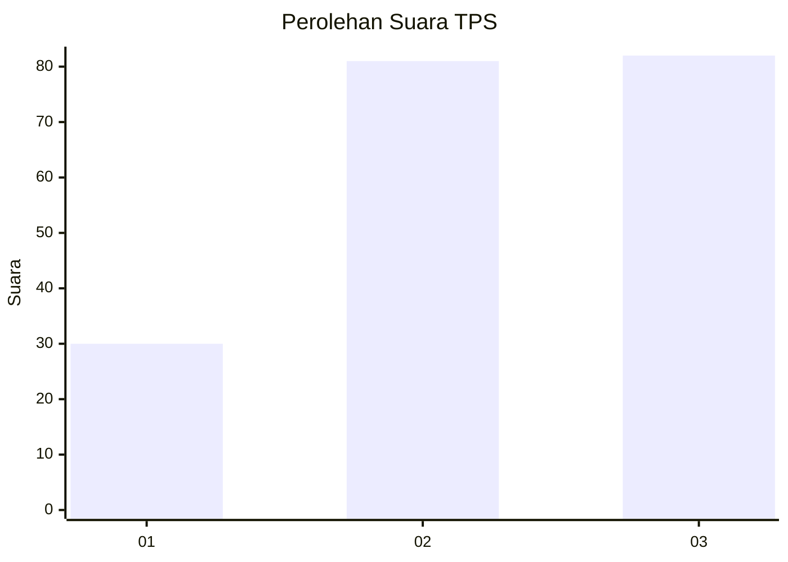
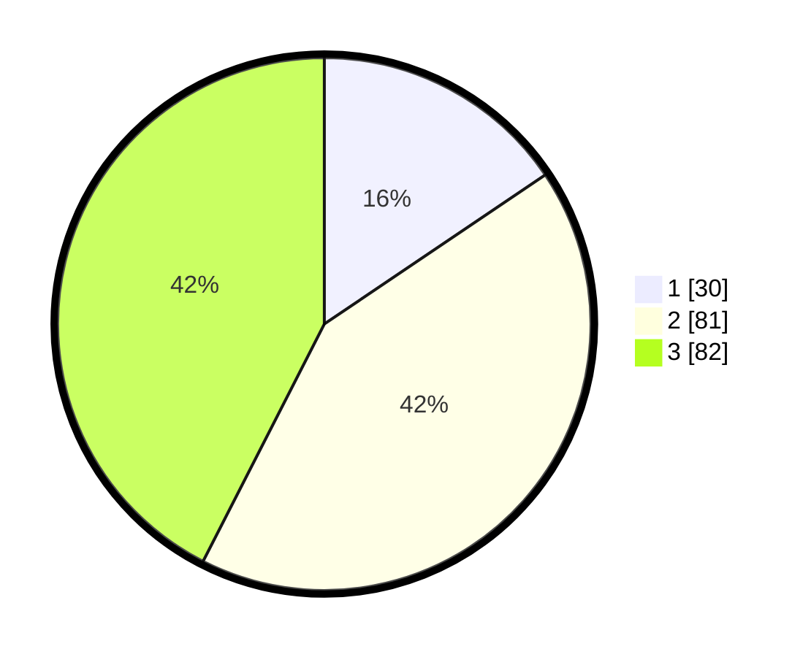

# Hasil

## Grafik

## Tabel

| No. | Nama Paslon    | Suara | Suara (raw) | Persentase |
|:--- |:-------------- | -----:| -----------:| ----------:|
| 1   | ANIES MUHAIMIN | 30    | [30][p-1]   | 15,54      |
| 2   | PRABOWO GIBRAN | 81    | [81][p-2]   | 41,97      |
| 3   | GANJAR MAHFUD  | 82    | [82][p-3]   | 42,49      |

[p-1]: https://github.com/gigit-pemilu/pemilu-2024/blob/main/pilpres/hitung-suara/sub/33-jawa-tengah/sub/02-banyumas/sub/06-kemranjen/sub/2013-petarangan/sub/002-tps/sub/paslon-1.txt
[p-2]: https://github.com/gigit-pemilu/pemilu-2024/blob/main/pilpres/hitung-suara/sub/33-jawa-tengah/sub/02-banyumas/sub/06-kemranjen/sub/2013-petarangan/sub/002-tps/sub/paslon-2.txt
[p-3]: https://github.com/gigit-pemilu/pemilu-2024/blob/main/pilpres/hitung-suara/sub/33-jawa-tengah/sub/02-banyumas/sub/06-kemranjen/sub/2013-petarangan/sub/002-tps/sub/paslon-3.txt

## Foto C Plano

https://sirekap-obj-formc.kpu.go.id/0246/pemilu/ppwp/33/02/06/20/13/3302062013002-20240217-175908--be404404-efec-4ef0-870e-9abded4ca7c3.jpg

https://sirekap-obj-formc.kpu.go.id/0246/pemilu/ppwp/33/02/06/20/13/3302062013002-20240217-175953--93a8b949-3914-4f6d-a6d7-e8300ba56bcd.jpg

https://sirekap-obj-formc.kpu.go.id/0246/pemilu/ppwp/33/02/06/20/13/3302062013002-20240217-180029--db7da60d-08eb-4000-b96c-f3d614f2ef30.jpg

## Metadata

| Key        | Value               |
| ---------- | ------------------- |
| Time Stamp | 2024-02-17 19:00:04 |

