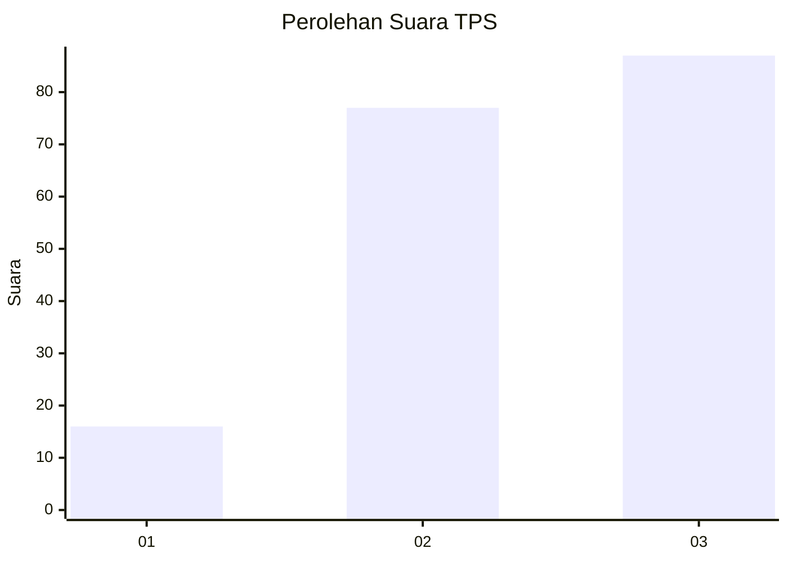
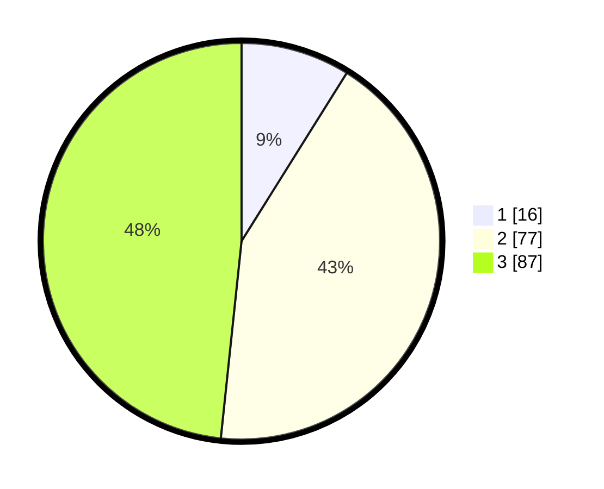

# Hasil

## Grafik

## Tabel

| No. | Nama Paslon    | Suara | Suara (raw) | Persentase |
|:--- |:-------------- | -----:| -----------:| ----------:|
| 1   | ANIES MUHAIMIN | 16    | [16][p-1]   | 8,89       |
| 2   | PRABOWO GIBRAN | 77    | [77][p-2]   | 42,78      |
| 3   | GANJAR MAHFUD  | 87    | [87][p-3]   | 48,33      |

[p-1]: https://github.com/gigit-pemilu/pemilu-2024/blob/main/pilpres/hitung-suara/sub/33-jawa-tengah/sub/02-banyumas/sub/06-kemranjen/sub/2013-petarangan/sub/015-tps/sub/paslon-1.txt
[p-2]: https://github.com/gigit-pemilu/pemilu-2024/blob/main/pilpres/hitung-suara/sub/33-jawa-tengah/sub/02-banyumas/sub/06-kemranjen/sub/2013-petarangan/sub/015-tps/sub/paslon-2.txt
[p-3]: https://github.com/gigit-pemilu/pemilu-2024/blob/main/pilpres/hitung-suara/sub/33-jawa-tengah/sub/02-banyumas/sub/06-kemranjen/sub/2013-petarangan/sub/015-tps/sub/paslon-3.txt

## Foto C Plano

https://sirekap-obj-formc.kpu.go.id/f552/pemilu/ppwp/33/02/06/20/13/3302062013015-20240215-013734--ea3b4425-ebe2-442e-aedc-b7fdedb2af6e.jpg

https://sirekap-obj-formc.kpu.go.id/f552/pemilu/ppwp/33/02/06/20/13/3302062013015-20240215-013913--e791b775-801a-4428-a37d-7bab17261194.jpg

https://sirekap-obj-formc.kpu.go.id/f552/pemilu/ppwp/33/02/06/20/13/3302062013015-20240215-014053--dd80d7ee-f3ff-4d07-ba7e-417d8f058306.jpg

## Metadata

| Key        | Value               |
| ---------- | ------------------- |
| Time Stamp | 2024-02-16 23:30:00 |

