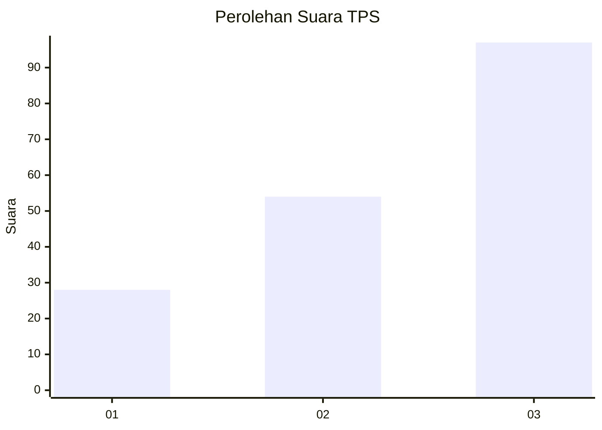
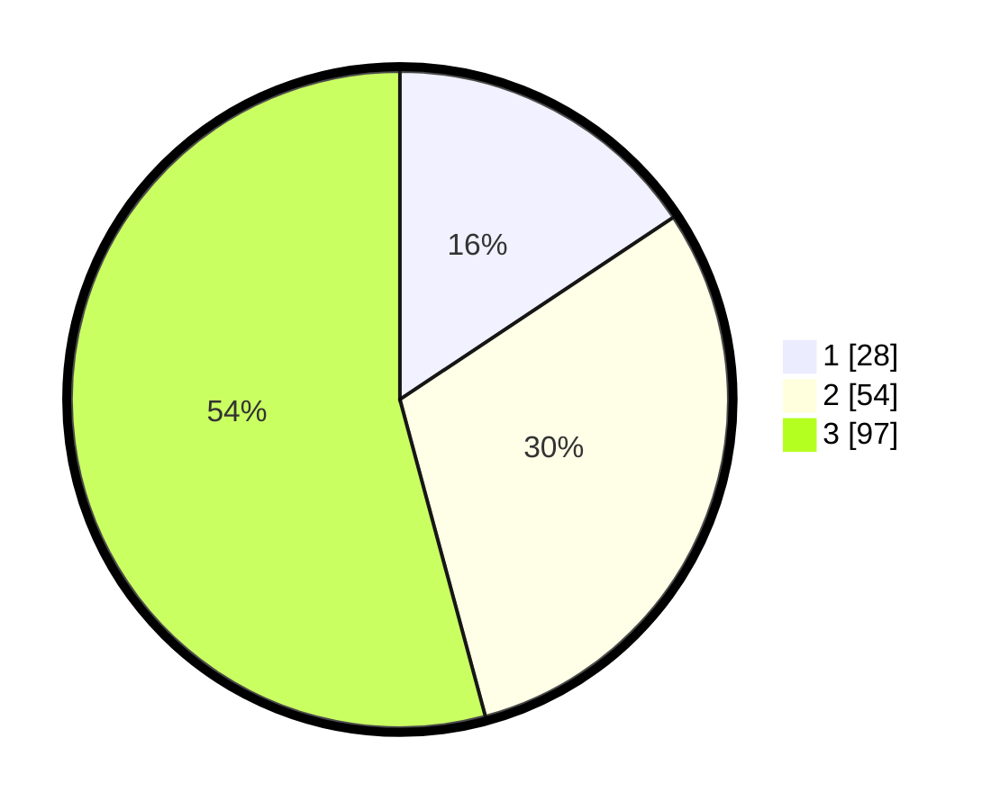

# Hasil

## Grafik

## Tabel

| No. | Nama Paslon    | Suara | Suara (raw) | Persentase |
|:--- |:-------------- | -----:| -----------:| ----------:|
| 1   | ANIES MUHAIMIN | 28    | [28][p-1]   | 15,64      |
| 2   | PRABOWO GIBRAN | 54    | [54][p-2]   | 30,17      |
| 3   | GANJAR MAHFUD  | 97    | [97][p-3]   | 54,19      |

[p-1]: https://github.com/gigit-pemilu/pemilu-2024-33-jawa-tengah/blob/main/pilpres/hitung-suara/sub/33-jawa-tengah/sub/02-banyumas/sub/06-kemranjen/sub/2014-karanggintung/sub/007-tps/sub/paslon-1.txt
[p-2]: https://github.com/gigit-pemilu/pemilu-2024-33-jawa-tengah/blob/main/pilpres/hitung-suara/sub/33-jawa-tengah/sub/02-banyumas/sub/06-kemranjen/sub/2014-karanggintung/sub/007-tps/sub/paslon-2.txt
[p-3]: https://github.com/gigit-pemilu/pemilu-2024-33-jawa-tengah/blob/main/pilpres/hitung-suara/sub/33-jawa-tengah/sub/02-banyumas/sub/06-kemranjen/sub/2014-karanggintung/sub/007-tps/sub/paslon-3.txt

## Foto C Plano

https://sirekap-obj-formc.kpu.go.id/8bad/pemilu/ppwp/33/02/06/20/14/3302062014007-20240215-033409--04f0b369-1110-41d3-bcbd-78bb85e159be.jpg

https://sirekap-obj-formc.kpu.go.id/8bad/pemilu/ppwp/33/02/06/20/14/3302062014007-20240215-033616--263a3641-96e9-45d7-aba5-494e643e3c19.jpg

https://sirekap-obj-formc.kpu.go.id/8bad/pemilu/ppwp/33/02/06/20/14/3302062014007-20240215-033743--970d598e-1ef3-441d-af28-24f478b36012.jpg

## Metadata

| Key        | Value               |
| ---------- | ------------------- |
| Time Stamp | 2024-02-16 23:30:00 |

