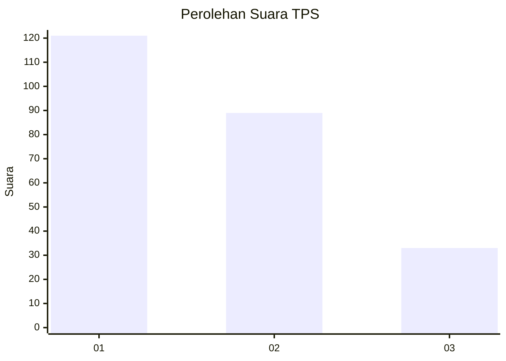
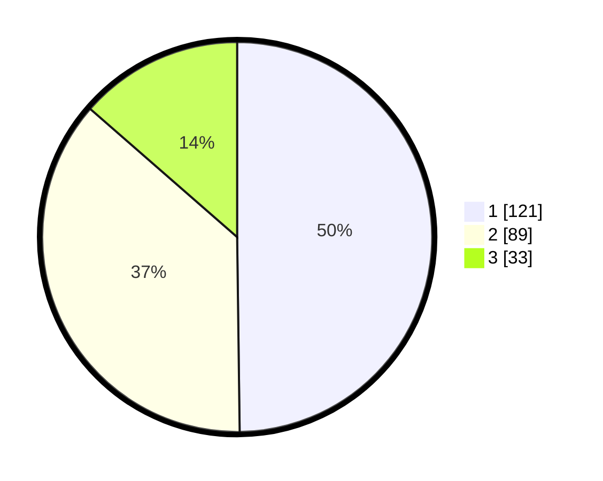

# Hasil

## Grafik

## Tabel

| No. | Nama Paslon    | Suara | Suara (raw) | Persentase |
|:--- |:-------------- | -----:| -----------:| ----------:|
| 1   | ANIES MUHAIMIN | 121   | [121][p-1]  | 49,79      |
| 2   | PRABOWO GIBRAN | 89    | [89][p-2]   | 36,63      |
| 3   | GANJAR MAHFUD  | 33    | [33][p-3]   | 13,58      |

[p-1]: https://github.com/gigit-pemilu/pemilu-2024-33-jawa-tengah/blob/main/pilpres/hitung-suara/sub/33-jawa-tengah/sub/02-banyumas/sub/07-sumpiuh/sub/2009-bogangin/sub/010-tps/sub/paslon-1.txt
[p-2]: https://github.com/gigit-pemilu/pemilu-2024-33-jawa-tengah/blob/main/pilpres/hitung-suara/sub/33-jawa-tengah/sub/02-banyumas/sub/07-sumpiuh/sub/2009-bogangin/sub/010-tps/sub/paslon-2.txt
[p-3]: https://github.com/gigit-pemilu/pemilu-2024-33-jawa-tengah/blob/main/pilpres/hitung-suara/sub/33-jawa-tengah/sub/02-banyumas/sub/07-sumpiuh/sub/2009-bogangin/sub/010-tps/sub/paslon-3.txt

## Foto C Plano

https://sirekap-obj-formc.kpu.go.id/3bcf/pemilu/ppwp/33/02/07/20/09/3302072009010-20240215-005215--e8c6d8d7-be88-4877-8e94-c0e23e5492bc.jpg

https://sirekap-obj-formc.kpu.go.id/3bcf/pemilu/ppwp/33/02/07/20/09/3302072009010-20240215-005317--6a1cf9c2-4186-40c5-8e4f-14a55800fc77.jpg

https://sirekap-obj-formc.kpu.go.id/3bcf/pemilu/ppwp/33/02/07/20/09/3302072009010-20240215-010058--3bc92562-2af8-437c-9b89-01fa3f87db90.jpg

## Metadata

| Key        | Value               |
| ---------- | ------------------- |
| Time Stamp | 2024-02-16 23:00:00 |

