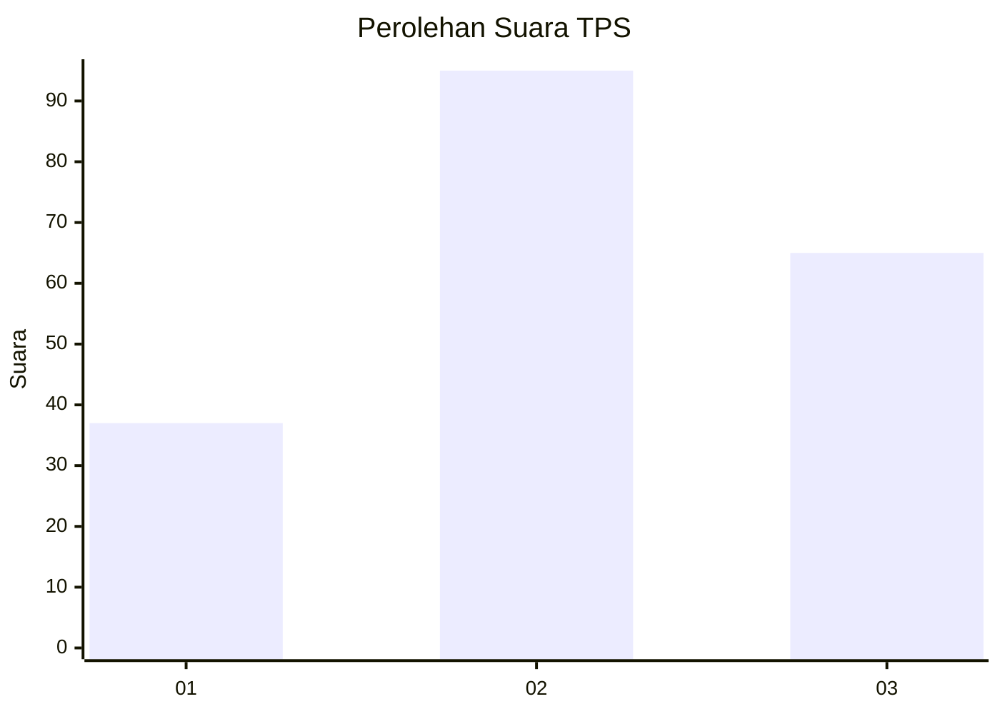
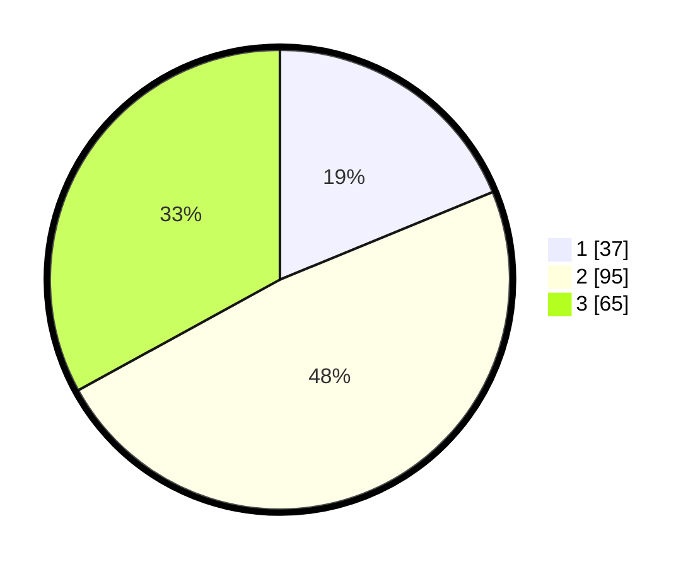

# Hasil

## Grafik

## Tabel

| No. | Nama Paslon    | Suara | Suara (raw) | Persentase |
|:--- |:-------------- | -----:| -----------:| ----------:|
| 1   | ANIES MUHAIMIN | 37    | [37][p-1]   | 18,78      |
| 2   | PRABOWO GIBRAN | 95    | [95][p-2]   | 48,22      |
| 3   | GANJAR MAHFUD  | 65    | [65][p-3]   | 32,99      |

[p-1]: https://github.com/gigit-pemilu/pemilu-2024/blob/main/pilpres/hitung-suara/sub/33-jawa-tengah/sub/02-banyumas/sub/08-tambak/sub/2001-plangkapan/sub/001-tps/sub/paslon-1.txt
[p-2]: https://github.com/gigit-pemilu/pemilu-2024/blob/main/pilpres/hitung-suara/sub/33-jawa-tengah/sub/02-banyumas/sub/08-tambak/sub/2001-plangkapan/sub/001-tps/sub/paslon-2.txt
[p-3]: https://github.com/gigit-pemilu/pemilu-2024/blob/main/pilpres/hitung-suara/sub/33-jawa-tengah/sub/02-banyumas/sub/08-tambak/sub/2001-plangkapan/sub/001-tps/sub/paslon-3.txt

## Foto C Plano

https://sirekap-obj-formc.kpu.go.id/719d/pemilu/ppwp/33/02/08/20/01/3302082001001-20240214-215916--dffeed79-63fc-46bb-9097-ffe1f78dc8fb.jpg

https://sirekap-obj-formc.kpu.go.id/719d/pemilu/ppwp/33/02/08/20/01/3302082001001-20240214-220114--3cc87c23-7407-4233-9c2a-52aded178f83.jpg

https://sirekap-obj-formc.kpu.go.id/719d/pemilu/ppwp/33/02/08/20/01/3302082001001-20240214-220439--01da8992-76d8-42f8-af9b-84332632c0a9.jpg

## Metadata

| Key        | Value               |
| ---------- | ------------------- |
| Time Stamp | 2024-02-16 23:30:00 |

