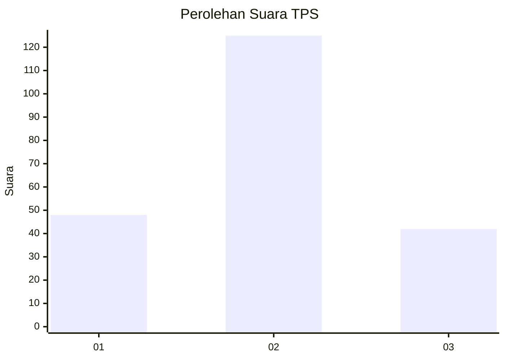
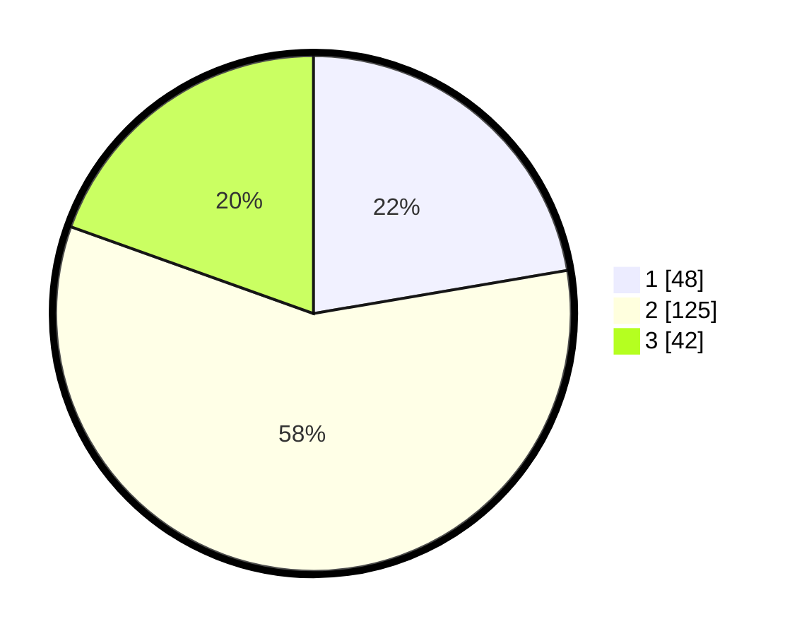

# Hasil

## Grafik

## Tabel

| No. | Nama Paslon    | Suara | Suara (raw) | Persentase |
|:--- |:-------------- | -----:| -----------:| ----------:|
| 1   | ANIES MUHAIMIN | 48    | [48][p-1]   | 22,33      |
| 2   | PRABOWO GIBRAN | 125   | [125][p-2]  | 58,14      |
| 3   | GANJAR MAHFUD  | 42    | [42][p-3]   | 19,53      |

[p-1]: https://github.com/gigit-pemilu/pemilu-2024/blob/main/pilpres/hitung-suara/sub/33-jawa-tengah/sub/02-banyumas/sub/08-tambak/sub/2001-plangkapan/sub/002-tps/sub/paslon-1.txt
[p-2]: https://github.com/gigit-pemilu/pemilu-2024/blob/main/pilpres/hitung-suara/sub/33-jawa-tengah/sub/02-banyumas/sub/08-tambak/sub/2001-plangkapan/sub/002-tps/sub/paslon-2.txt
[p-3]: https://github.com/gigit-pemilu/pemilu-2024/blob/main/pilpres/hitung-suara/sub/33-jawa-tengah/sub/02-banyumas/sub/08-tambak/sub/2001-plangkapan/sub/002-tps/sub/paslon-3.txt

## Foto C Plano

https://sirekap-obj-formc.kpu.go.id/e4eb/pemilu/ppwp/33/02/08/20/01/3302082001002-20240214-220244--f183d41c-28a1-456f-878a-5df0f66eb318.jpg

https://sirekap-obj-formc.kpu.go.id/e4eb/pemilu/ppwp/33/02/08/20/01/3302082001002-20240214-233450--dee7cc16-ebde-4c8d-904d-0f41207d741d.jpg

https://sirekap-obj-formc.kpu.go.id/e4eb/pemilu/ppwp/33/02/08/20/01/3302082001002-20240214-233641--2eff927f-36e7-49c6-9657-5dd87e0644e9.jpg

## Metadata

| Key        | Value               |
| ---------- | ------------------- |
| Time Stamp | 2024-02-16 23:30:00 |

