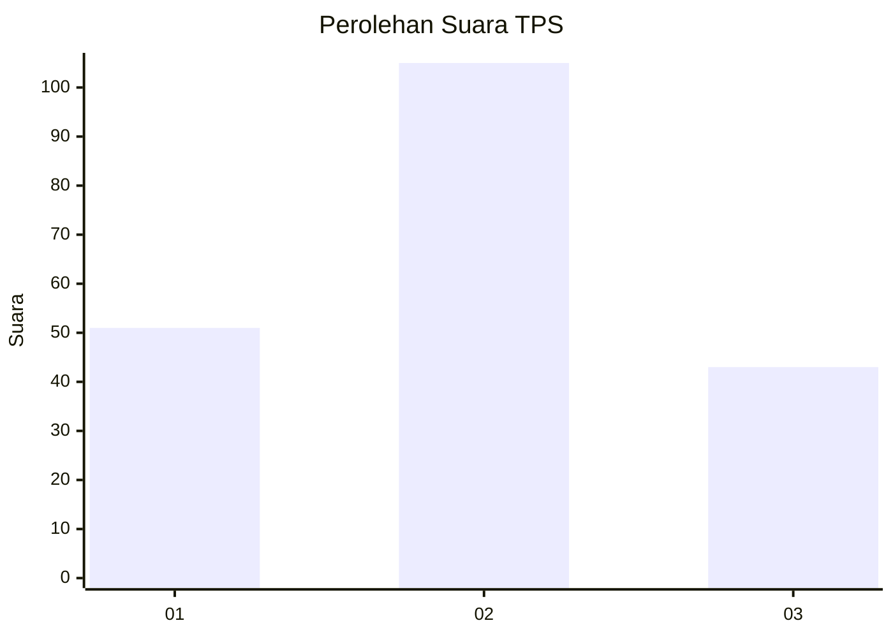
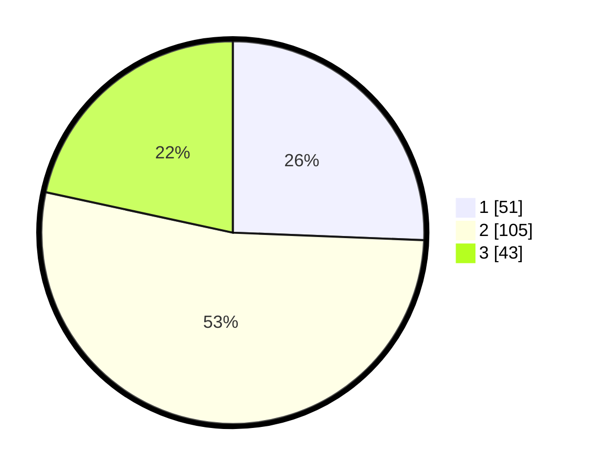

# Hasil

## Grafik

## Tabel

| No. | Nama Paslon    | Suara | Suara (raw) | Persentase |
|:--- |:-------------- | -----:| -----------:| ----------:|
| 1   | ANIES MUHAIMIN | 51    | [51][p-1]   | 25,63      |
| 2   | PRABOWO GIBRAN | 105   | [105][p-2]  | 52,76      |
| 3   | GANJAR MAHFUD  | 43    | [43][p-3]   | 21,61      |

[p-1]: https://github.com/gigit-pemilu/pemilu-2024-33-jawa-tengah/blob/main/pilpres/hitung-suara/sub/33-jawa-tengah/sub/02-banyumas/sub/08-tambak/sub/2001-plangkapan/sub/004-tps/sub/paslon-1.txt
[p-2]: https://github.com/gigit-pemilu/pemilu-2024-33-jawa-tengah/blob/main/pilpres/hitung-suara/sub/33-jawa-tengah/sub/02-banyumas/sub/08-tambak/sub/2001-plangkapan/sub/004-tps/sub/paslon-2.txt
[p-3]: https://github.com/gigit-pemilu/pemilu-2024-33-jawa-tengah/blob/main/pilpres/hitung-suara/sub/33-jawa-tengah/sub/02-banyumas/sub/08-tambak/sub/2001-plangkapan/sub/004-tps/sub/paslon-3.txt

## Foto C Plano

https://sirekap-obj-formc.kpu.go.id/804b/pemilu/ppwp/33/02/08/20/01/3302082001004-20240214-215742--0e5b1749-95af-4322-bf27-46c1b2dc692a.jpg

https://sirekap-obj-formc.kpu.go.id/804b/pemilu/ppwp/33/02/08/20/01/3302082001004-20240214-220107--60f0ca51-aec5-4e99-9177-5a121e2aa126.jpg

https://sirekap-obj-formc.kpu.go.id/804b/pemilu/ppwp/33/02/08/20/01/3302082001004-20240214-221011--61c6b563-5ef4-47e6-99a1-102417b5a4ea.jpg

## Metadata

| Key        | Value               |
| ---------- | ------------------- |
| Time Stamp | 2024-02-15 12:00:28 |

