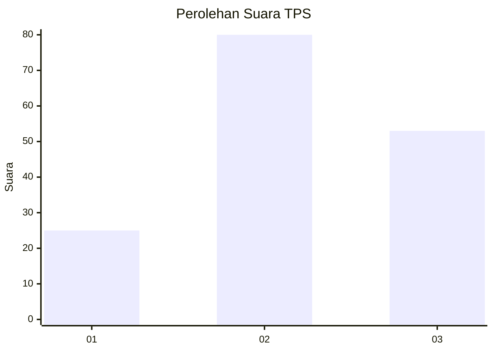
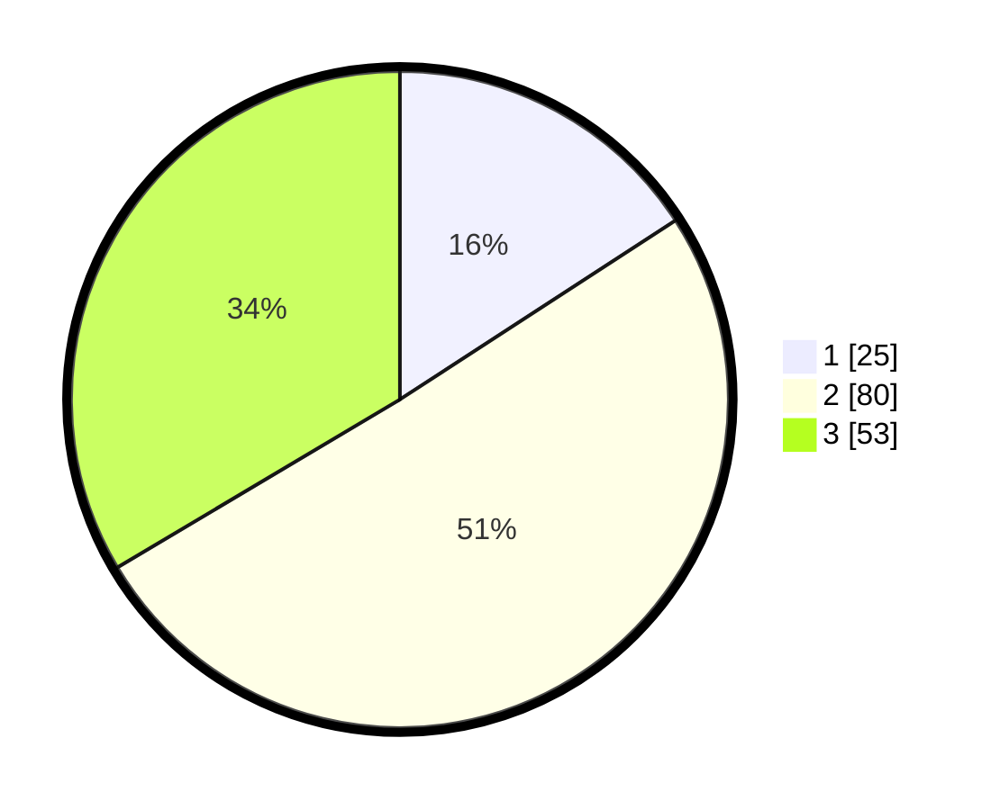

# Hasil

## Grafik

## Tabel

| No. | Nama Paslon    | Suara | Suara (raw) | Persentase |
|:--- |:-------------- | -----:| -----------:| ----------:|
| 1   | ANIES MUHAIMIN | 25    | [25][p-1]   | 15,82      |
| 2   | PRABOWO GIBRAN | 80    | [80][p-2]   | 50,63      |
| 3   | GANJAR MAHFUD  | 53    | [53][p-3]   | 33,54      |

[p-1]: https://github.com/gigit-pemilu/pemilu-2024-33-jawa-tengah/blob/main/pilpres/hitung-suara/sub/33-jawa-tengah/sub/02-banyumas/sub/08-tambak/sub/2002-gumelar-lor/sub/005-tps/sub/paslon-1.txt
[p-2]: https://github.com/gigit-pemilu/pemilu-2024-33-jawa-tengah/blob/main/pilpres/hitung-suara/sub/33-jawa-tengah/sub/02-banyumas/sub/08-tambak/sub/2002-gumelar-lor/sub/005-tps/sub/paslon-2.txt
[p-3]: https://github.com/gigit-pemilu/pemilu-2024-33-jawa-tengah/blob/main/pilpres/hitung-suara/sub/33-jawa-tengah/sub/02-banyumas/sub/08-tambak/sub/2002-gumelar-lor/sub/005-tps/sub/paslon-3.txt

## Foto C Plano

https://sirekap-obj-formc.kpu.go.id/26f2/pemilu/ppwp/33/02/08/20/02/3302082002005-20240215-011713--291b83b4-bfe5-4189-8101-197d1ab72bb6.jpg

https://sirekap-obj-formc.kpu.go.id/26f2/pemilu/ppwp/33/02/08/20/02/3302082002005-20240215-011902--64f89ddd-ef57-468d-80b6-8e499cb5381e.jpg

https://sirekap-obj-formc.kpu.go.id/26f2/pemilu/ppwp/33/02/08/20/02/3302082002005-20240215-012047--662a38b6-1506-4db1-90e6-17701ec7a361.jpg

## Metadata

| Key        | Value               |
| ---------- | ------------------- |
| Time Stamp | 2024-02-16 23:30:00 |

