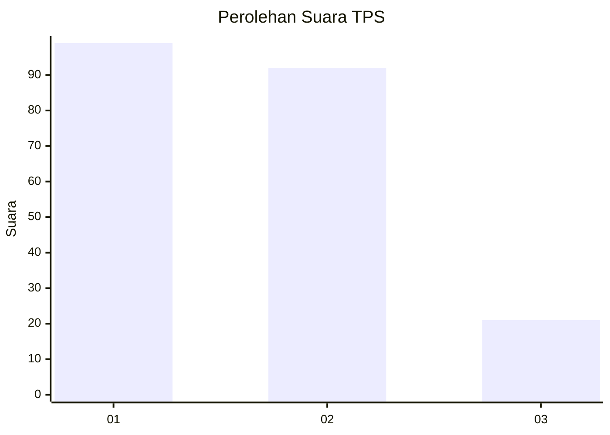
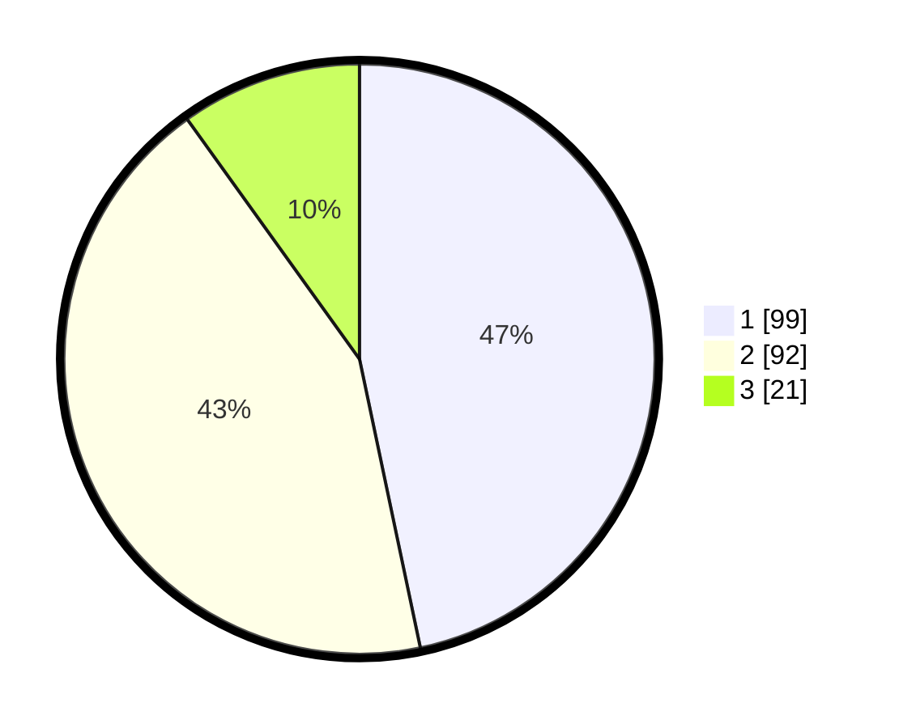

# Hasil

## Grafik

## Tabel

| No. | Nama Paslon    | Suara | Suara (raw) | Persentase |
|:--- |:-------------- | -----:| -----------:| ----------:|
| 1   | ANIES MUHAIMIN | 99    | [99][p-1]   | 46,70      |
| 2   | PRABOWO GIBRAN | 92    | [92][p-2]   | 43,40      |
| 3   | GANJAR MAHFUD  | 21    | [21][p-3]   | 9,91       |

[p-1]: https://github.com/gigit-pemilu/pemilu-2024/blob/main/pilpres/hitung-suara/sub/33-jawa-tengah/sub/02-banyumas/sub/08-tambak/sub/2004-karangpetir/sub/002-tps/sub/paslon-1.txt
[p-2]: https://github.com/gigit-pemilu/pemilu-2024/blob/main/pilpres/hitung-suara/sub/33-jawa-tengah/sub/02-banyumas/sub/08-tambak/sub/2004-karangpetir/sub/002-tps/sub/paslon-2.txt
[p-3]: https://github.com/gigit-pemilu/pemilu-2024/blob/main/pilpres/hitung-suara/sub/33-jawa-tengah/sub/02-banyumas/sub/08-tambak/sub/2004-karangpetir/sub/002-tps/sub/paslon-3.txt

## Foto C Plano

https://sirekap-obj-formc.kpu.go.id/ba47/pemilu/ppwp/33/02/08/20/04/3302082004002-20240214-223007--a93b8211-fa3d-41b2-a259-4899440e6e2c.jpg

https://sirekap-obj-formc.kpu.go.id/ba47/pemilu/ppwp/33/02/08/20/04/3302082004002-20240214-223241--52638a97-7fe8-4667-87a5-7b4386bd2bef.jpg

https://sirekap-obj-formc.kpu.go.id/ba47/pemilu/ppwp/33/02/08/20/04/3302082004002-20240214-223348--35b5e348-10c9-49e1-99c6-b80b61b8dc69.jpg

## Metadata

| Key        | Value               |
| ---------- | ------------------- |
| Time Stamp | 2024-02-16 23:00:00 |

