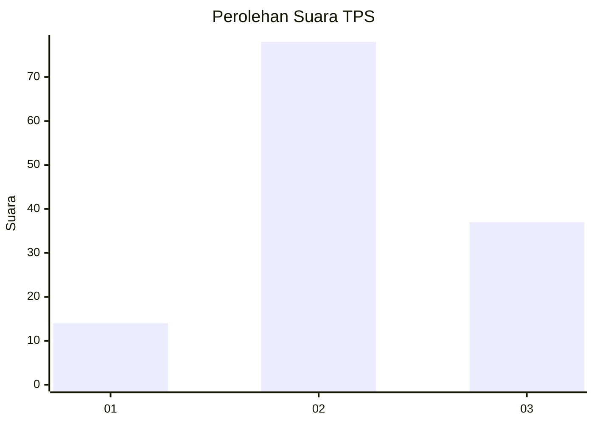
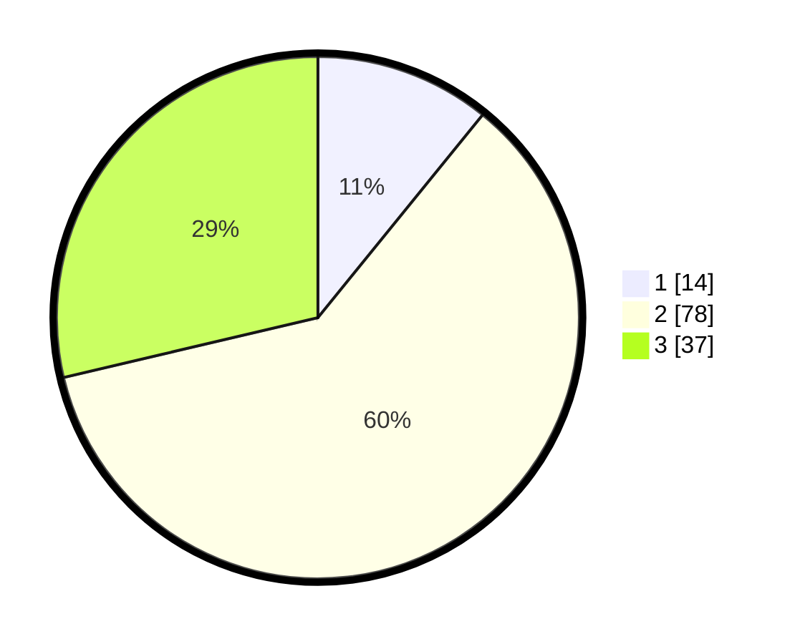

# Hasil

## Grafik

## Tabel

| No. | Nama Paslon    | Suara | Suara (raw) | Persentase |
|:--- |:-------------- | -----:| -----------:| ----------:|
| 1   | ANIES MUHAIMIN | 14    | [14][p-1]   | 10,85      |
| 2   | PRABOWO GIBRAN | 78    | [78][p-2]   | 60,47      |
| 3   | GANJAR MAHFUD  | 37    | [37][p-3]   | 28,68      |

[p-1]: https://github.com/gigit-pemilu/pemilu-2024/blob/main/pilpres/hitung-suara/sub/33-jawa-tengah/sub/02-banyumas/sub/08-tambak/sub/2005-gebangsari/sub/004-tps/sub/paslon-1.txt
[p-2]: https://github.com/gigit-pemilu/pemilu-2024/blob/main/pilpres/hitung-suara/sub/33-jawa-tengah/sub/02-banyumas/sub/08-tambak/sub/2005-gebangsari/sub/004-tps/sub/paslon-2.txt
[p-3]: https://github.com/gigit-pemilu/pemilu-2024/blob/main/pilpres/hitung-suara/sub/33-jawa-tengah/sub/02-banyumas/sub/08-tambak/sub/2005-gebangsari/sub/004-tps/sub/paslon-3.txt

## Foto C Plano

https://sirekap-obj-formc.kpu.go.id/09e3/pemilu/ppwp/33/02/08/20/05/3302082005004-20240215-003938--78ad014b-5194-41bd-a247-d31991651aed.jpg

https://sirekap-obj-formc.kpu.go.id/09e3/pemilu/ppwp/33/02/08/20/05/3302082005004-20240215-004125--86b6d3d0-f950-49b5-8d14-575129bd8bce.jpg

https://sirekap-obj-formc.kpu.go.id/09e3/pemilu/ppwp/33/02/08/20/05/3302082005004-20240216-063417--c2412482-2a4f-4ada-be4d-2f870ae9ef18.jpg

## Metadata

| Key        | Value               |
| ---------- | ------------------- |
| Time Stamp | 2024-02-16 08:00:28 |

