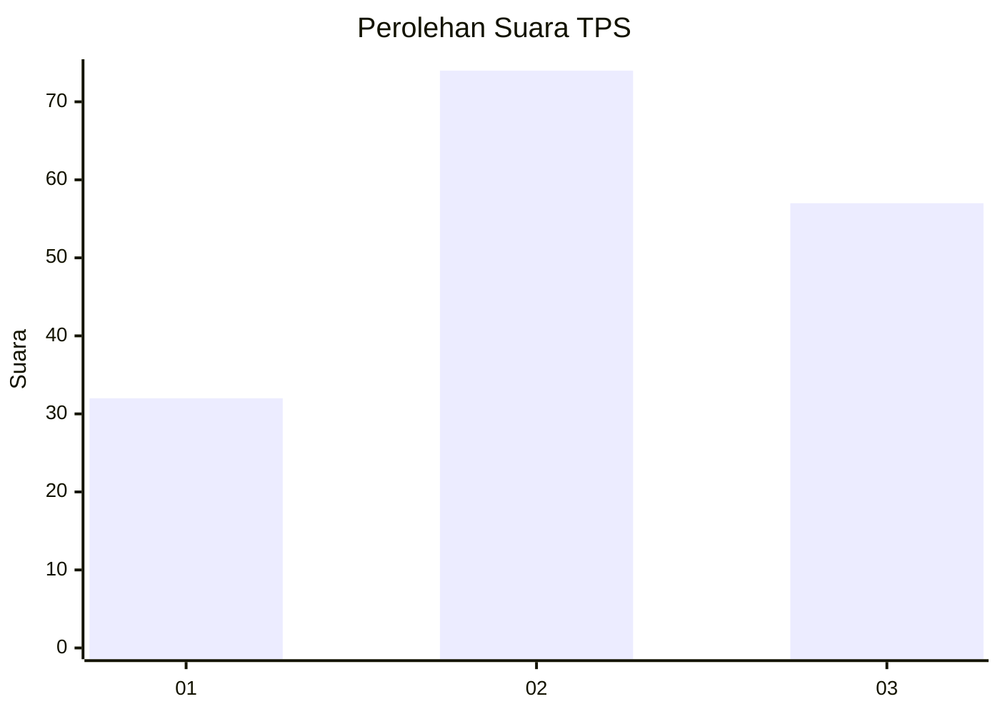
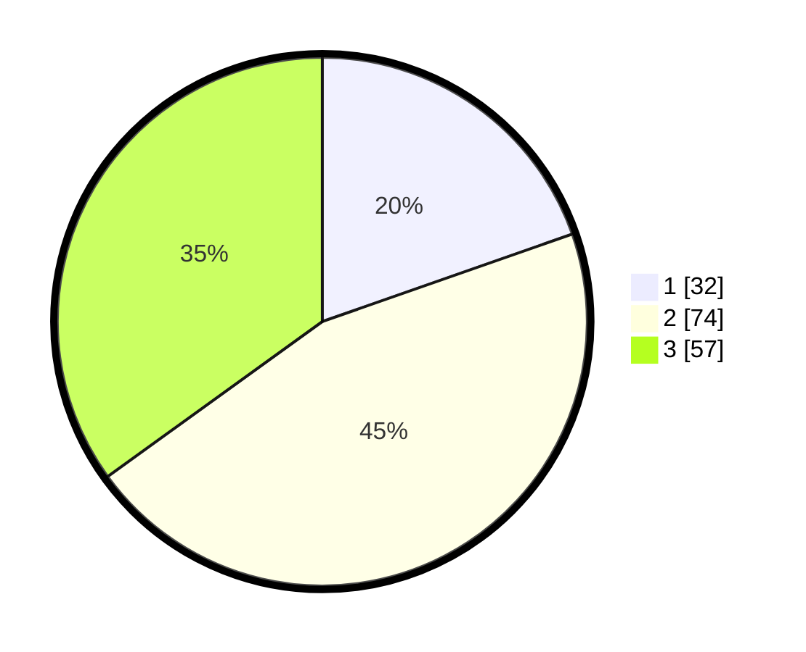

# Hasil

## Grafik

## Tabel

| No. | Nama Paslon    | Suara | Suara (raw) | Persentase |
|:--- |:-------------- | -----:| -----------:| ----------:|
| 1   | ANIES MUHAIMIN | 32    | [32][p-1]   | 19,63      |
| 2   | PRABOWO GIBRAN | 74    | [74][p-2]   | 45,40      |
| 3   | GANJAR MAHFUD  | 57    | [57][p-3]   | 34,97      |

[p-1]: https://github.com/gigit-pemilu/pemilu-2024-33-jawa-tengah/blob/main/pilpres/hitung-suara/sub/33-jawa-tengah/sub/02-banyumas/sub/08-tambak/sub/2007-buniayu/sub/001-tps/sub/paslon-1.txt
[p-2]: https://github.com/gigit-pemilu/pemilu-2024-33-jawa-tengah/blob/main/pilpres/hitung-suara/sub/33-jawa-tengah/sub/02-banyumas/sub/08-tambak/sub/2007-buniayu/sub/001-tps/sub/paslon-2.txt
[p-3]: https://github.com/gigit-pemilu/pemilu-2024-33-jawa-tengah/blob/main/pilpres/hitung-suara/sub/33-jawa-tengah/sub/02-banyumas/sub/08-tambak/sub/2007-buniayu/sub/001-tps/sub/paslon-3.txt

## Foto C Plano

https://sirekap-obj-formc.kpu.go.id/0b46/pemilu/ppwp/33/02/08/20/07/3302082007001-20240214-225819--5555418a-c881-47b4-8ef2-0a1862287ac5.jpg

https://sirekap-obj-formc.kpu.go.id/0b46/pemilu/ppwp/33/02/08/20/07/3302082007001-20240215-000747--dc703a83-8543-47fb-bac0-fb41b666abf7.jpg

https://sirekap-obj-formc.kpu.go.id/0b46/pemilu/ppwp/33/02/08/20/07/3302082007001-20240214-225958--14238b89-d685-44dd-8dca-45e9917478a6.jpg

## Metadata

| Key        | Value               |
| ---------- | ------------------- |
| Time Stamp | 2024-02-16 23:00:00 |

