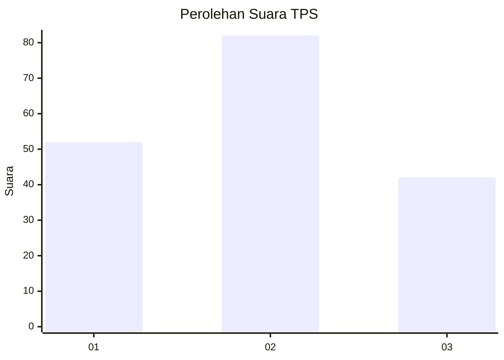
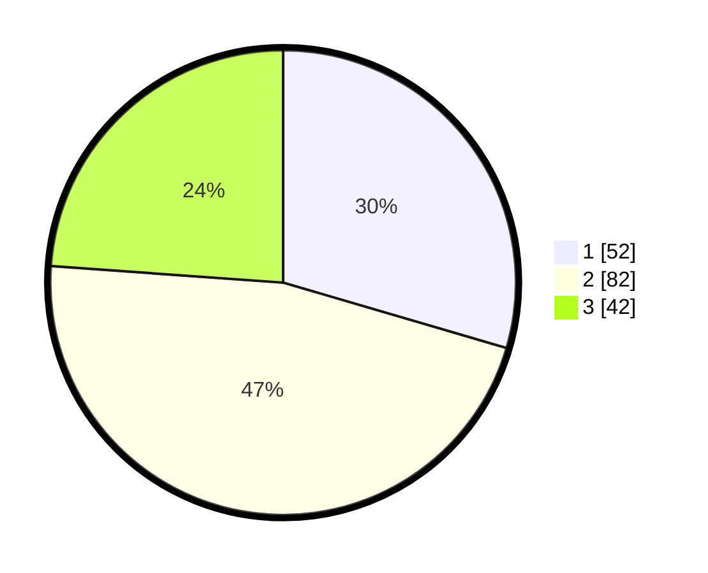

# Hasil

## Grafik

## Tabel

| No. | Nama Paslon    | Suara | Suara (raw) | Persentase |
|:--- |:-------------- | -----:| -----------:| ----------:|
| 1   | ANIES MUHAIMIN | 52    | [52][p-1]   | 29,55      |
| 2   | PRABOWO GIBRAN | 82    | [82][p-2]   | 46,59      |
| 3   | GANJAR MAHFUD  | 42    | [42][p-3]   | 23,86      |

[p-1]: https://github.com/gigit-pemilu/pemilu-2024/blob/main/pilpres/hitung-suara/sub/33-jawa-tengah/sub/02-banyumas/sub/08-tambak/sub/2008-pesantren/sub/008-tps/sub/paslon-1.txt
[p-2]: https://github.com/gigit-pemilu/pemilu-2024/blob/main/pilpres/hitung-suara/sub/33-jawa-tengah/sub/02-banyumas/sub/08-tambak/sub/2008-pesantren/sub/008-tps/sub/paslon-2.txt
[p-3]: https://github.com/gigit-pemilu/pemilu-2024/blob/main/pilpres/hitung-suara/sub/33-jawa-tengah/sub/02-banyumas/sub/08-tambak/sub/2008-pesantren/sub/008-tps/sub/paslon-3.txt

## Foto C Plano

https://sirekap-obj-formc.kpu.go.id/61c5/pemilu/ppwp/33/02/08/20/08/3302082008008-20240214-213029--b69062a0-08dc-4f55-acbf-ab1fe768d4d0.jpg

https://sirekap-obj-formc.kpu.go.id/61c5/pemilu/ppwp/33/02/08/20/08/3302082008008-20240214-213144--1030b9ed-c169-472d-b0a8-cd1f4f3125ce.jpg

https://sirekap-obj-formc.kpu.go.id/61c5/pemilu/ppwp/33/02/08/20/08/3302082008008-20240214-213235--b58f6ae3-d8c4-4609-89f2-87f4a834f7e5.jpg

## Metadata

| Key        | Value               |
| ---------- | ------------------- |
| Time Stamp | 2024-02-16 23:00:00 |

